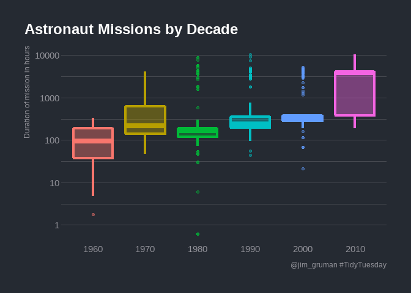
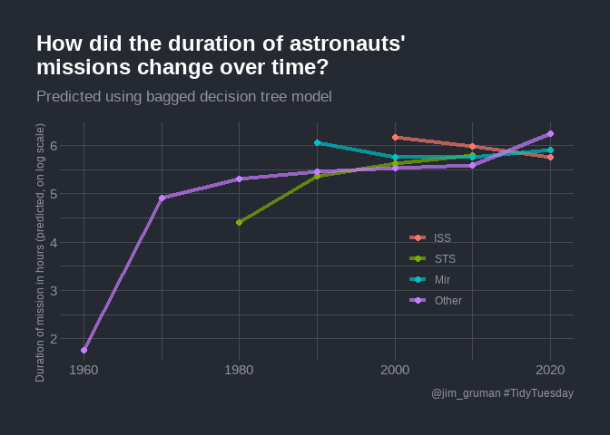
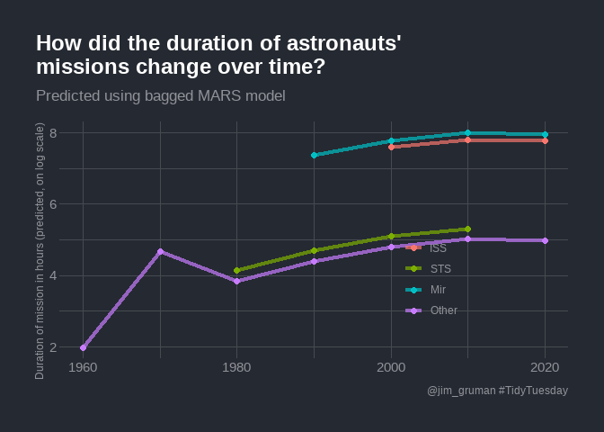

TidyTemplate
================
2020-07-15

# TidyTuesday

Join the R4DS Online Learning Community in the weekly \#TidyTuesday
event\! Every week we post a raw dataset, a chart or article related to
that dataset, and ask you to explore the data. While the dataset will be
“tamed”, it will not always be tidy\! As such you might need to apply
various R for Data Science techniques to wrangle the data into a true
tidy format. The goal of TidyTuesday is to apply your R skills, get
feedback, explore other’s work, and connect with the greater \#RStats
community\! As such we encourage everyone of all skills to participate\!

# Load the weekly Data

Dowload the weekly data and make available in the `tt` object.

``` r
tt <- tt_load("2020-07-14")
```

    ## --- Compiling #TidyTuesday Information for 2020-07-14 ----

    ## --- There is 1 file available ---

    ## --- Starting Download ---

    ## 
    ##  Downloading file 1 of 1: `astronauts.csv`

    ## --- Download complete ---

# Readme

Take a look at the readme for the weekly data to get insight on the
dataset. This includes a data dictionary, source, and a link to an
article on the data.

``` r
tt
```

# Glimpse Data

Take an initial look at the format of the data available.

``` r
tt %>% 
  map(glimpse)
```

    ## Rows: 1,277
    ## Columns: 24
    ## $ id                       <dbl> 1, 2, 3, 4, 5, 6, 7, 8, 9, 10, 11, 12, 13,...
    ## $ number                   <dbl> 1, 2, 3, 3, 4, 5, 5, 6, 6, 7, 7, 7, 8, 8, ...
    ## $ nationwide_number        <dbl> 1, 2, 1, 1, 2, 2, 2, 4, 4, 3, 3, 3, 4, 4, ...
    ## $ name                     <chr> "Gagarin, Yuri", "Titov, Gherman", "Glenn,...
    ## $ original_name            <chr> "<U+0413><U+0410><U+0413><U+0410><U+0420><U+0418><U+041D> <U+042E><U+0440><U+0438><U+0439> <U+0410><U+043B><U+0435><U+043A><U+0441><U+0435><U+0435><U+0432><U+0438><U+0447>", "<U+0422><U+0418><U+0422><U+041E><U+0412> <U+0413><U+0435><U+0440><U+043C><U+0430><U+043D> <U+0421>...
    ## $ sex                      <chr> "male", "male", "male", "male", "male", "m...
    ## $ year_of_birth            <dbl> 1934, 1935, 1921, 1921, 1925, 1929, 1929, ...
    ## $ nationality              <chr> "U.S.S.R/Russia", "U.S.S.R/Russia", "U.S."...
    ## $ military_civilian        <chr> "military", "military", "military", "milit...
    ## $ selection                <chr> "TsPK-1", "TsPK-1", "NASA Astronaut Group ...
    ## $ year_of_selection        <dbl> 1960, 1960, 1959, 1959, 1959, 1960, 1960, ...
    ## $ mission_number           <dbl> 1, 1, 1, 2, 1, 1, 2, 1, 2, 1, 2, 3, 1, 2, ...
    ## $ total_number_of_missions <dbl> 1, 1, 2, 2, 1, 2, 2, 2, 2, 3, 3, 3, 2, 2, ...
    ## $ occupation               <chr> "pilot", "pilot", "pilot", "PSP", "Pilot",...
    ## $ year_of_mission          <dbl> 1961, 1961, 1962, 1998, 1962, 1962, 1970, ...
    ## $ mission_title            <chr> "Vostok 1", "Vostok 2", "MA-6", "STS-95", ...
    ## $ ascend_shuttle           <chr> "Vostok 1", "Vostok 2", "MA-6", "STS-95", ...
    ## $ in_orbit                 <chr> "Vostok 2", "Vostok 2", "MA-6", "STS-95", ...
    ## $ descend_shuttle          <chr> "Vostok 3", "Vostok 2", "MA-6", "STS-95", ...
    ## $ hours_mission            <dbl> 1.77, 25.00, 5.00, 213.00, 5.00, 94.00, 42...
    ## $ total_hrs_sum            <dbl> 1.77, 25.30, 218.00, 218.00, 5.00, 519.33,...
    ## $ field21                  <dbl> 0, 0, 0, 0, 0, 0, 0, 0, 0, 0, 0, 0, 0, 0, ...
    ## $ eva_hrs_mission          <dbl> 0.00, 0.00, 0.00, 0.00, 0.00, 0.00, 0.00, ...
    ## $ total_eva_hrs            <dbl> 0.00, 0.00, 0.00, 0.00, 0.00, 0.00, 0.00, ...

    ## $astronauts
    ## # A tibble: 1,277 x 24
    ##       id number nationwide_numb~ name  original_name sex   year_of_birth
    ##    <dbl>  <dbl>            <dbl> <chr> <chr>         <chr>         <dbl>
    ##  1     1      1                1 Gaga~ <U+0413><U+0410><U+0413><U+0410><U+0420><U+0418><U+041D> <U+042E><U+0440><U+0438><U+0439>~ male           1934
    ##  2     2      2                2 Tito~ <U+0422><U+0418><U+0422><U+041E><U+0412> <U+0413><U+0435><U+0440><U+043C><U+0430><U+043D>~ male           1935
    ##  3     3      3                1 Glen~ Glenn, John ~ male           1921
    ##  4     4      3                1 Glen~ Glenn, John ~ male           1921
    ##  5     5      4                2 Carp~ Carpenter, M~ male           1925
    ##  6     6      5                2 Niko~ <U+041D><U+0418><U+041A><U+041E><U+041B><U+0410><U+0415><U+0412> <U+0410><U+043D><U+0434>~ male           1929
    ##  7     7      5                2 Niko~ <U+041D><U+0418><U+041A><U+041E><U+041B><U+0410><U+0415><U+0412> <U+0410><U+043D><U+0434>~ male           1929
    ##  8     8      6                4 Popo~ <U+041F><U+041E><U+041F><U+041E><U+0412><U+0418><U+0427> <U+041F><U+0430><U+0432><U+0435>~ male           1930
    ##  9     9      6                4 Popo~ <U+041F><U+041E><U+041F><U+041E><U+0412><U+0418><U+0427> <U+041F><U+0430><U+0432><U+0435>~ male           1930
    ## 10    10      7                3 Schi~ Schirra, Wal~ male           1923
    ## # ... with 1,267 more rows, and 17 more variables: nationality <chr>,
    ## #   military_civilian <chr>, selection <chr>, year_of_selection <dbl>,
    ## #   mission_number <dbl>, total_number_of_missions <dbl>, occupation <chr>,
    ## #   year_of_mission <dbl>, mission_title <chr>, ascend_shuttle <chr>,
    ## #   in_orbit <chr>, descend_shuttle <chr>, hours_mission <dbl>,
    ## #   total_hrs_sum <dbl>, field21 <dbl>, eva_hrs_mission <dbl>,
    ## #   total_eva_hrs <dbl>

``` r
astronauts<-tt$astronauts

astronauts %>%
  count(in_orbit, sort = TRUE)
```

    ## # A tibble: 289 x 2
    ##    in_orbit      n
    ##    <chr>     <int>
    ##  1 ISS         174
    ##  2 Mir          71
    ##  3 Salyut 6     24
    ##  4 Salyut 7     24
    ##  5 STS-42        8
    ##  6 explosion     7
    ##  7 STS-103       7
    ##  8 STS-107       7
    ##  9 STS-109       7
    ## 10 STS-110       7
    ## # ... with 279 more rows

How has the duration of missions changed over time?

``` r
astronauts %>%
  mutate(
    year_of_mission = 10 * (year_of_mission %/% 10),
    year_of_mission = factor(year_of_mission)
  ) %>%
  ggplot(aes(year_of_mission, hours_mission,
    fill = year_of_mission, color = year_of_mission
  )) +
  geom_boxplot(alpha = 0.4, size = 1.5, show.legend = FALSE) +
  scale_y_log10() +
  labs(x = NULL, y = "Duration of mission in hours",
       title = "Astronaut Missions by Decade",
       caption = "@jim_gruman #TidyTuesday")+
  theme(plot.title.position = "plot",
        panel.grid.major.x = element_blank())
```

<!-- -->

This duration is what we will to build a model to predict, using the
other information in this per-astronaut-per-mission dataset. Let’s get
ready for modeling next, by bucketing some of the spacecraft together
and taking the logarithm of the mission length.

``` r
astronauts_df <- astronauts %>%
  select(
    name, mission_title, hours_mission,
    military_civilian, occupation, year_of_mission, in_orbit
  ) %>%
  mutate(in_orbit = case_when(
    str_detect(in_orbit, "^Salyut") ~ "Salyut",
    str_detect(in_orbit, "^STS") ~ "STS",
    TRUE ~ in_orbit
  )) %>%
  filter(hours_mission > 0) %>%
  mutate(hours_mission = log(hours_mission)) %>%
  na.omit()
```

Julia Silge advises that it may make more sense to perform
transformations like taking the logarithm of the outcome during data
cleaning, before feature engineering and using any `tidymodels` packages
like `recipes`. This kind of transformation is deterministic and can
cause problems for tuning and resampling. OK…

# Build a Model

We can start by loading the `tidymodels` metapackage, and splitting our
data into training and testing sets.

``` r
library(tidymodels)
```

    ## -- Attaching packages ---------------------------------------------- tidymodels 0.1.1 --

    ## v broom     0.7.0      v recipes   0.1.13
    ## v dials     0.0.8      v rsample   0.0.7 
    ## v infer     0.5.3      v tune      0.1.1 
    ## v modeldata 0.0.2      v workflows 0.1.2 
    ## v parsnip   0.1.2      v yardstick 0.0.7

    ## -- Conflicts ------------------------------------------------- tidymodels_conflicts() --
    ## x scales::discard() masks purrr::discard()
    ## x dplyr::filter()   masks stats::filter()
    ## x recipes::fixed()  masks stringr::fixed()
    ## x dplyr::lag()      masks stats::lag()
    ## x yardstick::spec() masks readr::spec()
    ## x recipes::step()   masks stats::step()

``` r
astro_split <- initial_split(astronauts_df, strata = hours_mission)
astro_train <- training(astro_split)
astro_test <- testing(astro_split)
```

Next, let’s preprocess our data to get it ready for modeling.

``` r
astro_recipe <- recipe(hours_mission ~ ., data = astro_train) %>%
  update_role(name, mission_title, new_role = "id") %>%
  step_other(occupation, in_orbit,
    threshold = 0.005, other = "Other"
  ) %>%
  step_dummy(all_nominal(), -has_role("id"))
```

Let’s walk through the steps in this recipe.

  - First, we must tell the recipe() what our model is going to be
    (using a formula here) and what data we are using.

  - Next, update the role for the two columns that are not predictors or
    outcome. This way, we can keep them in the data for identification
    later.

  - There are a lot of different occupations and spacecraft in this
    dataset, so let’s collapse some of the less frequently occurring
    levels into an “Other” category, for each predictor.

  - Finally, we can create indicator variables.

We’re going to use this recipe in a `workflow()` so we don’t need to
stress about whether to `prep()` or not.

``` r
astro_wf <- workflow() %>%
  add_recipe(astro_recipe)

astro_wf
```

    ## == Workflow ============================================================================
    ## Preprocessor: Recipe
    ## Model: None
    ## 
    ## -- Preprocessor ------------------------------------------------------------------------
    ## 2 Recipe Steps
    ## 
    ## * step_other()
    ## * step_dummy()

For this analysis, we are going to build a `bagging`, i.e. bootstrap
aggregating, model. This is an ensembling and model averaging method
that:

  - improves accuracy and stability

  - reduces overfitting and variance

In `tidymodels`, you can create bagging ensemble models with `baguette`,
a parsnip-adjacent package. The `baguette` functions create new
bootstrap training sets by sampling with replacement and then fit a
model to each new training set. These models are combined by averaging
the predictions for the regression case, like what we have here (by
voting, for classification).

Let’s make two bagged models, one with decision trees and one with
`MARS` models.

``` r
library(baguette)

tree_spec <- bag_tree() %>%
  set_engine("rpart", times = 25) %>%
  set_mode("regression")

tree_spec
```

    ## Bagged Decision Tree Model Specification (regression)
    ## 
    ## Main Arguments:
    ##   cost_complexity = 0
    ##   min_n = 2
    ## 
    ## Engine-Specific Arguments:
    ##   times = 25
    ## 
    ## Computational engine: rpart

``` r
mars_spec <- bag_mars() %>%
  set_engine("earth", times = 25) %>%
  set_mode("regression")

mars_spec
```

    ## Bagged MARS Model Specification (regression)
    ## 
    ## Engine-Specific Arguments:
    ##   times = 25
    ## 
    ## Computational engine: earth

Let’s fit these models to the training data.

``` r
tree_rs <- astro_wf %>%
  add_model(tree_spec) %>%
  fit(astro_train)

tree_rs
```

    ## == Workflow [trained] ==================================================================
    ## Preprocessor: Recipe
    ## Model: bag_tree()
    ## 
    ## -- Preprocessor ------------------------------------------------------------------------
    ## 2 Recipe Steps
    ## 
    ## * step_other()
    ## * step_dummy()
    ## 
    ## -- Model -------------------------------------------------------------------------------
    ## Bagged CART (regression with 25 members)
    ## 
    ## Variable importance scores include:
    ## 
    ## # A tibble: 12 x 4
    ##    term                       value std.error  used
    ##    <chr>                      <dbl>     <dbl> <int>
    ##  1 year_of_mission            869.      26.0     25
    ##  2 in_orbit_Other             623.      57.1     25
    ##  3 in_orbit_STS               357.      23.3     25
    ##  4 occupation_flight.engineer 213.      21.5     25
    ##  5 in_orbit_Mir               154.      18.5     25
    ##  6 occupation_pilot           139.      19.8     25
    ##  7 occupation_MSP              98.8     10.4     25
    ##  8 in_orbit_Salyut             92.6      8.59    25
    ##  9 occupation_Other            59.6      4.59    25
    ## 10 occupation_PSP              48.8      9.52    25
    ## 11 military_civilian_military  34.8      3.36    25
    ## 12 in_orbit_Mir.EP             20.5      3.76    23

``` r
mars_rs <- astro_wf %>%
  add_model(mars_spec) %>%
  fit(astro_train)

mars_rs
```

    ## == Workflow [trained] ==================================================================
    ## Preprocessor: Recipe
    ## Model: bag_mars()
    ## 
    ## -- Preprocessor ------------------------------------------------------------------------
    ## 2 Recipe Steps
    ## 
    ## * step_other()
    ## * step_dummy()
    ## 
    ## -- Model -------------------------------------------------------------------------------
    ## Bagged MARS (regression with 25 members)
    ## 
    ## Variable importance scores include:
    ## 
    ## # A tibble: 12 x 4
    ##    term                         value std.error  used
    ##    <chr>                        <dbl>     <dbl> <int>
    ##  1 in_orbit_STS               100         0        25
    ##  2 in_orbit_Other              93.1       1.74     25
    ##  3 year_of_mission             67.0       4.64     25
    ##  4 in_orbit_Mir.EP             29.8       1.60     25
    ##  5 in_orbit_Salyut             27.3       2.09     24
    ##  6 occupation_Other             7.01      1.46     15
    ##  7 in_orbit_Mir                 4.22      0.830     9
    ##  8 occupation_flight.engineer   3.00      7.31      3
    ##  9 military_civilian_military   2.71      0.703    10
    ## 10 occupation_PSP               0.755     1.82      2
    ## 11 occupation_MSP               0.577     0.324     2
    ## 12 occupation_pilot             0.207     0         1

The models return aggregated variable importance scores, and we can see
that the spacecraft and year are importance in both models.

# Evaluate the Models

Let’s evaluate how well these two models did by evaluating performance
on the test data.

``` r
test_rs <- astro_test %>%
  bind_cols(predict(tree_rs, astro_test)) %>%
  rename(.pred_tree = .pred) %>%
  bind_cols(predict(mars_rs, astro_test)) %>%
  rename(.pred_mars = .pred)

test_rs
```

    ## # A tibble: 316 x 9
    ##    name  mission_title hours_mission military_civili~ occupation year_of_mission
    ##    <chr> <chr>                 <dbl> <chr>            <chr>                <dbl>
    ##  1 Glen~ STS-95                 5.36 military         PSP                   1998
    ##  2 Schi~ Mercury-Atla~          2.22 military         pilot                 1962
    ##  3 Coop~ Mercury-Atla~          3.54 military         pilot                 1963
    ##  4 Koma~ Voskhod 1              3.19 military         commander             1964
    ##  5 Yego~ Voskhod 1              3.19 civilian         MSP                   1964
    ##  6 Borm~ Gemini 7               5.80 military         commander             1965
    ##  7 Love~ Apollo 13              4.96 military         commander             1970
    ##  8 Staf~ gemini 6A              3.25 military         pilot                 1965
    ##  9 Staf~ Apollo 10              5.26 military         commander             1969
    ## 10 Cern~ Apollo 10              5.26 military         pilot                 1969
    ## # ... with 306 more rows, and 3 more variables: in_orbit <chr>,
    ## #   .pred_tree <dbl>, .pred_mars <dbl>

We can use the `yardstick::metrics()` function for both sets of
predictions.

``` r
test_rs %>%
  metrics(hours_mission, .pred_tree)
```

    ## # A tibble: 3 x 3
    ##   .metric .estimator .estimate
    ##   <chr>   <chr>          <dbl>
    ## 1 rmse    standard       0.653
    ## 2 rsq     standard       0.762
    ## 3 mae     standard       0.337

``` r
test_rs %>%
  metrics(hours_mission, .pred_mars)
```

    ## # A tibble: 3 x 3
    ##   .metric .estimator .estimate
    ##   <chr>   <chr>          <dbl>
    ## 1 rmse    standard       0.616
    ## 2 rsq     standard       0.786
    ## 3 mae     standard       0.357

Both models performed pretty similarly.

Let’s make some “new” astronauts to understand the kinds of predictions
our bagged tree model is making.

``` r
new_astronauts <- crossing(
  in_orbit = fct_inorder(c("ISS", "STS", "Mir", "Other")),
  military_civilian = "civilian",
  occupation = "Other",
  year_of_mission = seq(1960, 2020, by = 10),
  name = "id", mission_title = "id"
) %>%
  filter(
    !(in_orbit == "ISS" & year_of_mission < 2000),
    !(in_orbit == "Mir" & year_of_mission < 1990),
    !(in_orbit == "STS" & year_of_mission > 2010),
    !(in_orbit == "STS" & year_of_mission < 1980)
  )

new_astronauts
```

    ## # A tibble: 18 x 6
    ##    in_orbit military_civilian occupation year_of_mission name  mission_title
    ##    <fct>    <chr>             <chr>                <dbl> <chr> <chr>        
    ##  1 ISS      civilian          Other                 2000 id    id           
    ##  2 ISS      civilian          Other                 2010 id    id           
    ##  3 ISS      civilian          Other                 2020 id    id           
    ##  4 STS      civilian          Other                 1980 id    id           
    ##  5 STS      civilian          Other                 1990 id    id           
    ##  6 STS      civilian          Other                 2000 id    id           
    ##  7 STS      civilian          Other                 2010 id    id           
    ##  8 Mir      civilian          Other                 1990 id    id           
    ##  9 Mir      civilian          Other                 2000 id    id           
    ## 10 Mir      civilian          Other                 2010 id    id           
    ## 11 Mir      civilian          Other                 2020 id    id           
    ## 12 Other    civilian          Other                 1960 id    id           
    ## 13 Other    civilian          Other                 1970 id    id           
    ## 14 Other    civilian          Other                 1980 id    id           
    ## 15 Other    civilian          Other                 1990 id    id           
    ## 16 Other    civilian          Other                 2000 id    id           
    ## 17 Other    civilian          Other                 2010 id    id           
    ## 18 Other    civilian          Other                 2020 id    id

Let’s start with the decision tree model.

``` r
new_astronauts %>%
  bind_cols(predict(tree_rs, new_astronauts)) %>%
  ggplot(aes(year_of_mission, .pred, color = in_orbit)) +
  geom_line(size = 1.5, alpha = 0.7) +
  geom_point(size = 2) +
  labs(
    x = NULL, y = "Duration of mission in hours (predicted, on log scale)",
    color = NULL, title = "How did the duration of astronauts' \nmissions change over time?",
    subtitle = "Predicted using bagged decision tree model",
    caption = "@jim_gruman #TidyTuesday"
  )+
  theme(plot.title.position = "plot",
        legend.position = c(0.73, 0.4))
```

<!-- -->

What about the MARS model?

``` r
new_astronauts %>%
  bind_cols(predict(mars_rs, new_astronauts)) %>%
  ggplot(aes(year_of_mission, .pred, color = in_orbit)) +
  geom_line(size = 1.5, alpha = 0.7) +
  geom_point(size = 2) +
  labs(
    x = NULL, y = "Duration of mission in hours (predicted, on log scale)",
    color = NULL, title = "How did the duration of astronauts' \nmissions change over time?",
    subtitle = "Predicted using bagged MARS model",
    caption = "@jim_gruman #TidyTuesday"
  )+
  theme(plot.title.position = "plot",
        legend.position = c(0.73, 0.35))
```

<!-- -->

You can really get a sense of how these two kinds of models work from
the differences in these plots (tree vs. splines with knots), but from
both, we can see that missions to space stations are longer, and
missions in that “Other” category change characteristics over time
pretty dramatically.
