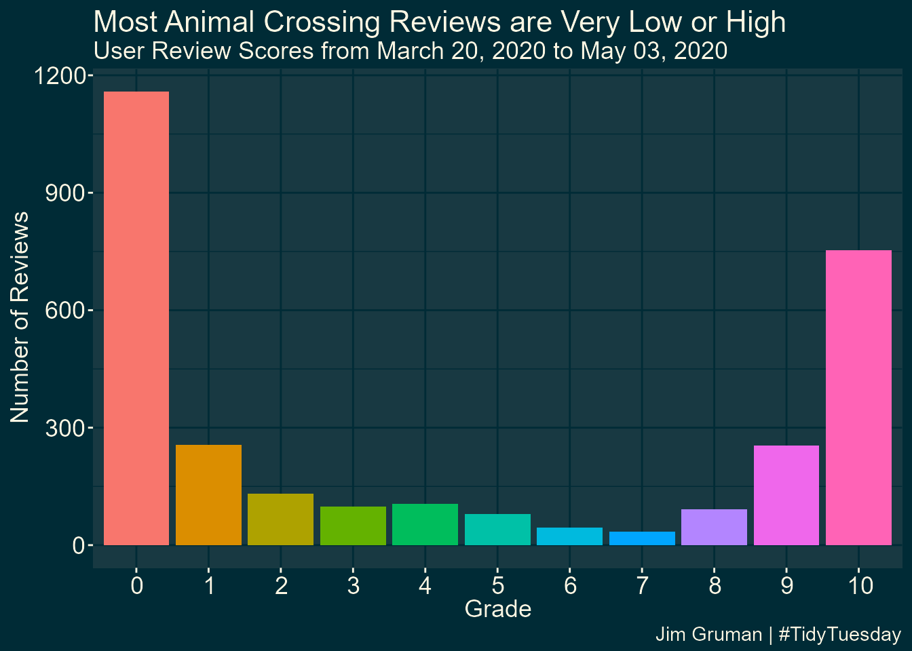
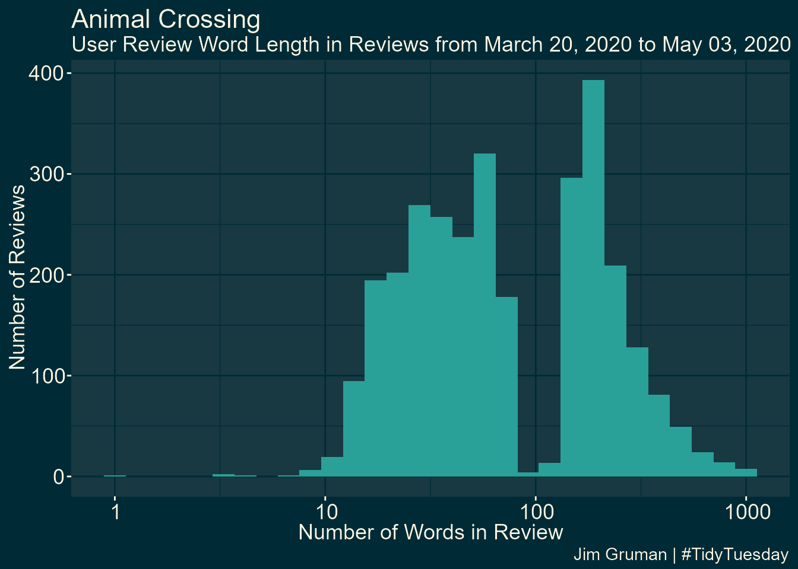
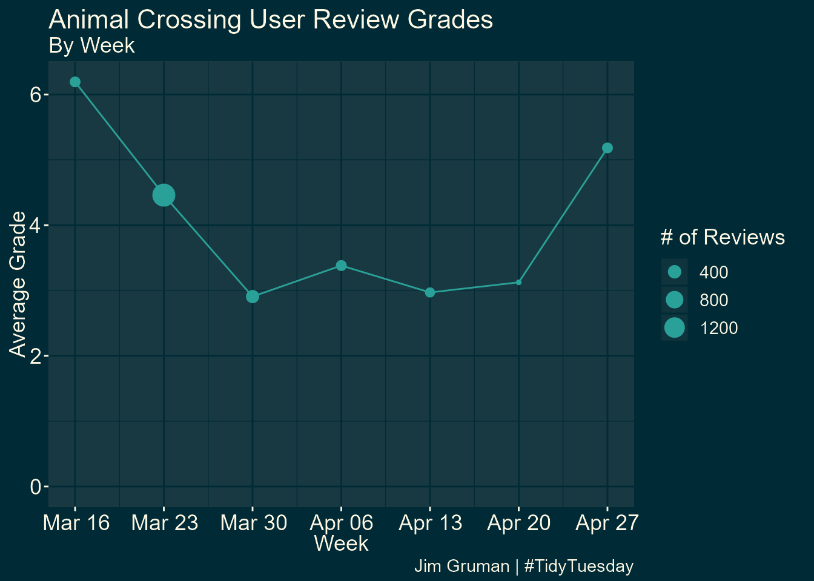
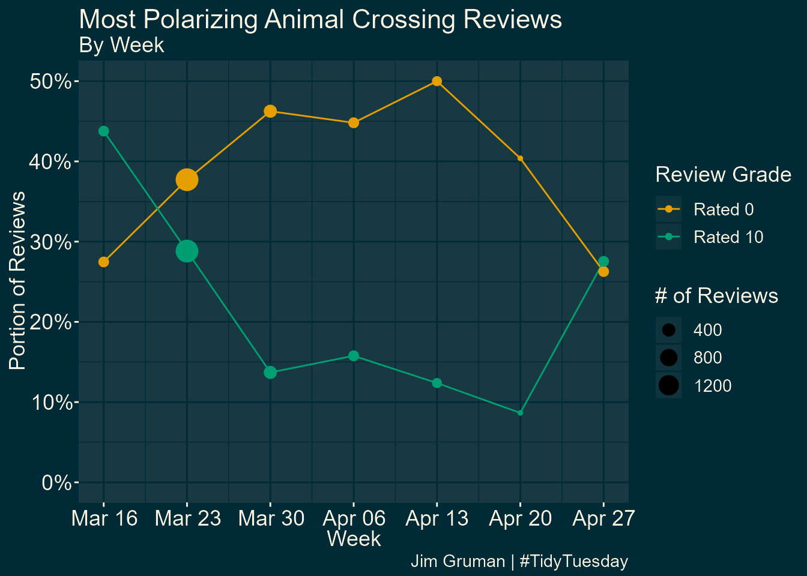
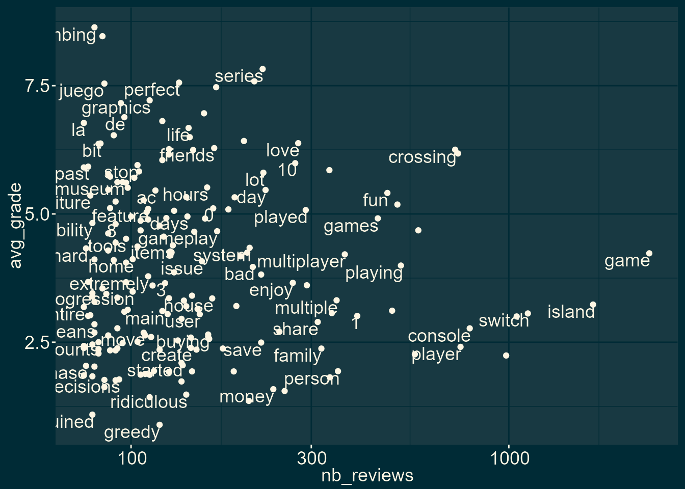
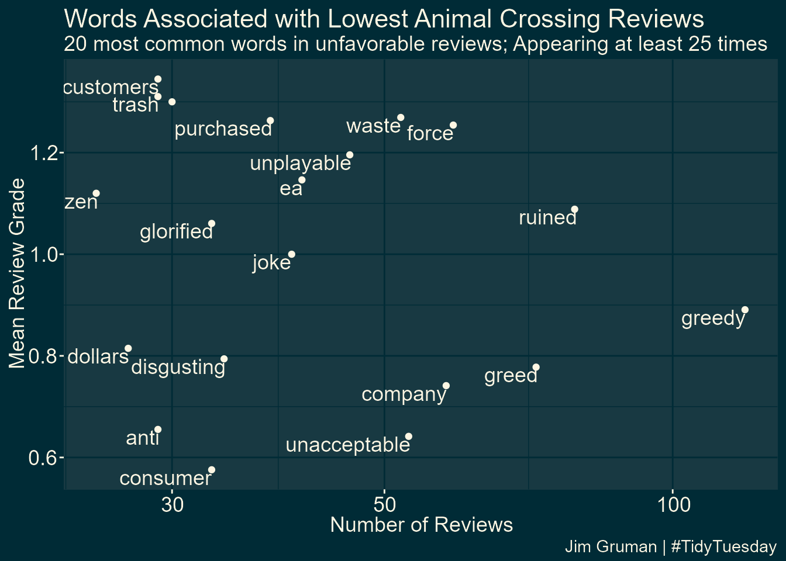
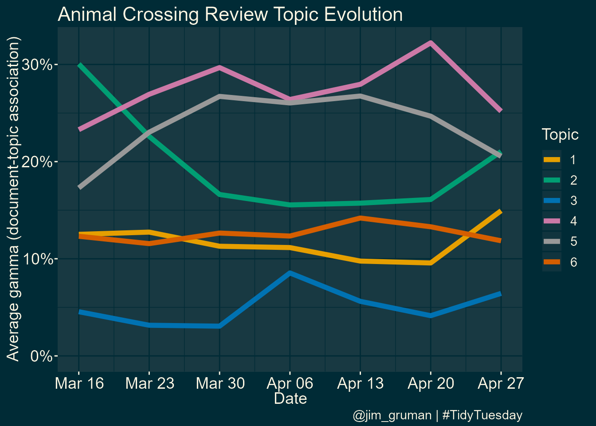
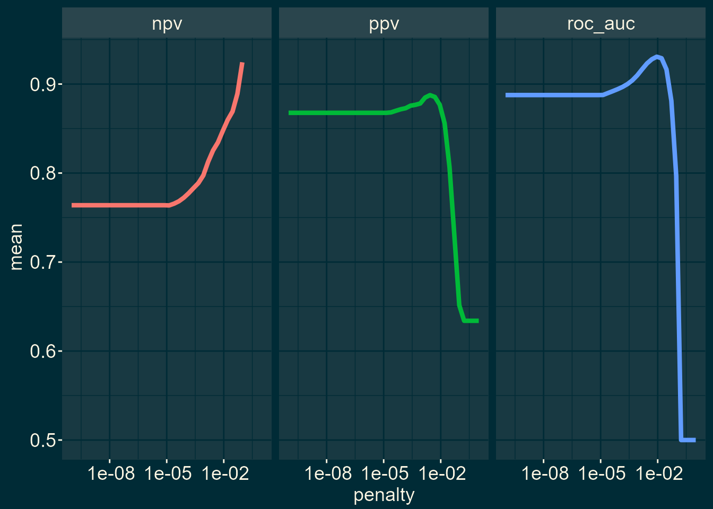
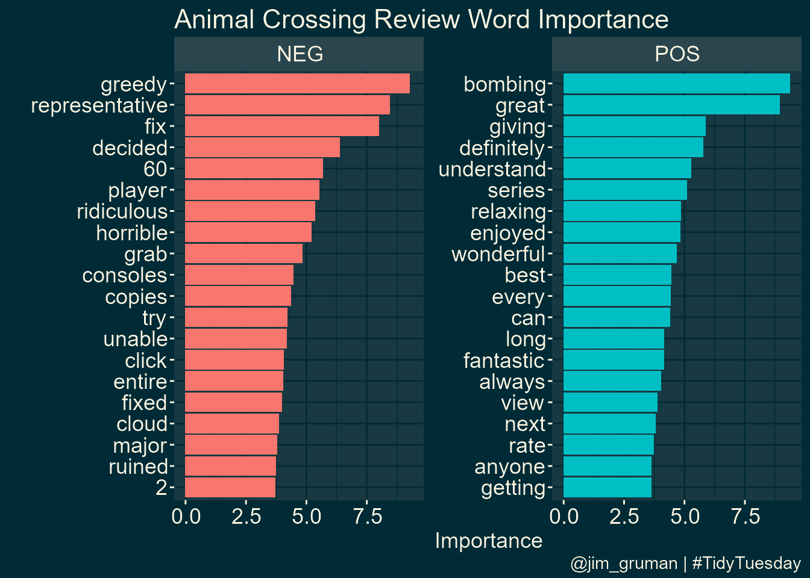

Animal Crossing Sentiment Analysis
================
Jim Gruman
12 May 2020

Our goal this week is to explore and predict ratings for [Animal
Crossing user reviews in this week’s \#TidyTuesday
dataset](https://github.com/rfordatascience/tidytuesday/blob/master/data/2020/2020-05-05/readme.md)
from the text in the review. This is what is typically called a
sentiment analysis modeling, and it’s a common real-world problem.

## Explore the data

``` r
library(tidyverse)

user_reviews <- readr::read_tsv("https://raw.githubusercontent.com/rfordatascience/tidytuesday/master/data/2020/2020-05-05/user_reviews.tsv")

user_reviews %>%
  count(grade) %>%
  ggplot(aes(factor(grade), n)) +
  geom_col(aes(fill = factor(grade)),
           show.legend = FALSE)+
  labs(title = "Most Animal Crossing Reviews are Very Low or High",
       subtitle = paste0("User Review Scores from ",format(min(user_reviews$date),"%B %d, %Y")
                                        ," to ",
                         format(max(user_reviews$date),"%B %d, %Y")),
       caption = "Jim Gruman | #TidyTuesday" ,
       x = "Grade", y = "Number of Reviews")
```

<!-- -->

This phenomenon is common in surveys, where many people give the extreme
scores of zero and 10. This does not look like a nice distribution for
predicting a not-really-continuous quantity like grade, so we’ll convert
these user scores to a label, good vs. bad user reviews, and build a
classification model. A common theme for the negative reviews is
frustration with the one-island-per-console setup, and more specifically
the relative roles of player 1 vs. others on the same console.

There is definitely evidence of scraping problems when looking at the
review text. Let’s remove at least the final “Expand” from the reviews,
and create a new categorical rating variable.

``` r
reviews_parsed <- user_reviews %>%
  mutate(text = str_remove(text, "Expand$")) %>%
  mutate(rating = case_when(
    grade > 7 ~ "good",
    TRUE ~ "bad"
  )) 
```

What is the distribution of words per review?

``` r
library(tidytext)
library(lubridate)

reviews_parsed %>%
  unnest_tokens(word, text) %>%
  count(user_name, name = "total_words") %>%
  ggplot(aes(total_words)) +
  geom_histogram(fill = "#2AA198", bins = 30)+
  scale_x_log10()+
  labs(title = "Animal Crossing",
       subtitle = paste0("User Review Word Length in Reviews from ",format(min(user_reviews$date),"%B %d, %Y")
                                        ," to ",
                         format(max(user_reviews$date),"%B %d, %Y")),
       caption = "Jim Gruman | #TidyTuesday" ,
       x = "Number of Words in Review", y = "Number of Reviews")
```

<!-- -->

After a cursory inspection of the text of the reviews, there are some
where the author pasted the same phrase into the field verbatim several
times. We will filter out the repeats above 3x in the modeling dataset.

Let’s take a look at how the reviews evolve over time:

``` r
by_week <-reviews_parsed %>%
  group_by(week = floor_date(date, "week", week_start = 1)) %>%
  summarize(nb_reviews = n(),
            avg_grade = mean(grade),
            pct_zero = mean(grade == 0),
            pct_ten = mean(grade ==10)) 

by_week %>% 
  ggplot(aes(week, avg_grade)) +
  geom_line(color = "#2AA198")+
  geom_point(aes(size = nb_reviews), color = "#2AA198")+
  expand_limits(y = 0)+
  scale_x_date(date_labels = "%b %d", date_breaks = "1 week")+
  labs(x = "Week", y = "Average Grade",
       size = "# of Reviews",
       title = "Animal Crossing User Review Grades",
       subtitle = paste0("By Week"),
       caption = "Jim Gruman | #TidyTuesday" )
```

<!-- -->

``` r
by_week %>% 
  gather(type, value, contains("pct")) %>%
  mutate(type = ifelse(type == "pct_zero", "Rated 0", "Rated 10")) %>%
  ggplot(aes(week, value, color = type)) +
  geom_line()+
  geom_point(aes(size = nb_reviews))+
  expand_limits(y = 0)+
  scale_y_continuous(labels = scales::percent_format(accuracy = 1))+
  scale_x_date(date_labels = "%b %d", date_breaks = "1 week")+
  labs(x = "Week", y = "Portion of Reviews",
       size = "# of Reviews",
       title = "Most Polarizing Animal Crossing Reviews",
       color = "Review Grade",
       subtitle = paste0("By Week"),
       caption = "Jim Gruman | #TidyTuesday" )
```

<!-- -->

For further topic modeling, we will remove the stop words and excessive
copy-pasting within each review document.

``` r
user_review_words<-reviews_parsed %>%
  unnest_tokens(word, text) %>%
  anti_join(stop_words, by = "word") %>%
  group_by(user_name, word) %>%
  mutate(id = row_number()) %>%
  filter(id < 4) %>%
  ungroup() %>%
  count(user_name, date, grade, word)
```

What are the words that are positively or negatively associated with
each user grade?

``` r
by_word<-user_review_words %>%
  group_by(word) %>%
  summarize(avg_grade = mean(grade),
            nb_reviews = n()) %>%
  filter(nb_reviews >= 25) %>%
  arrange(desc(avg_grade)) 

by_word%>%
  filter(nb_reviews >= 75) %>%
  ggplot(aes(nb_reviews, avg_grade))+
  geom_point()+
  geom_text(aes(label = word),
            vjust = 1, hjust =1, check_overlap = TRUE) +
  scale_x_log10()
```

<!-- -->

To make a nice chart, let’s zoom in on the 20 words associated with the
lowest Review Grades:

``` r
by_word %>%
  top_n(20, -avg_grade) %>%
  ggplot(aes(nb_reviews, avg_grade))+
  geom_point()+
  geom_text(aes(label = word),
            vjust = 1, hjust =1, check_overlap = TRUE) +
  scale_x_log10()+
  labs(x = "Number of Reviews", y = "Mean Review Grade",
       title = "Words Associated with Lowest Animal Crossing Reviews",
       subtitle = "20 most common words in unfavorable reviews; Appearing at least 25 times",
       caption = "Jim Gruman | #TidyTuesday" )
```

<!-- -->

The `stm` Structural Topic Model package offers unsupervised approaches
to building clusters of topics, their relationships with documents, and
their relationships with words.

We will arbitrarily choose to cluster here into 6 topics.

``` r
library(tidyr)
library(stm)

review_matrix <-user_review_words %>%
  group_by(word) %>%
  filter(n() >= 25) %>%
  cast_sparse(user_name, word, n)

topic_model <- stm(review_matrix, 
                   K = 6,
                   verbose = FALSE, 
                   init.type = "Spectral"
                   )
```

We can plot the words most highly associated with each of 6 topics:

``` r
tidy(topic_model) %>%
  group_by(topic) %>%
  top_n(10, beta) %>%
  ggplot(aes(beta, reorder_within(term, by = beta, within = topic),fill = factor(topic)))+
  geom_col(show.legend = FALSE)+
  tidytext::scale_y_reordered()+
  facet_wrap(~ topic, scales = "free_y")+
  labs(x = "beta",
       y = "Word Tokens",
       title = "Animal Crossing Review Topics",
       caption = "@jim_gruman | #TidyTuesday")+
  theme(axis.text.x.bottom = element_text(size = 8),
        plot.margin = unit(c(c(1, 1, 1, 0.5)), units="cm"))
```

<!-- -->

Is there a correlation between the document gamma and the grade that the
reviewer gave? We will use the Spearman Correlation, which is sensitive
to the ranks of the items. And once again, we will examine how each
topic is represented over time.

``` r
topic_model_gamma <-tidy(topic_model, matrix = "gamma") %>%
  mutate(user_name = rownames(review_matrix)[document])  %>%
    inner_join(user_reviews, by = "user_name")

topic_model_gamma %>%
  group_by(topic) %>%
  summarize(spearman_correlation = cor(gamma, grade, method = "spearman")) %>%
  knitr::kable()
```

| topic | spearman\_correlation |
| ----: | --------------------: |
|     1 |             0.4214898 |
|     2 |             0.5652946 |
|     3 |             0.2873774 |
|     4 |           \-0.5849657 |
|     5 |           \-0.6001275 |
|     6 |             0.1519181 |

``` r
topic_model_gamma %>%
  group_by(week = floor_date(date, "week", week_start = 1),
           topic) %>%
  summarize(avg_gamma= mean(gamma)) %>%
  ggplot(aes(week, avg_gamma, color = factor(topic)))+
  geom_line(size = 2) +
  expand_limits(y = 0)+
  scale_y_continuous(labels = scales::percent_format(accuracy = 1))+
  scale_x_date(date_labels = "%b %d", date_breaks = "1 week")+
  labs(x = "Date", color = "Topic",
       y = "Average gamma (document-topic association)",
       title = "Animal Crossing Review Topic Evolution",
       caption = "@jim_gruman | #TidyTuesday")
```

<!-- -->

## Build a Model

We start by loading the tidymodels metapackage, and splitting our data
into training and testing sets.

``` r
library(tidymodels)

review_split <- initial_split(reviews_parsed, strata = rating)
review_train <- training(review_split)
review_test <- testing(review_split)
```

Next, let’s preprocess the data to get it ready for modeling. We can use
specialized steps from textrecipes, along with the general recipe steps.

``` r
library(textrecipes)

review_rec <- recipe(rating ~ text, data = review_train) %>%
  step_tokenize(text) %>%
  step_stopwords(text) %>%
  step_tokenfilter(text, max_tokens = 500) %>%
  step_tfidf(text) %>%
  step_normalize(all_predictors())

review_prep <- prep(review_rec)

review_prep
```

    ## Data Recipe
    ## 
    ## Inputs:
    ## 
    ##       role #variables
    ##    outcome          1
    ##  predictor          1
    ## 
    ## Training data contained 2250 data points and no missing data.
    ## 
    ## Operations:
    ## 
    ## Tokenization for text [trained]
    ## Stop word removal for text [trained]
    ## Text filtering for text [trained]
    ## Term frequency-inverse document frequency with text [trained]
    ## Centering and scaling for tfidf_text_0, tfidf_text_1, ... [trained]

Let’s walk through the steps in this recipe, which are sensible defaults
for a first attempt at training a text classification model such as a
sentiment analysis model.

  - First, we must tell the `recipe()` what our model is going to be
    (using a formula here) and what data we are using.

  - Next, we tokenize our text, with the default tokenization into
    single words.

  - Next, we remove stop words (again, just the default set).

  - It wouldn’t be practical to keep all the tokens from this whole
    dataset in our model, so we can filter down to only keep, in this
    case, the top 500 most-used tokens (after removing stop words). This
    is a pretty dramatic cut and keeping more tokens would be a good
    next step in improving this model.

  - We need to decide on some kind of weighting for these tokens next,
    either something like term frequency or, what we used here, tf-idf.
    \`

  - Finally, we center and scale (i.e. normalize) all the newly created
    tf-idf values because the model we are going to use is sensitive to
    this.

Before using `prep()` these steps have been defined but not actually run
or implemented. The `prep()` function is where everything gets
evaluated.

Now it’s time to specify our model. Here we can set up the model
specification for lasso regression with `penalty = tune()` since we
don’t yet know the best value for the regularization parameter and
mixture = 1 for lasso. The lasso is often a good baseline for text
modeling.

I am using a `workflow()` in this example for convenience; these are
objects that can help you manage modeling pipelines more easily, with
pieces that fit together like Lego blocks. This `workflow()` contains
both the recipe and the model.

``` r
lasso_spec <- logistic_reg(penalty = tune(), mixture = 1) %>%
  set_engine("glmnet")

lasso_wf <- workflow() %>%
  add_recipe(review_rec) %>%
  add_model(lasso_spec)

lasso_wf
```

    ## == Workflow ==================================================================
    ## Preprocessor: Recipe
    ## Model: logistic_reg()
    ## 
    ## -- Preprocessor --------------------------------------------------------------
    ## 5 Recipe Steps
    ## 
    ## * step_tokenize()
    ## * step_stopwords()
    ## * step_tokenfilter()
    ## * step_tfidf()
    ## * step_normalize()
    ## 
    ## -- Model ---------------------------------------------------------------------
    ## Logistic Regression Model Specification (classification)
    ## 
    ## Main Arguments:
    ##   penalty = tune()
    ##   mixture = 1
    ## 
    ## Computational engine: glmnet

### Tune model parameters

Let’s get ready to `tune` the lasso model\! First, we need a set of
possible regularization parameters to try.

``` r
lambda_grid <- grid_regular(penalty(), levels = 40)
```

Next, we need a set of resampled data to fit and evaluate all these
models.

``` r
review_folds <- bootstraps(review_train, strata = rating)
review_folds
```

    ## # Bootstrap sampling using stratification 
    ## # A tibble: 25 x 2
    ##    splits             id         
    ##    <named list>       <chr>      
    ##  1 <split [2.2K/841]> Bootstrap01
    ##  2 <split [2.2K/841]> Bootstrap02
    ##  3 <split [2.2K/848]> Bootstrap03
    ##  4 <split [2.2K/848]> Bootstrap04
    ##  5 <split [2.2K/817]> Bootstrap05
    ##  6 <split [2.2K/827]> Bootstrap06
    ##  7 <split [2.2K/846]> Bootstrap07
    ##  8 <split [2.2K/810]> Bootstrap08
    ##  9 <split [2.2K/797]> Bootstrap09
    ## 10 <split [2.2K/835]> Bootstrap10
    ## # ... with 15 more rows

Now we can put it all together and implement the tuning. We can set
specific metrics to compute during tuning with `metric_set()`. Let’s
look at AUC, positive predictive value, and negative predictive value so
we can understand if one class is harder to predict than another.

``` r
lasso_grid <- tune::tune_grid(
  lasso_wf,
  resamples = review_folds,
  grid = lambda_grid,
  metrics = yardstick::metric_set(yardstick::roc_auc, yardstick::ppv, yardstick::npv)
)
```

Once we have our tuning results, we can examine them in detail.

``` r
lasso_grid %>%
  collect_metrics()
```

    ## # A tibble: 120 x 6
    ##     penalty .metric .estimator  mean     n std_err
    ##       <dbl> <chr>   <chr>      <dbl> <int>   <dbl>
    ##  1 1.00e-10 npv     binary     0.764    25 0.00396
    ##  2 1.00e-10 ppv     binary     0.868    25 0.00238
    ##  3 1.00e-10 roc_auc binary     0.888    25 0.00234
    ##  4 1.80e-10 npv     binary     0.764    25 0.00396
    ##  5 1.80e-10 ppv     binary     0.868    25 0.00238
    ##  6 1.80e-10 roc_auc binary     0.888    25 0.00234
    ##  7 3.26e-10 npv     binary     0.764    25 0.00396
    ##  8 3.26e-10 ppv     binary     0.868    25 0.00238
    ##  9 3.26e-10 roc_auc binary     0.888    25 0.00234
    ## 10 5.88e-10 npv     binary     0.764    25 0.00396
    ## # ... with 110 more rows

Visualization is often more helpful to understand model performance.

``` r
lasso_grid %>%
  collect_metrics() %>%
  ggplot(aes(penalty, mean, color = .metric)) +
  geom_line(size = 1.5, show.legend = FALSE) +
  facet_wrap(~.metric) +
  scale_x_log10()
```

    ## Error in get(S3[i, 1L], mode = "function", envir = parent.frame()) : 
    ##   invalid first argument

<!-- -->

This shows us a lot. We see clearly that AUC and PPV have benefited from
the regularization and we could identify the best value of penalty for
each of those metrics. The same is not true for NPV. One class (the
happy comments) is harder to predict than the other. It might be worth
including more tokens in our model, based on this plot.

### Choose the final model

Let’s keep our model as is for now, and choose a final model based on
AUC. We can use `select_best()` to find the best AUC and then update our
workflow lasso\_wf with this value.

``` r
#best_auc <- lasso_grid %>%
#  select_best(metric = "roc_auc")

best_auc <- lasso_grid %>%
  collect_metrics() %>%
  filter(.metric == "roc_auc") %>%
  top_n(1, wt = mean) %>%
  select(penalty)

best_auc
```

    ## # A tibble: 1 x 1
    ##   penalty
    ##     <dbl>
    ## 1 0.00889

``` r
final_lasso <- finalize_workflow(lasso_wf, best_auc)

final_lasso
```

    ## == Workflow ==================================================================
    ## Preprocessor: Recipe
    ## Model: logistic_reg()
    ## 
    ## -- Preprocessor --------------------------------------------------------------
    ## 5 Recipe Steps
    ## 
    ## * step_tokenize()
    ## * step_stopwords()
    ## * step_tokenfilter()
    ## * step_tfidf()
    ## * step_normalize()
    ## 
    ## -- Model ---------------------------------------------------------------------
    ## Logistic Regression Model Specification (classification)
    ## 
    ## Main Arguments:
    ##   penalty = 0.00888623816274339
    ##   mixture = 1
    ## 
    ## Computational engine: glmnet

This is our tuned, finalized workflow (but it is not fit yet). One of
the things we can do when we start to fit this finalized workflow on the
whole training set is to see what the most important variables are using
the `vip` package.

``` r
library(vip)

final_lasso %>%
  fit(review_train) %>%
  pull_workflow_fit() %>%
  vi(lambda = best_auc$penalty) %>%
  group_by(Sign) %>%
  top_n(20, wt = abs(Importance)) %>%
  ungroup() %>%
  mutate(
    Importance = abs(Importance),
    Variable = str_remove(Variable, "tfidf_text_"),
    Variable = fct_reorder(Variable, Importance)
  ) %>%
  ggplot(aes(x = Importance, y = Variable, fill = Sign)) +
  geom_col(show.legend = FALSE) +
  facet_wrap(~Sign, scales = "free_y") +
  labs(y = NULL)+
  labs(title = "Animal Crossing Review Word Importance",
       caption = "@jim_gruman | #TidyTuesday")
```

    ## Error in get(S3[i, 1L], mode = "function", envir = parent.frame()) : 
    ##   invalid first argument

<!-- -->

People who are happy with Animal Crossing like to talk about how
relaxing, fantastic, enjoyable, and great it is, and also talk in their
reviews about the “review bombing” of the negative reviews. Notice that
many of the words from the negative reviews are specifically used to
talk about the multiplayer experience. These users want a fix and they
declare Nintendo greedy for the one-island-per-console play.

Finally, let’s return to our test data. The `tune` package has a
function `last_fit()` which is nice for situations when you have tuned
and finalized a model or workflow and want to fit it one last time on
your training data and evaluate it on your testing data. You only have
to pass this function your finalized model/workflow and your split.

``` r
review_final <- last_fit(final_lasso, review_split)

review_final %>%
  collect_metrics()
```

    ## # A tibble: 2 x 3
    ##   .metric  .estimator .estimate
    ##   <chr>    <chr>          <dbl>
    ## 1 accuracy binary         0.870
    ## 2 roc_auc  binary         0.938

We did not overfit during our tuning process, and the overall accuracy
is not bad. Let’s create a confusion matrix for the testing data.

``` r
review_final %>%
  collect_predictions() %>%
  conf_mat(rating, .pred_class)
```

    ##           Truth
    ## Prediction bad good
    ##       bad  433   55
    ##       good  42  219

Though our overall accuracy isn’t great, we discover here that it is
easier to detect the negative reviews than the positive ones.
