BeerProduction
================
Jim Gruman
`Sys.Date`

``` r
library(tidyverse)   
library(lubridate)
library(tidymetrics)
library(viridis)  
library(GGally)      
library(gghighlight) 
library(Cairo)      
library(tidymodels)
theme_set(theme_minimal())
```

## Import this week’s data

``` r
brewing_materials <- readr::read_csv('https://raw.githubusercontent.com/rfordatascience/tidytuesday/master/data/2020/2020-03-31/brewing_materials.csv') %>%
    mutate(date = ymd(paste0(year, "/", month, "/1"))) 
beer_taxed <- readr::read_csv('https://raw.githubusercontent.com/rfordatascience/tidytuesday/master/data/2020/2020-03-31/beer_taxed.csv')
brewer_size <- readr::read_csv('https://raw.githubusercontent.com/rfordatascience/tidytuesday/master/data/2020/2020-03-31/brewer_size.csv')
beer_states <- readr::read_csv('https://raw.githubusercontent.com/rfordatascience/tidytuesday/master/data/2020/2020-03-31/beer_states.csv')
```

## Exploration

``` r
skimr::skim(beer_states)
# 19 year/states with missing barrels

skimr::skim(brewing_materials)
table(brewing_materials$type)
# opportunity to examine the proportional trends of Corn vresus Sugar/syrups use

skimr::skim(beer_taxed)

skimr::skim(brewer_size)
table(brewer_size$brewer_size)
```

Total all barrels produced by state per year (regardless of type)

``` r
all_barrels <-
  beer_states %>%
  na.omit() %>%
  filter(state != 'total') %>%
  group_by(state, year) %>%
  summarise(barrels = sum(barrels))
```

The top 5 states with largest increase in barrels from 2008 to 2019

``` r
increase_states <-
  all_barrels %>%
  mutate(total_barrels = cumsum(barrels)) %>%
  filter(year %in% c(2008, 2019)) %>%
  mutate(pct_chg = (total_barrels - lag(total_barrels)) / lag(total_barrels)) %>%
  ungroup() %>%
  top_n(5, pct_chg) %>%
  pull(state)     # Alabama, Connecticut, North Dakota, Rhode Island, Tennesee
```

``` r
#Lets get the state names
states <- tibble(state = state.abb, state_name = state.name)

beer_df <- 
  beer_states %>%
  na.omit() %>%
  filter(state != 'total') %>%
  group_by(state, year) %>%
  summarise(barrels = sum(barrels)) %>%
  mutate(total_barrels = cumsum(barrels)) %>%
  left_join(states, by = 'state')
```

Lets have a look at the materials trends. What ingredients are used in
beer production?

``` r
brewing_materials %>%
  filter(!str_detect(material_type, "Total"),
         !(month == 12 & year %in% 2014:2015)) %>%  # remove the subtotals) %>%
  filter(date == max(date)) %>%
  mutate(type = fct_reorder(type, month_current)) %>%
  ggplot(aes(type, month_current/1000000, fill =  type)) +
  geom_col()+
  scale_y_continuous(breaks = scales::pretty_breaks()) +
  coord_flip()+
  theme(plot.title.position = "plot",
        legend.position = "")+
  viridis::scale_color_viridis(discrete = TRUE)  +
  labs(
    x = 'Ingredient',
    y = 'Million Pounds',
    title = 'Ingredients in US Beer Production, in the month of December 2019',
    subtitle = 'US Alcohol and Tobacco Tax and Trade Bureau',
    caption = '@Jim_Gruman | #TidyTuesday'
  )
```

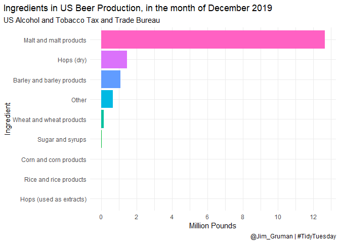<!-- -->

``` r
brewing_materials %>%
  filter(!str_detect(type, "Total"), year < 2016,
         !(month == 12 & year %in% 2014:2015)) %>%  # remove the subtotals
  ggplot(aes(date, month_current/1000000, color= type)) +
  geom_line()+
  viridis::scale_color_viridis(discrete = TRUE) +
    labs(
    x = 'Date',
    y = 'Million Pounds',
    color = "Material",
    title = 'Ingredients in US Beer Production, 2008-2016',
    subtitle = 'US Alcohol and Tobacco Tax and Trade Bureau',
    caption = '@Jim_Gruman | #TidyTuesday'
  )
```

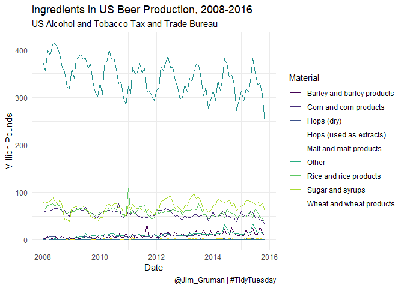<!-- -->

Tidymetrics

``` r
brewing_summarized <-brewing_materials %>%
  rename(material = type) %>%
  filter(!str_detect(material_type, "Total"), year < 2016) %>%
  cross_by_dimensions(material_type, material) %>%  # duplicates the data to summarize it
  cross_by_periods(c("month","quarter","year")) %>%
  summarize(total_pounds = sum(month_current)) %>%
  ungroup()
```

    ## Warning: The `add` argument of `group_by()` is deprecated as of dplyr 1.0.0.
    ## Please use the `.add` argument instead.
    ## This warning is displayed once every 8 hours.
    ## Call `lifecycle::last_warnings()` to see where this warning was generated.

``` r
brewing_summarized %>%
  filter(material_type != "All", material != "All", period == "month") %>%
  ggplot(aes(date, total_pounds/1000000, color = material))+
  geom_line()+
  viridis::scale_color_viridis(discrete = TRUE) +
    labs(
    x = 'Date',
    y = 'Million Pounds',
    color = "Material",
    title = 'Ingredients in US Beer Production, 2008-2016',
    subtitle = 'US Alcohol and Tobacco Tax and Trade Bureau',
    caption = '@Jim_Gruman | #TidyTuesday'
  )
```

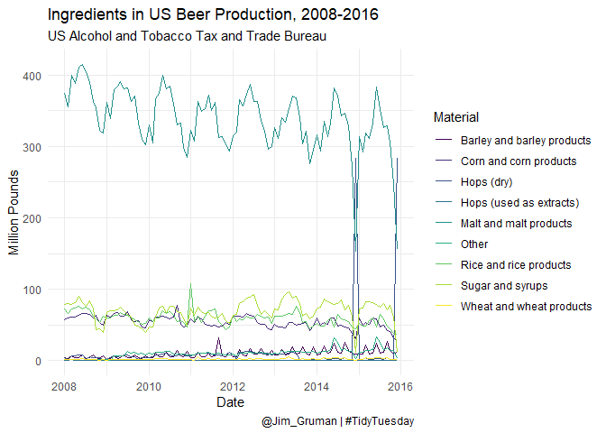<!-- -->

``` r
brewing_summarized %>%
  filter(material_type != "All", material != "All", period == "quarter") %>%
  ggplot(aes(date, total_pounds/1000000, color = material))+
  geom_line()+
  viridis::scale_color_viridis(discrete = TRUE) +
    labs(
    x = 'Date',
    y = 'Million Pounds',
    color = "Material",
    title = 'Ingredients in US Beer Production, 2008-2016',
    subtitle = 'US Alcohol and Tobacco Tax and Trade Bureau',
    caption = '@Jim_Gruman | #TidyTuesday'
  )
```

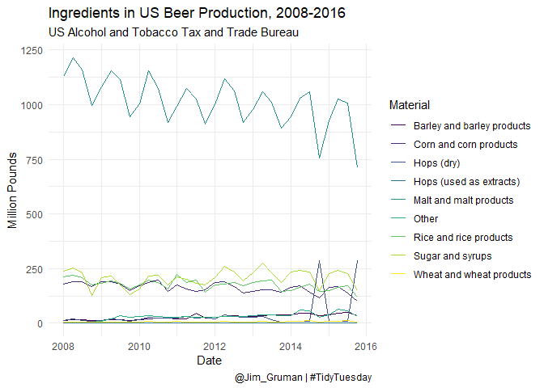<!-- -->

``` r
brewing_summarized %>%
  filter(material_type != "All", material != "All", period == "year") %>%
  ggplot(aes(date, total_pounds/1000000, color = material))+
  geom_line()+
  viridis::scale_color_viridis(discrete = TRUE) +
    labs(
    x = 'Date',
    y = 'Million Pounds',
    color = "Material",
    title = 'Ingredients in US Beer Production, 2008-2016',
    subtitle = 'US Alcohol and Tobacco Tax and Trade Bureau',
    caption = '@Jim_Gruman | #TidyTuesday'
  )  
```

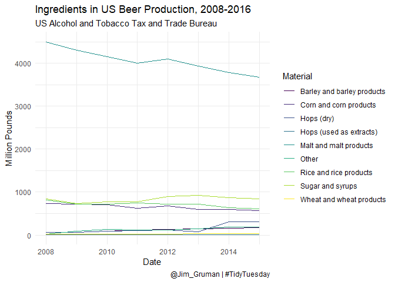<!-- -->

``` r
brewing_materials %>%
  filter(material_type == "Total Used", year < 2016) %>%
  mutate(month = factor(month, labels = month.abb)) %>%
  ggplot(aes(x= month,y=month_current/1000000, group = factor(year), color = factor(year)))+
  geom_line() +
  expand_limits(y=0) +
  viridis::scale_color_viridis(discrete = TRUE) +
    labs(x = 'Month',
    y = 'Million Pounds',
    color = "Year",
    title = 'Ingredients in US Beer Production, 2008-2016',
    subtitle = 'US Alcohol and Tobacco Tax and Trade Bureau',
    caption = '@Jim_Gruman | #TidyTuesday') +  
  scale_y_continuous(labels = scales::comma_format())   
```

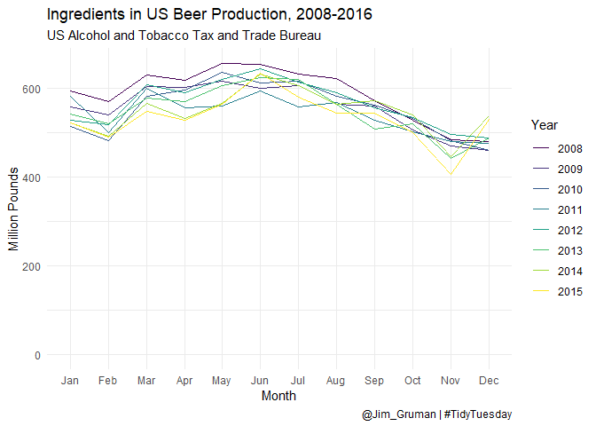<!-- -->

``` r
brewing_metrics<-create_metrics(brewing_summarized)

library(shinymetrics)

# interactive plotly visualization of grouped time multi-dimensional BI 
preview_metric(brewing_metrics$production_NA_total_pounds)
# change the dropdown from "last year" to "all time" because 2019 is not in this dataset
```

``` r
brewer_size %>%
  filter(brewer_size != "Total", !is.na(total_barrels))%>%
  mutate(brewer_size = fct_lump(brewer_size, 5, w = total_barrels),
         barrel_number = coalesce(parse_number(as.character(brewer_size)),1),
         brewer_size = fct_reorder(brewer_size, barrel_number)) %>%
  ggplot(aes(as_factor(year), total_barrels, fill = brewer_size))+
  geom_col() +
  scale_y_continuous(labels = scales::comma_format())  +
  viridis::scale_fill_viridis(discrete = TRUE) +
    labs(x = 'Year',
    y = 'Total Barrels',
    fill = "Brewer Size",
    title = 'Total Production, by US Brewer Size in 2019',
    subtitle = 'US Alcohol and Tobacco Tax and Trade Bureau',
    caption = '@Jim_Gruman | #TidyTuesday')   +
  theme(plot.title.position = "plot")
```

    ## Warning: 74 parsing failures.
    ## row col expected actual
    ##   2  -- a number  Other
    ##   5  -- a number  Other
    ##   6  -- a number  Other
    ##   7  -- a number  Other
    ##   8  -- a number  Other
    ## ... ... ........ ......
    ## See problems(...) for more details.

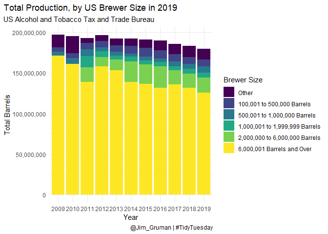<!-- -->

## Where is Beer produced?

``` r
increase_plot <-
  ggplot(beer_df, aes(year, barrels, group = state)) +
  geom_line(aes(color = state), show.legend = F) +
  gghighlight(                               
    state %in% increase_states,
    label_key = state_name,
    label_params = list(size = 3, family = 'Arial Narrow',
                        fill = 'grey95', alpha = 0.8, 
                        label.r = 0.1, segment.alpha = 0),
    unhighlighted_params = list(color = 'grey88')
  ) +
  labs(
    x = 'Year',
    y = 'Total number of barrels produced',
    title = 'States with the Largest Increase in Beer Production, 2008-2019',
    subtitle = 'US Alcohol and Tobacco Tax and Trade Bureau',
    caption = '@Jim_Gruman | #TidyTuesday'
  ) +
  scale_x_continuous(breaks = scales::pretty_breaks()) +
  scale_y_log10(labels = scales::label_number()) +
  viridis::scale_color_viridis(discrete = TRUE) +
  theme(panel.grid = element_blank(),
        panel.grid.major = element_blank(),
        plot.title.position = "plot")
```

    ## Warning: The `...` argument of `group_keys()` is deprecated as of dplyr 1.0.0.
    ## Please `group_by()` first
    ## This warning is displayed once every 8 hours.
    ## Call `lifecycle::last_warnings()` to see where this warning was generated.

``` r
ggsave(increase_plot, file = 'Increase_StateBeerProd.png', type = 'cairo')
```

    ## Saving 7 x 5 in image

``` r
beer_states %>%
  count(type, sort = TRUE, wt = barrels)
```

    ## # A tibble: 3 x 2
    ##   type                       n
    ## * <chr>                  <dbl>
    ## 1 Bottles and Cans 3790640995.
    ## 2 Kegs and Barrels  413060363.
    ## 3 On Premises        32942944.

``` r
beer_states %>%
  group_by(year) %>%
  summarize(barrels = sum(barrels, na.rm = TRUE))
```

    ## # A tibble: 12 x 2
    ##     year    barrels
    ##  * <dbl>      <dbl>
    ##  1  2008 369365660.
    ##  2  2009 366722996 
    ##  3  2010 362423267.
    ##  4  2011 356149025.
    ##  5  2012 360802673.
    ##  6  2013 356172814.
    ##  7  2014 354773849.
    ##  8  2015 352082099.
    ##  9  2016 348860505.
    ## 10  2017 341358612.
    ## 11  2018 333778335.
    ## 12  2019 334154466.

``` r
# Who consumes beer on premises?

beer_states %>%
  filter(type == "On Premises", year == max(year), state != "total")%>%
  arrange(desc(barrels))
```

    ## # A tibble: 51 x 4
    ##    state  year barrels type       
    ##    <chr> <dbl>   <dbl> <chr>      
    ##  1 CA     2019 399693. On Premises
    ##  2 NC     2019 222609. On Premises
    ##  3 TX     2019 196218. On Premises
    ##  4 FL     2019 182784. On Premises
    ##  5 CO     2019 175934. On Premises
    ##  6 VA     2019 163801. On Premises
    ##  7 NY     2019 150617. On Premises
    ##  8 WA     2019 144278. On Premises
    ##  9 OH     2019 132030. On Premises
    ## 10 MI     2019 131485. On Premises
    ## # ... with 41 more rows

``` r
beer_states %>%
  filter( year == max(year), state != "total")%>%
  group_by(state) %>%
  mutate(percent = barrels / sum(barrels)) %>%
  filter(type == "On Premises") %>%
  arrange(desc(percent))
```

    ## # A tibble: 51 x 5
    ## # Groups:   state [51]
    ##    state  year barrels type        percent
    ##    <chr> <dbl>   <dbl> <chr>         <dbl>
    ##  1 ND     2019  10219. On Premises   0.982
    ##  2 OK     2019  21129. On Premises   0.925
    ##  3 SD     2019   9386. On Premises   0.722
    ##  4 WV     2019   8302. On Premises   0.673
    ##  5 AL     2019  47160. On Premises   0.659
    ##  6 SC     2019  53161. On Premises   0.625
    ##  7 IA     2019  61429. On Premises   0.560
    ##  8 MS     2019  11912. On Premises   0.555
    ##  9 DC     2019  16348. On Premises   0.547
    ## 10 AR     2019  16569. On Premises   0.542
    ## # ... with 41 more rows

``` r
beer_states %>%
  filter( year == max(year), state != "total")%>%
  group_by(state) %>%
  mutate(percent = barrels / sum(barrels)) %>%
  filter(type == "Bottles and Cans") %>%
  arrange(desc(percent))
```

    ## # A tibble: 51 x 5
    ## # Groups:   state [51]
    ##    state  year   barrels type             percent
    ##    <chr> <dbl>     <dbl> <chr>              <dbl>
    ##  1 TN     2019  2641268. Bottles and Cans   0.965
    ##  2 GA     2019 12855949. Bottles and Cans   0.959
    ##  3 MO     2019 11393002. Bottles and Cans   0.936
    ##  4 TX     2019 16934638. Bottles and Cans   0.931
    ##  5 NY     2019  7720585. Bottles and Cans   0.928
    ##  6 OH     2019 16176334. Bottles and Cans   0.915
    ##  7 CO     2019 17351292. Bottles and Cans   0.909
    ##  8 WI     2019  8353029. Bottles and Cans   0.905
    ##  9 VA     2019 12829544. Bottles and Cans   0.905
    ## 10 NH     2019  2276766. Bottles and Cans   0.877
    ## # ... with 41 more rows

``` r
beer_states %>%
  filter( year == max(year), state != "total")%>%
  group_by(state) %>%
  mutate(percent = barrels / sum(barrels)) %>%
  filter(type == "Kegs and Barrels") %>%
  arrange(desc(percent))
```

    ## # A tibble: 51 x 5
    ## # Groups:   state [51]
    ##    state  year barrels type             percent
    ##    <chr> <dbl>   <dbl> <chr>              <dbl>
    ##  1 ME     2019 101033. Kegs and Barrels   0.457
    ##  2 HI     2019  35112. Kegs and Barrels   0.428
    ##  3 WY     2019  18726. Kegs and Barrels   0.409
    ##  4 WA     2019 208290. Kegs and Barrels   0.385
    ##  5 ID     2019  14403. Kegs and Barrels   0.328
    ##  6 WV     2019   4017. Kegs and Barrels   0.326
    ##  7 NM     2019  37838. Kegs and Barrels   0.317
    ##  8 MA     2019 143222. Kegs and Barrels   0.316
    ##  9 AK     2019  55454. Kegs and Barrels   0.307
    ## 10 IN     2019  49086. Kegs and Barrels   0.295
    ## # ... with 41 more rows

``` r
states_percents_2019 <-beer_states %>%
  filter( year == max(year), state != "total")%>%
  group_by(state) %>%
  mutate(percent = barrels / sum(barrels)) %>%
  ungroup() 

states_percents_2019 %>%
  filter(type == "On Premises") %>%
  arrange(desc(percent))
```

    ## # A tibble: 51 x 5
    ##    state  year barrels type        percent
    ##    <chr> <dbl>   <dbl> <chr>         <dbl>
    ##  1 ND     2019  10219. On Premises   0.982
    ##  2 OK     2019  21129. On Premises   0.925
    ##  3 SD     2019   9386. On Premises   0.722
    ##  4 WV     2019   8302. On Premises   0.673
    ##  5 AL     2019  47160. On Premises   0.659
    ##  6 SC     2019  53161. On Premises   0.625
    ##  7 IA     2019  61429. On Premises   0.560
    ##  8 MS     2019  11912. On Premises   0.555
    ##  9 DC     2019  16348. On Premises   0.547
    ## 10 AR     2019  16569. On Premises   0.542
    ## # ... with 41 more rows

``` r
library(maps)
```

    ## 
    ## Attaching package: 'maps'

    ## The following object is masked from 'package:purrr':
    ## 
    ##     map

``` r
library(sf)
```

    ## Linking to GEOS 3.6.1, GDAL 2.2.3, PROJ 4.9.3

``` r
states <- st_as_sf(map("state", plot = FALSE, fill = TRUE))

states
```

    ## Simple feature collection with 49 features and 1 field
    ## geometry type:  MULTIPOLYGON
    ## dimension:      XY
    ## bbox:           xmin: -124.6813 ymin: 25.12993 xmax: -67.00742 ymax: 49.38323
    ## CRS:            EPSG:4326
    ## First 10 features:
    ##                      ID                           geom
    ## 1               alabama MULTIPOLYGON (((-87.46201 3...
    ## 2               arizona MULTIPOLYGON (((-114.6374 3...
    ## 3              arkansas MULTIPOLYGON (((-94.05103 3...
    ## 4            california MULTIPOLYGON (((-120.006 42...
    ## 5              colorado MULTIPOLYGON (((-102.0552 4...
    ## 6           connecticut MULTIPOLYGON (((-73.49902 4...
    ## 7              delaware MULTIPOLYGON (((-75.80231 3...
    ## 8  district of columbia MULTIPOLYGON (((-77.13731 3...
    ## 9               florida MULTIPOLYGON (((-85.01548 3...
    ## 10              georgia MULTIPOLYGON (((-80.89018 3...

``` r
 states_percents_2019 %>%
   mutate(ID = str_to_lower(state.name[match(state,state.abb)]))%>%
   inner_join(states, by = "ID") %>%
   ggplot()+
   scale_fill_gradient2(low = "yellow", high = "blue", midpoint = 0.5,
                        labels = scales::percent)+
   geom_sf(aes(geometry = geom, fill = percent)) +
   facet_wrap(~ type, nrow = 2)+
   ggthemes::theme_map()+
   labs(title = "In Each State, What is the Highest Proportion of Beer Consumed?",
        subtitle = 'US Alcohol and Tobacco Tax and Trade Bureau',
        caption = '@Jim_Gruman | #TidyTuesday',
        fill = "% Percent")+
   theme(legend.position = c(0.7,0.1))
```

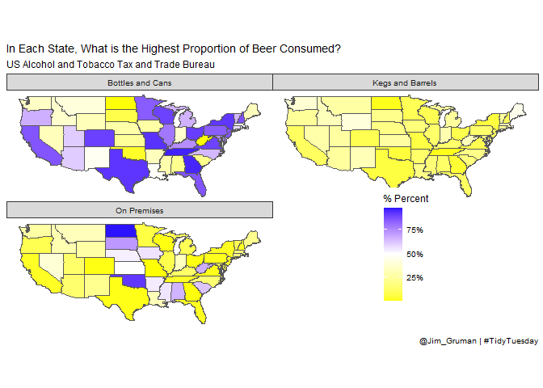<!-- -->

## An animamated map. Because it’s TidyTuesday

``` r
library(gganimate)

p<-beer_states %>%
  filter(state != "total")%>%
  group_by(state, year) %>%
  mutate(percent = barrels / sum(barrels)) %>%
  ungroup() %>%
  mutate(ID = str_to_lower(state.name[match(state, state.abb)]))%>%
  inner_join(states, by = "ID") %>%
  ggplot(aes(geometry = geom, fill = percent))+
  geom_sf() +
  transition_time(year) +
  facet_wrap(~ type, nrow = 2) +
  scale_fill_gradient2(low = "yellow", high = "blue", midpoint = 0.5,
                        labels = scales::percent) +
  ggthemes::theme_map() +
  labs(title = "In Each State, What is the Highest Proportion of Beer Consumed? {as.integer(frame_time)}",
        subtitle = 'US Alcohol and Tobacco Tax and Trade Bureau, 2008-2019',
        caption = '@Jim_Gruman | #TidyTuesday',
        fill = "% Percent")+
   theme(legend.position = c(0.7,0.1))


animate(p,  width = 900, height = 750, end_pause = 50, renderer = gifski_renderer("gganimqdodge1.gif"))
```

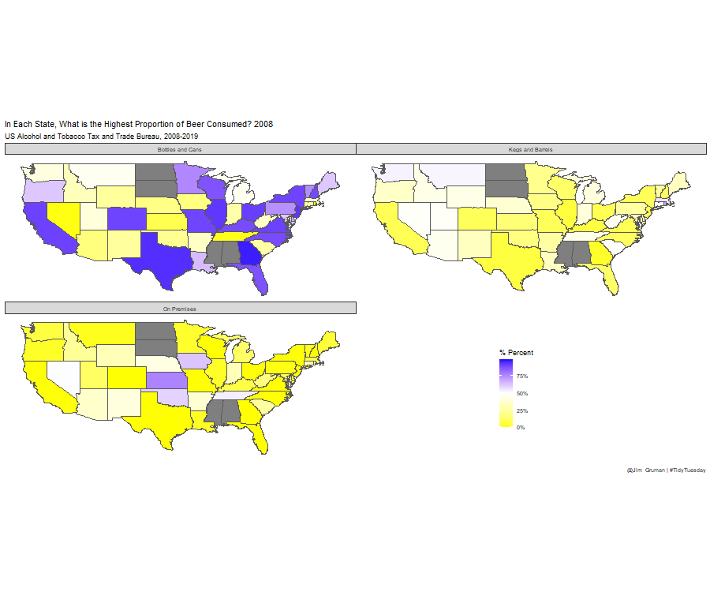<!-- -->

## What is the relationship between the materials used? (using resampling methods)

# How much sugar do beer producers need per pound of malt?

``` r
brewing_materials %>% count(type, wt = month_current,  sort = TRUE)
```

    ## # A tibble: 12 x 2
    ##    type                                 n
    ##  * <chr>                            <dbl>
    ##  1 Total Used                 53559516695
    ##  2 Total Grain products       44734903124
    ##  3 Malt and malt products     32697313882
    ##  4 Total Non-Grain products    8824613571
    ##  5 Sugar and syrups            6653104081
    ##  6 Rice and rice products      5685742541
    ##  7 Corn and corn products      5207759409
    ##  8 Hops (dry)                  1138840132
    ##  9 Other                        998968470
    ## 10 Barley and barley products   941444745
    ## 11 Wheat and wheat products     202642547
    ## 12 Hops (used as extracts)       33700888

``` r
brewing_filtered<-brewing_materials %>%
  filter(!str_detect(type, "Total"), year < 2016,
         !(month == 12 & year %in% 2014:2015))
```

``` r
brewing_df<-brewing_filtered %>%
  select(date, type, month_current) %>%
  pivot_wider(names_from = type, 
              values_from = month_current) %>%
  janitor::clean_names()

# is there a remote correlation between
brewing_df %>%
  ggplot(aes(malt_and_malt_products, sugar_and_syrups))+
  geom_smooth(method = "lm")+
  geom_point()
```

    ## `geom_smooth()` using formula 'y ~ x'

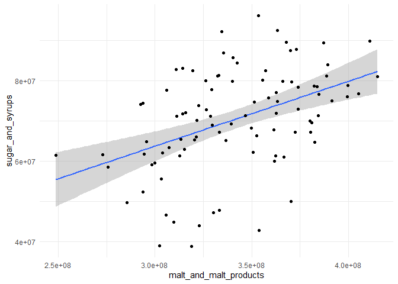<!-- -->

A simple linear model

``` r
# force the y-intercept to be zero (no beer, no malt, no sugar)
beer_fit<-lm(sugar_and_syrups ~ 0 + malt_and_malt_products, data = brewing_df)

summary(beer_fit)
```

    ## 
    ## Call:
    ## lm(formula = sugar_and_syrups ~ 0 + malt_and_malt_products, data = brewing_df)
    ## 
    ## Residuals:
    ##       Min        1Q    Median        3Q       Max 
    ## -29985291  -6468052    174001   7364462  23462837 
    ## 
    ## Coefficients:
    ##                        Estimate Std. Error t value Pr(>|t|)    
    ## malt_and_malt_products 0.205804   0.003446   59.72   <2e-16 ***
    ## ---
    ## Signif. codes:  0 '***' 0.001 '**' 0.01 '*' 0.05 '.' 0.1 ' ' 1
    ## 
    ## Residual standard error: 11480000 on 93 degrees of freedom
    ## Multiple R-squared:  0.9746, Adjusted R-squared:  0.9743 
    ## F-statistic:  3567 on 1 and 93 DF,  p-value: < 2.2e-16

``` r
tidy(beer_fit)
```

    ## # A tibble: 1 x 5
    ##   term                   estimate std.error statistic  p.value
    ##   <chr>                     <dbl>     <dbl>     <dbl>    <dbl>
    ## 1 malt_and_malt_products    0.206   0.00345      59.7 5.72e-76

## Bootstrap Resampling

to arrive at a confidence interval for a linear model

``` r
beer_boot<-bootstraps(data = brewing_df, times = 1e3, apparent = FALSE)
```

``` r
beer_models<- beer_boot %>% 
  dplyr::mutate(model = purrr::map(splits, ~ lm(sugar_and_syrups ~ 0 + malt_and_malt_products, 
                                  data = . )),
  coef_info = purrr::map(model, tidy))

beer_coefs<-beer_models %>%
     unnest(coef_info)
```

## Evaluate results

What is the distribution of the estimates for the model?

``` r
beer_coefs %>%
  ggplot(aes(estimate))+
  geom_histogram(alpha = 0.7)
```

    ## `stat_bin()` using `bins = 30`. Pick better value with `binwidth`.

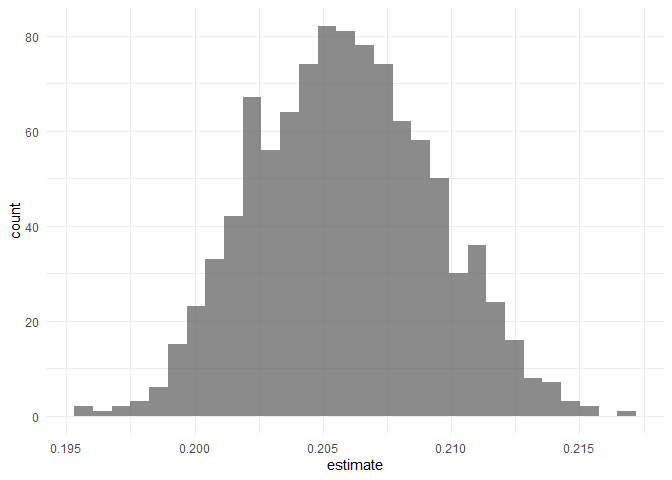<!-- -->

Our bootstrap confidence intervals:

``` r
int_pctl(beer_models, coef_info)
```

    ## # A tibble: 1 x 6
    ##   term                   .lower .estimate .upper .alpha .method   
    ##   <chr>                   <dbl>     <dbl>  <dbl>  <dbl> <chr>     
    ## 1 malt_and_malt_products  0.200     0.206  0.213   0.05 percentile

``` r
beer_aug<-beer_models %>%
  dplyr::mutate(augmented = purrr::map(model, augment)) %>%
  unnest(augmented)

beer_aug %>%
  ggplot(aes(malt_and_malt_products, sugar_and_syrups))+
  geom_line(aes(y=.fitted, group = id), alpha = 0.1, color = "cyan3")+
  geom_point()+
  labs(title = "Bootstrap Resampling Model Estimates Confidence Interval")
```

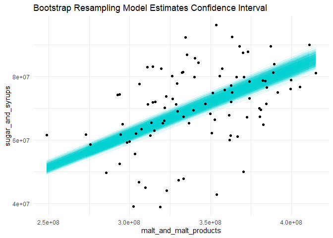<!-- -->
