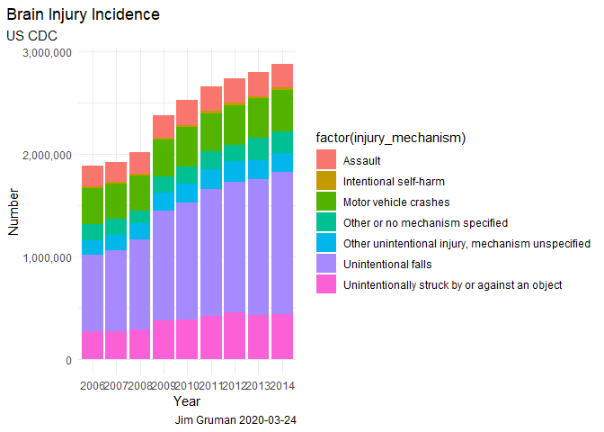
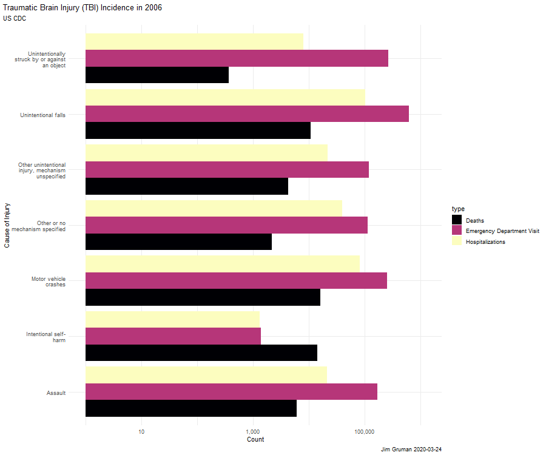

Brain Injury
================
Jim Gruman
2020-03-24

## R Markdown

``` r
# Get the Data

tbi_age <- readr::read_csv('https://raw.githubusercontent.com/rfordatascience/tidytuesday/master/data/2020/2020-03-24/tbi_age.csv')
```

    ## Parsed with column specification:
    ## cols(
    ##   age_group = col_character(),
    ##   type = col_character(),
    ##   injury_mechanism = col_character(),
    ##   number_est = col_double(),
    ##   rate_est = col_double()
    ## )

``` r
tbi_year <- readr::read_csv('https://raw.githubusercontent.com/rfordatascience/tidytuesday/master/data/2020/2020-03-24/tbi_year.csv')
```

    ## Parsed with column specification:
    ## cols(
    ##   injury_mechanism = col_character(),
    ##   type = col_character(),
    ##   year = col_double(),
    ##   rate_est = col_double(),
    ##   number_est = col_double()
    ## )

``` r
tbi_military <- readr::read_csv('https://raw.githubusercontent.com/rfordatascience/tidytuesday/master/data/2020/2020-03-24/tbi_military.csv')
```

    ## Parsed with column specification:
    ## cols(
    ##   service = col_character(),
    ##   component = col_character(),
    ##   severity = col_character(),
    ##   diagnosed = col_double(),
    ##   year = col_double()
    ## )

# Data Exploration

Brain Injury Awareness Month, observed each March, was established 3
decades ago to educate the public about the incidence of brain injury
and the needs of persons with brain injuries and their families (1).
Caused by a bump, blow, or jolt to the head, or penetrating head injury,
a traumatic brain injury (TBI) can lead to short- or long-term changes
affecting thinking, sensation, language, or emotion.

The goal of this week’s \#TidyTuesday is to spread awareness for just
how common TBIs are - both in civilian and military populations.

> One of every 60 people in the U.S. lives with a TBI related
> disability. Moderate and severe traumatic brain injury (TBI) can lead
> to a lifetime of physical, cognitive, emotional, and behavioral
> changes.

``` r
tbi_year %>%
  ggplot(aes(factor(year), number_est, fill = factor(injury_mechanism)))+
  geom_col()+
  labs(title = "Brain Injury Incidence",
       subtitle = "US CDC",
       caption = paste0("Jim Gruman ", Sys.Date()))+
  theme(plot.title.position = "plot") +
  scale_y_continuous(labels = scales::comma)+
  xlab("Year")+ylab("Number")
```

    ## Warning: Removed 27 rows containing missing values (position_stack).

<!-- -->

``` r
library(tidyverse)
library(gganimate)
library(gifski)
library(png)
library(viridis)
```

    ## Loading required package: viridisLite

    ## 
    ## Attaching package: 'viridis'

    ## The following object is masked from 'package:scales':
    ## 
    ##     viridis_pal

``` r
p <- tbi_year %>% 
  filter(injury_mechanism != "Total") %>% 
  ggplot(aes(x = injury_mechanism,y = number_est, fill = type )) +
  geom_bar(position = "dodge", stat = "identity") + 
  viridis::scale_fill_viridis(discrete = TRUE, option = "A" ) +  
  scale_x_discrete(labels = function(x) stringr::str_wrap(x, width = 20)) +
  coord_flip() +
  transition_states(year, transition_length = 10, state_length = 1) +
    labs(title = "Traumatic Brain Injury (TBI) Incidence in {closest_state}",
       subtitle = "US CDC", x = "Cause of Injury", y = "Count",
       caption = paste0("Jim Gruman ", Sys.Date()))+
  theme(plot.title.position = "plot") +  
  scale_y_log10(labels = scales::comma) 


animate(p,  width = 900, height = 750, end_pause = 50, renderer = gifski_renderer("gganimqdodge1.gif"))
```

<!-- -->
