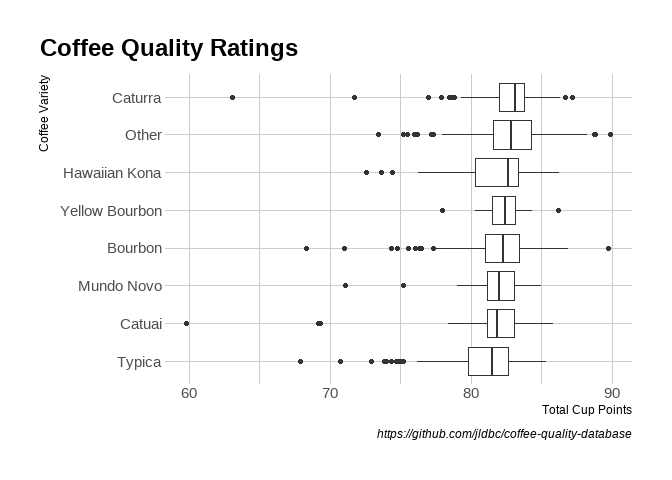
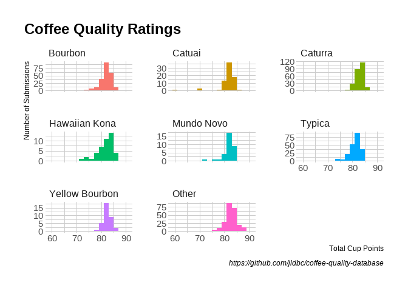
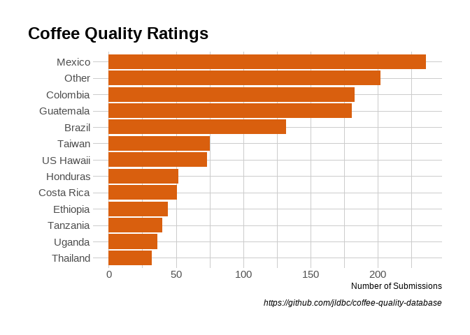
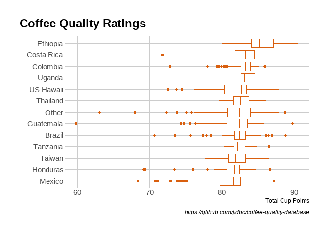
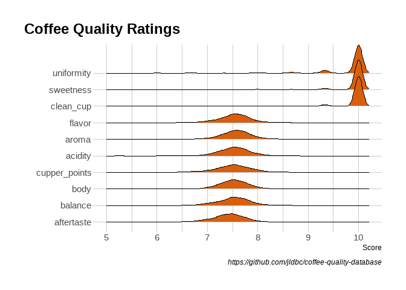
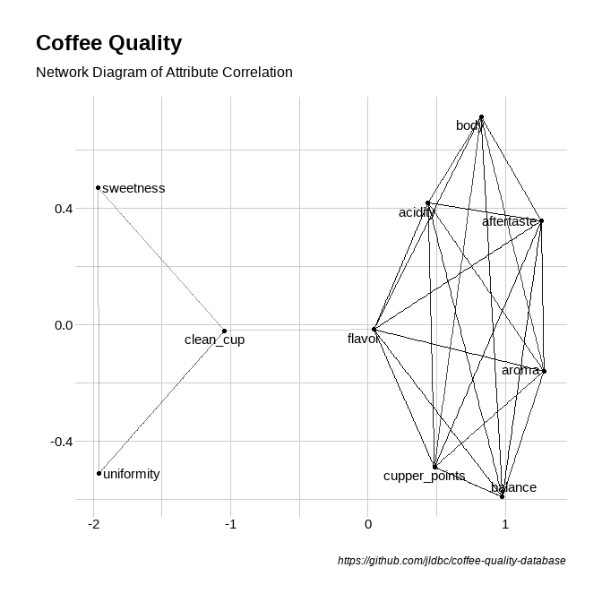
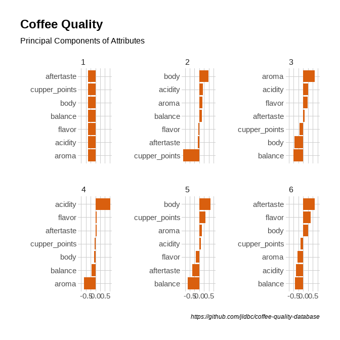
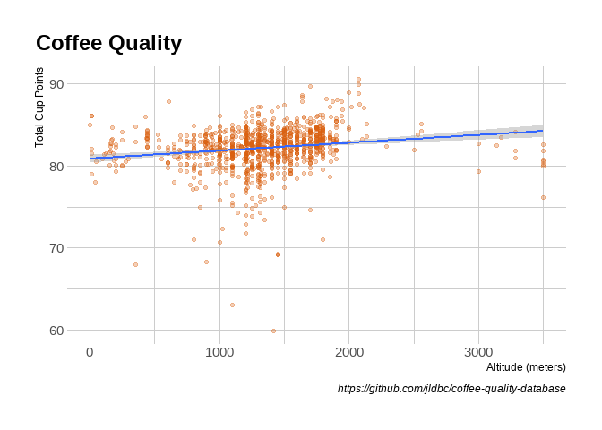
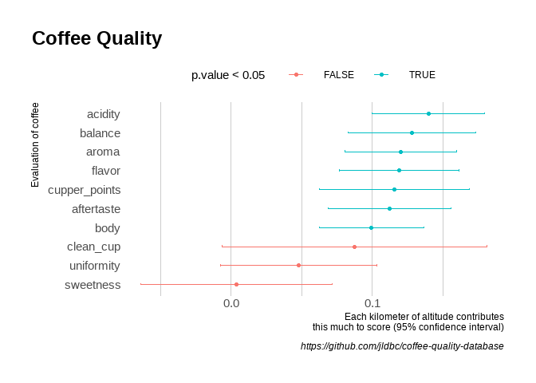
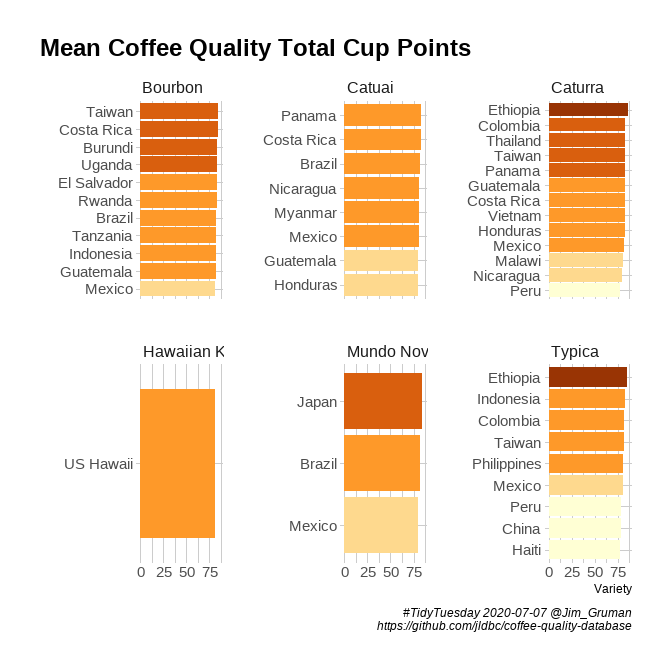

Coffee
================
Jim Gruman
07 July 2020

``` r
library(tidyverse)
library(ggridges)

library(widyr)
library(ggraph)
library(igraph)
library(tidytext)

showtext::showtext_auto()

## ggplot theme
theme_set(hrbrthemes::theme_ipsum())
```

``` r
coffee <- tidytuesdayR::tt_load("2020-07-07")
```

    ## --- Compiling #TidyTuesday Information for 2020-07-07 ----

    ## --- There is 1 file available ---

    ## --- Starting Download ---

    ## 
    ##  Downloading file 1 of 1: `coffee_ratings.csv`

    ## --- Download complete ---

``` r
coffee_ratings <- coffee$coffee_ratings %>%
  mutate(coffee_id = row_number(),
         country_of_origin = case_when(stringr::str_detect(country_of_origin,"Tanzania")~ "Tanzania",
          stringr::str_detect(country_of_origin,"Hawaii")~ "US Hawaii",                            TRUE ~ country_of_origin)) %>%
  filter(total_cup_points > 0) 
```

``` r
coffee_ratings %>%
  count(species, sort = TRUE) %>%
  knitr::kable()
```

| species |    n |
| :------ | ---: |
| Arabica | 1310 |
| Robusta |   28 |

``` r
coffee_lumped <- coffee_ratings %>%
  filter(!is.na(variety)) %>%
  mutate(variety = fct_lump(variety, 8), sort = TRUE)

coffee_lumped %>%
  mutate(variety = fct_reorder(variety, total_cup_points)) %>%
  ggplot(aes(total_cup_points, variety)) +
  geom_boxplot()+
  theme(plot.title.position = "plot")+
  labs(title = "Coffee Quality Ratings",
       caption = "https://github.com/jldbc/coffee-quality-database",
       x = "Total Cup Points",
       y = "Coffee Variety")
```

<!-- -->

``` r
coffee_lumped %>%
  ggplot(aes(total_cup_points, fill = variety)) +
  geom_histogram(binwidth = 2) +
  facet_wrap(~ variety, scale = "free_y") +
  theme(legend.position = "none",
        plot.title.position = "plot")+
  labs(title = "Coffee Quality Ratings",
       caption = "https://github.com/jldbc/coffee-quality-database",
       x = "Total Cup Points",
       y = "Number of Submissions")
```

<!-- -->

``` r
coffee_ratings %>%
  summarize(across(everything(), ~ mean(!is.na(.)))) %>%
  gather() %>%
  arrange(desc(value))%>%
  knitr::kable()
```

| key                    |     value |
| :--------------------- | --------: |
| total\_cup\_points     | 1.0000000 |
| species                | 1.0000000 |
| number\_of\_bags       | 1.0000000 |
| bag\_weight            | 1.0000000 |
| in\_country\_partner   | 1.0000000 |
| grading\_date          | 1.0000000 |
| aroma                  | 1.0000000 |
| flavor                 | 1.0000000 |
| aftertaste             | 1.0000000 |
| acidity                | 1.0000000 |
| body                   | 1.0000000 |
| balance                | 1.0000000 |
| uniformity             | 1.0000000 |
| clean\_cup             | 1.0000000 |
| sweetness              | 1.0000000 |
| cupper\_points         | 1.0000000 |
| moisture               | 1.0000000 |
| category\_one\_defects | 1.0000000 |
| category\_two\_defects | 1.0000000 |
| expiration             | 1.0000000 |
| certification\_body    | 1.0000000 |
| certification\_address | 1.0000000 |
| certification\_contact | 1.0000000 |
| unit\_of\_measurement  | 1.0000000 |
| coffee\_id             | 1.0000000 |
| country\_of\_origin    | 0.9992526 |
| quakers                | 0.9992526 |
| owner                  | 0.9947683 |
| owner\_1               | 0.9947683 |
| harvest\_year          | 0.9648729 |
| region                 | 0.9559043 |
| ico\_number            | 0.8871450 |
| processing\_method     | 0.8736921 |
| company                | 0.8437967 |
| color                  | 0.8370703 |
| altitude               | 0.8310912 |
| variety                | 0.8310912 |
| altitude\_low\_meters  | 0.8281016 |
| altitude\_high\_meters | 0.8281016 |
| altitude\_mean\_meters | 0.8281016 |
| producer               | 0.8273543 |
| mill                   | 0.7645740 |
| farm\_name             | 0.7316891 |
| lot\_number            | 0.2055306 |

``` r
coffee_ratings %>%
  filter(!is.na(producer))%>%
  mutate(producer = fct_lump(producer, 20))%>%
  count(producer, sort = TRUE) %>%
  knitr::kable(caption = "Count of Coffee Samples by")
```

| producer                     |   n |
| :--------------------------- | --: |
| Other                        | 900 |
| La Plata                     |  30 |
| Ipanema Agrícola SA          |  22 |
| Doi Tung Development Project |  17 |
| Ipanema Agricola             |  12 |
| VARIOS                       |  12 |
| Ipanema Agricola S.A         |  11 |
| ROBERTO MONTERROSO           |  10 |
| AMILCAR LAPOLA               |   9 |
| LA PLATA                     |   9 |
| AGROPECUARIA QUIAGRAL        |   8 |
| Martin Gutierrez             |   8 |
| Reinerio Zepeda              |   8 |
| JESUS RAMIREZ                |   7 |
| Mzuzu Coffee Coop Union      |   7 |
| varios                       |   7 |
| FINCA MEDINA                 |   6 |
| LUIS RODRIGUEZ               |   6 |
| MANUEL HERRERA JUAREZ        |   6 |
| Nishant Gurjer               |   6 |
| Omar Acosta                  |   6 |

Count of Coffee Samples by

``` r
coffee_ratings %>%
  filter(!is.na(company))%>% 
  mutate(company = fct_lump(company, 20))%>%
  count(company, sort = TRUE)%>%
  knitr::kable(caption = "Count of Coffee Samples by")
```

| company                                                |   n |
| :----------------------------------------------------- | --: |
| Other                                                  | 614 |
| unex guatemala, s.a.                                   |  86 |
| ipanema coffees                                        |  50 |
| exportadora de cafe condor s.a                         |  40 |
| kona pacific farmers cooperative                       |  40 |
| racafe & cia s.c.a                                     |  40 |
| blossom valley\<U+5BB8\>\<U+5DA7\>\<U+570B\>\<U+969B\> |  25 |
| carcafe ltda                                           |  25 |
| nucoffee                                               |  24 |
| taiwan coffee laboratory                               |  20 |
| \<U+5BB8\>\<U+5DA7\>\<U+570B\>\<U+969B\>               |  19 |
| ecomtrading                                            |  19 |
| the coffee source inc.                                 |  19 |
| bourbon specialty coffees                              |  17 |
| cadexsa                                                |  15 |
| cigrah s.a de c.v                                      |  14 |
| siembras vision, s.a.                                  |  14 |
| cafeorganico.mx                                        |  12 |
| ecom cca sa                                            |  12 |
| essence coffee                                         |  12 |
| yunnan coffee exchange                                 |  12 |

Count of Coffee Samples by

``` r
coffee_ratings %>%
  filter(!is.na(color))%>% 
  count(color, sort = TRUE)%>%
  knitr::kable(caption = "Count of Coffee Samples by")
```

| color        |   n |
| :----------- | --: |
| Green        | 869 |
| Bluish-Green | 114 |
| Blue-Green   |  85 |
| None         |  52 |

Count of Coffee Samples by

``` r
coffee_ratings %>%
  count(country = fct_lump(country_of_origin, 12), sort = TRUE) %>%
  filter(!is.na(country)) %>%
  mutate(country = fct_reorder(country, n)) %>%
  ggplot(aes(n, country)) +
  geom_col(fill = "#d95f0e")+
  theme(plot.title.position = "plot")+
  labs(title = "Coffee Quality Ratings",
       caption = "https://github.com/jldbc/coffee-quality-database",
       x = "Number of Submissions",
       y = "")
```

<!-- -->

``` r
coffee_ratings %>%
  filter(!is.na(country_of_origin)) %>%
  mutate(country = fct_lump(country_of_origin, 12),
         country = fct_reorder(country, total_cup_points)) %>%
  ggplot(aes(total_cup_points, country)) +
  geom_boxplot(color = "#d95f0e") +
  theme(plot.title.position = "plot")+
  labs(title = "Coffee Quality Ratings",
       caption = "https://github.com/jldbc/coffee-quality-database",
       x = "Total Cup Points",
       y = "")
```

<!-- -->

``` r
coffee_metrics <- coffee_ratings %>%
  dplyr::select(coffee_id, total_cup_points, variety, company,
         country_of_origin,
         altitude_mean_meters,
         aroma:moisture) %>%
  pivot_longer(aroma:cupper_points, names_to = "metric", values_to = "value")

coffee_metrics %>%
  mutate(metric = fct_reorder(metric, value)) %>%
  ggplot(aes(value, metric)) +
  geom_density_ridges(fill = "#d95f0e")+
  scale_x_continuous(limits = c(5,10.2))+
  theme(plot.title.position = "plot")+
  labs(title = "Coffee Quality Ratings",
       caption = "https://github.com/jldbc/coffee-quality-database",
       x = "Score",
       y = "")
```

    ## Picking joint bandwidth of 0.0769

<!-- -->

``` r
coffee_metrics %>%
  group_by(metric) %>%
  summarize(average = mean(value),
            sd = sd(value)) %>%
  arrange(desc(average)) %>%
  knitr::kable()
```

    ## `summarise()` ungrouping output (override with `.groups` argument)

| metric         |  average |        sd |
| :------------- | -------: | --------: |
| sweetness      | 9.864058 | 0.5542069 |
| clean\_cup     | 9.842459 | 0.7152956 |
| uniformity     | 9.842227 | 0.4851825 |
| aroma          | 7.572362 | 0.3159156 |
| acidity        | 7.541338 | 0.3191726 |
| flavor         | 7.526046 | 0.3413824 |
| balance        | 7.523632 | 0.3536297 |
| body           | 7.523117 | 0.3078146 |
| cupper\_points | 7.508984 | 0.4268430 |
| aftertaste     | 7.406614 | 0.3503042 |

``` r
correlations <- coffee_metrics %>%
  pairwise_cor(metric, coffee_id, value, sort = TRUE)

correlations %>%
  head(50) %>%
  graph_from_data_frame() %>%
  ggraph() +
  geom_edge_link(aes(edge_alpha = correlation),show.legend = FALSE ) +
  geom_node_point() +
  geom_node_text(aes(label = name), repel = TRUE)+
  theme(plot.title.position = "plot")+
  labs(title = "Coffee Quality",
       subtitle = "Network Diagram of Attribute Correlation",
       caption = "https://github.com/jldbc/coffee-quality-database",
       x = "",
       y = "")
```

    ## Using `stress` as default layout

<!-- -->

``` r
coffee_metrics %>%
  filter(!metric %in% c("sweetness", "clean_cup", "uniformity")) %>%
  group_by(metric) %>%
  mutate(centered = value - mean(value)) %>%
  ungroup() %>%
  widely_svd(metric, coffee_id, value) %>%
  filter(between(dimension, 1, 6)) %>%
  mutate(metric = reorder_within(metric, value, dimension)) %>%
  ggplot(aes(value, metric)) +
  geom_col( fill = "#d95f0e") +
  scale_y_reordered() +
  facet_wrap(~ dimension, scales = "free_y")+
  theme(plot.title.position = "plot")+
  labs(title = "Coffee Quality",
       subtitle = "Principal Components of Attributes",
       caption = "https://github.com/jldbc/coffee-quality-database",
       x = "",
       y = "")
```

<!-- -->

``` r
coffee_ratings %>%
  filter(altitude_mean_meters < 10000,
         altitude != 1) %>%
  mutate(altitude_mean_meters = pmin(altitude_mean_meters, 3500)) %>%
  ggplot(aes(altitude_mean_meters, total_cup_points)) +
  geom_point(color = "#d95f0e", alpha = 0.3) +
  geom_smooth(method = "lm")+
  theme(plot.title.position = "plot")+
  labs(title = "Coffee Quality",
       caption = "https://github.com/jldbc/coffee-quality-database",
       x = "Altitude (meters)",
       y = "Total Cup Points")
```

    ## `geom_smooth()` using formula 'y ~ x'

<!-- -->

``` r
coffee_metrics %>%
  filter(altitude_mean_meters < 10000) %>%
  mutate(altitude_mean_meters = pmin(altitude_mean_meters, 3000)) %>%
  mutate(km = altitude_mean_meters / 1000) %>%
  group_by(metric) %>%
  summarize(correlation = cor(altitude_mean_meters, value),
            model = list(lm(value ~ km))) %>%
  mutate(tidied = map(model, broom::tidy, conf.int = TRUE)) %>%
  unnest(tidied) %>%
  filter(term == "km") %>%
  ungroup() %>%
  mutate(metric = fct_reorder(metric, estimate)) %>%
  ggplot(aes(estimate, metric, color = p.value < .05)) +
  geom_point() +
  geom_errorbarh(aes(xmin = conf.low, xmax = conf.high), height = .1) +
  theme(plot.title.position = "plot",
        legend.position = "top",
        legend.spacing.x = unit(6, "mm"),
        panel.grid.major.y = element_blank())+
  labs(title = "Coffee Quality",
       y = "Evaluation of coffee",
       x = "Each kilometer of altitude contributes\n this much to score (95% confidence interval)",
       caption = "https://github.com/jldbc/coffee-quality-database")
```

    ## `summarise()` ungrouping output (override with `.groups` argument)

<!-- -->

``` r
coffee_lumped%>%
  mutate(country_of_origin = fct_lump_lowfreq(country_of_origin, 8)) %>%
  group_by(country_of_origin, variety) %>%
  summarise(score = mean(total_cup_points)) %>%
  ungroup()%>%
  filter(!variety %in% c("Other", "Yellow Bourbon")) %>%
  mutate(country_of_origin = reorder_within(country_of_origin, score, variety)) %>%
  ggplot()+
  geom_col(aes(x=score, 
              y=country_of_origin, 
              fill = ggplot2::cut_width(score,2)), show.legend = FALSE)+
  scale_fill_brewer(type = "seq", palette = "YlOrBr") +
  scale_y_reordered() +
#  scale_fill_brewer(type= "seq", palette = "YlOrBr")+
  theme(plot.title.position = "plot")+
  labs(title = "Mean Coffee Quality Total Cup Points",
       y = "", x = "Variety",
       caption = "#TidyTuesday 2020-07-07 @Jim_Gruman\n https://github.com/jldbc/coffee-quality-database")+
  facet_wrap(~ variety,  scales = "free_y")
```

    ## `summarise()` regrouping output by 'country_of_origin' (override with `.groups` argument)

<!-- -->

-----

``` r
Sys.time()
```

    ## [1] "2020-07-07 21:08:10 CDT"

``` r
git2r::repository()
```

    ## Local:    master D:/myTidyTuesday
    ## Remote:   master @ origin (https://github.com/opus1993/myTidyTuesday.git)
    ## Head:     [b6311fe] 2020-07-01: Clone George Karamanis DataViz

``` r
sessionInfo()
```

    ## R version 4.0.0 (2020-04-24)
    ## Platform: x86_64-w64-mingw32/x64 (64-bit)
    ## Running under: Windows 10 x64 (build 18363)
    ## 
    ## Matrix products: default
    ## 
    ## locale:
    ## [1] LC_COLLATE=English_United States.1252 
    ## [2] LC_CTYPE=English_United States.1252   
    ## [3] LC_MONETARY=English_United States.1252
    ## [4] LC_NUMERIC=C                          
    ## [5] LC_TIME=English_United States.1252    
    ## 
    ## attached base packages:
    ## [1] stats     graphics  grDevices utils     datasets  methods   base     
    ## 
    ## other attached packages:
    ##  [1] tidytext_0.2.4  igraph_1.2.5    ggraph_2.0.3    widyr_0.1.3    
    ##  [5] ggridges_0.5.2  forcats_0.5.0   stringr_1.4.0   dplyr_1.0.0    
    ##  [9] purrr_0.3.4     readr_1.3.1     tidyr_1.1.0     tibble_3.0.1   
    ## [13] ggplot2_3.3.2   tidyverse_1.3.0
    ## 
    ## loaded via a namespace (and not attached):
    ##  [1] nlme_3.1-148       fs_1.4.2           lubridate_1.7.9    RColorBrewer_1.1-2
    ##  [5] httr_1.4.1         SnowballC_0.7.0    tools_4.0.0        backports_1.1.8   
    ##  [9] R6_2.4.1           mgcv_1.8-31        DBI_1.1.0          colorspace_1.4-1  
    ## [13] withr_2.2.0        tidyselect_1.1.0   gridExtra_2.3      git2r_0.27.1      
    ## [17] curl_4.3           compiler_4.0.0     extrafontdb_1.0    cli_2.0.2         
    ## [21] rvest_0.3.5        xml2_1.3.2         labeling_0.3       scales_1.1.1      
    ## [25] systemfonts_0.2.3  digest_0.6.25      rmarkdown_2.3      tidytuesdayR_1.0.0
    ## [29] pkgconfig_2.0.3    htmltools_0.5.0    showtext_0.8-1     extrafont_0.17    
    ## [33] highr_0.8          dbplyr_1.4.4       rlang_0.4.6        readxl_1.3.1      
    ## [37] rstudioapi_0.11    sysfonts_0.8.1     farver_2.0.3       generics_0.0.2    
    ## [41] jsonlite_1.7.0     tokenizers_0.2.1   magrittr_1.5       Matrix_1.2-18     
    ## [45] Rcpp_1.0.5         munsell_0.5.0      fansi_0.4.1        gdtools_0.2.2     
    ## [49] viridis_0.5.1      lifecycle_0.2.0    stringi_1.4.6      yaml_2.2.1        
    ## [53] MASS_7.3-51.6      plyr_1.8.6         grid_4.0.0         hrbrthemes_0.8.0  
    ## [57] blob_1.2.1         ggrepel_0.8.2      crayon_1.3.4       lattice_0.20-41   
    ## [61] splines_4.0.0      graphlayouts_0.7.0 haven_2.3.1        hms_0.5.3         
    ## [65] knitr_1.29         pillar_1.4.4       reshape2_1.4.4     reprex_0.3.0      
    ## [69] glue_1.4.1         drat_0.1.6         evaluate_0.14      modelr_0.1.8      
    ## [73] selectr_0.4-2      vctrs_0.3.1        tweenr_1.0.1       Rttf2pt1_1.3.8    
    ## [77] cellranger_1.1.0   gtable_0.3.0       polyclip_1.10-0    assertthat_0.2.1  
    ## [81] xfun_0.15          ggforce_0.3.2      broom_0.5.6        tidygraph_1.2.0   
    ## [85] janeaustenr_0.1.5  viridisLite_0.3.0  showtextdb_3.0     ellipsis_0.3.1
