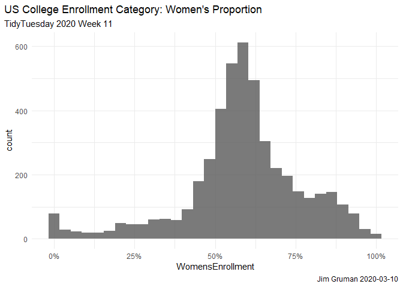
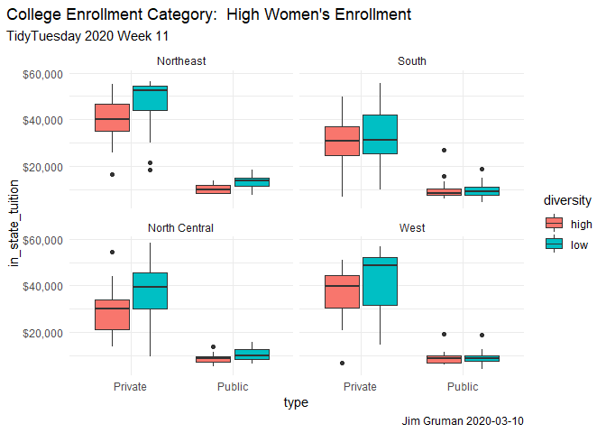
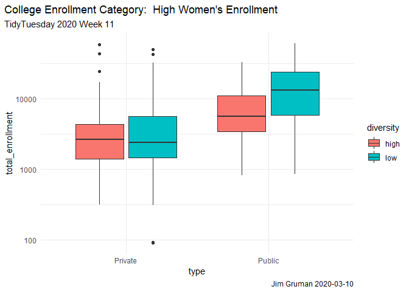
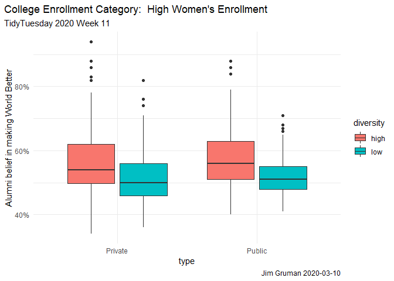
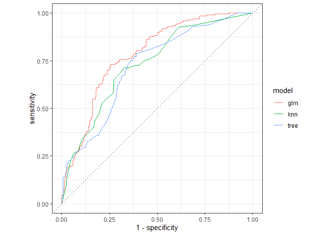
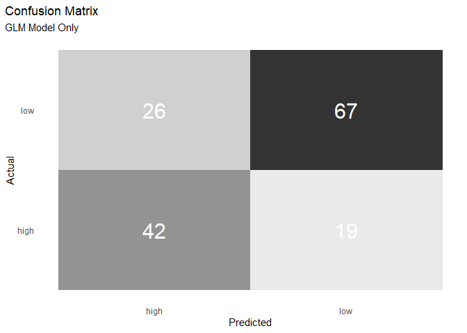

College Tuition and Diversity
================
Jim Gruman
2020-03-10

# TidyTuesday 2020 Week 11


Topic: [College tuition, diversity, and salary
outcomes](https://github.com/rfordatascience/tidytuesday/blob/master/data/2020/2020-03-10/readme.md)

``` r
# Get the data

tuition_cost <- readr::read_csv('https://raw.githubusercontent.com/rfordatascience/tidytuesday/master/data/2020/2020-03-10/tuition_cost.csv')

tuition_income <- readr::read_csv('https://raw.githubusercontent.com/rfordatascience/tidytuesday/master/data/2020/2020-03-10/tuition_income.csv') 

salary_potential <- readr::read_csv('https://raw.githubusercontent.com/rfordatascience/tidytuesday/master/data/2020/2020-03-10/salary_potential.csv')

historical_tuition <- readr::read_csv('https://raw.githubusercontent.com/rfordatascience/tidytuesday/master/data/2020/2020-03-10/historical_tuition.csv')

diversity_school <- readr::read_csv('https://raw.githubusercontent.com/rfordatascience/tidytuesday/master/data/2020/2020-03-10/diversity_school.csv')
```

What are the characteristics of schools that enroll and graduate more
women?

``` r
diversity_gender<-diversity_school %>%
  filter(category == "Women")%>%
  mutate(WomensEnrollment = enrollment / total_enrollment)

diversity_gender %>%
  ggplot(aes(WomensEnrollment))+
  geom_histogram(alpha = 0.8)+
  labs(title = "US College Enrollment Category: Women's Proportion",
       subtitle = "TidyTuesday 2020 Week 11",
       caption = paste0("Jim Gruman ", Sys.Date()))+
  scale_x_continuous(labels=scales::percent)+
  theme(plot.title.position = "plot")
```

    ## `stat_bin()` using `bins = 30`. Pick better value with `binwidth`.

<!-- -->

``` r
median(diversity_gender$WomensEnrollment)
```

    ## [1] 0.586676

How can we understand what drives higher proportions of enrollment of
Women?

``` r
university_df<-diversity_gender %>%
  transmute(diversity = case_when(WomensEnrollment > 0.586 ~ "high",
                                  TRUE ~ "low"),
            name, state, total_enrollment) %>%
  inner_join(tuition_cost %>% select(name, type, degree_length, 
                                     in_state_tuition:out_of_state_total)) %>%
  inner_join(salary_potential %>% select(name, make_world_better_percent, stem_percent)) %>%
  left_join(tibble(state = state.name, region = state.region)) %>%
  select(-state, -name) %>%
  mutate_if(is.character, factor)
```

    ## Joining, by = "name"
    ## Joining, by = "name"

    ## Joining, by = "state"

``` r
university_df %>%
  ggplot(aes(type, in_state_tuition, fill = diversity))+
  geom_boxplot()+
  scale_y_continuous(labels = scales::dollar_format())+
  facet_wrap(~region)+  
  labs(title = "College Enrollment Category:  High Women's Enrollment",
       subtitle = "TidyTuesday 2020 Week 11",
       caption = paste0("Jim Gruman ", Sys.Date()))+
  theme(plot.title.position = "plot")
```

<!-- -->

``` r
university_df %>%
  ggplot(aes(type, total_enrollment, fill = diversity))+
  geom_boxplot()+
  scale_y_log10()+
  labs(title = "College Enrollment Category:  High Women's Enrollment",
       subtitle = "TidyTuesday 2020 Week 11",
       caption = paste0("Jim Gruman ", Sys.Date()))+
  theme(plot.title.position = "plot")
```

<!-- -->

``` r
university_df %>%
  ggplot(aes(type, make_world_better_percent/100, fill = diversity))+
  geom_boxplot()+
  labs(title = "College Enrollment Category:  High Women's Enrollment",
       subtitle = "TidyTuesday 2020 Week 11",
       caption = paste0("Jim Gruman ", Sys.Date()))+
  scale_y_continuous(labels = scales::percent_format())+
  theme(plot.title.position = "plot")+
  ylab("Alumni belief in making World Better")
```

<!-- -->

``` r
skimr::skim(university_df)
```

|                                                  |                |
| :----------------------------------------------- | :------------- |
| Name                                             | university\_df |
| Number of rows                                   | 640            |
| Number of columns                                | 11             |
| \_\_\_\_\_\_\_\_\_\_\_\_\_\_\_\_\_\_\_\_\_\_\_   |                |
| Column type frequency:                           |                |
| factor                                           | 4              |
| numeric                                          | 7              |
| \_\_\_\_\_\_\_\_\_\_\_\_\_\_\_\_\_\_\_\_\_\_\_\_ |                |
| Group variables                                  | None           |

Data summary

**Variable type: factor**

| skim\_variable | n\_missing | complete\_rate | ordered | n\_unique | top\_counts                           |
| :------------- | ---------: | -------------: | :------ | --------: | :------------------------------------ |
| diversity      |          0 |              1 | FALSE   |         2 | low: 375, hig: 265                    |
| type           |          0 |              1 | FALSE   |         2 | Pri: 398, Pub: 242                    |
| degree\_length |          0 |              1 | FALSE   |         2 | 4 Y: 637, 2 Y: 3                      |
| region         |          0 |              1 | FALSE   |         4 | Sou: 257, Nor: 170, Nor: 129, Wes: 84 |

**Variable type: numeric**

| skim\_variable               | n\_missing | complete\_rate |     mean |       sd |   p0 |      p25 |   p50 |      p75 |  p100 | hist  |
| :--------------------------- | ---------: | -------------: | -------: | -------: | ---: | -------: | ----: | -------: | ----: | :---- |
| total\_enrollment            |          0 |           1.00 |  7557.24 |  9286.93 |   90 |  1869.25 |  3633 |  9841.50 | 60767 | ▇▁▁▁▁ |
| in\_state\_tuition           |          0 |           1.00 | 26780.54 | 16365.44 | 4220 | 10095.50 | 26746 | 41130.00 | 58230 | ▇▂▅▃▃ |
| in\_state\_total             |          0 |           1.00 | 37275.52 | 18746.72 | 4258 | 19664.25 | 35654 | 53057.00 | 75003 | ▆▇▅▆▅ |
| out\_of\_state\_tuition      |          0 |           1.00 | 31059.86 | 12967.12 | 6570 | 20894.50 | 29466 | 41220.00 | 58230 | ▃▇▆▅▃ |
| out\_of\_state\_total        |          0 |           1.00 | 41554.84 | 15608.48 | 6670 | 29991.00 | 39114 | 53166.25 | 75003 | ▂▇▇▅▃ |
| make\_world\_better\_percent |         17 |           0.97 |    53.58 |     8.80 |   34 |    48.00 |    52 |    58.00 |    94 | ▂▇▃▁▁ |
| stem\_percent                |          0 |           1.00 |    16.84 |    15.80 |    0 |     7.00 |    13 |    22.00 |   100 | ▇▂▁▁▁ |

Lets build several classification models, starting with pre-processing

``` r
set.seed(42)

uni_split<-initial_split(university_df, strate = diversity)
uni_train<- training(uni_split)
uni_test<- testing(uni_split)

uni_rec<-recipe(diversity ~ ., data = uni_train) %>%
  step_corr(all_numeric()) %>%
  step_dummy(all_nominal(), -all_outcomes()) %>%
  step_zv(all_numeric()) %>%
  step_normalize(all_numeric()) %>%
  prep()

# The steps taken
uni_rec
```

    ## Data Recipe
    ## 
    ## Inputs:
    ## 
    ##       role #variables
    ##    outcome          1
    ##  predictor         10
    ## 
    ## Training data contained 480 data points and 11 incomplete rows. 
    ## 
    ## Operations:
    ## 
    ## Correlation filter removed in_state_total, ... [trained]
    ## Dummy variables from type, degree_length, region [trained]
    ## Zero variance filter removed no terms [trained]
    ## Centering and scaling for total_enrollment, ... [trained]

``` r
# What the data looks like after pre-processing (similar to bake)
juice(uni_rec)
```

    ## # A tibble: 480 x 10
    ##    total_enrollment in_state_tuition make_world_bett~ stem_percent diversity
    ##               <dbl>            <dbl>            <dbl>        <dbl> <fct>    
    ##  1             5.84           -1.25            -0.383      -0.0522 low      
    ##  2             4.62           -1.24            -0.271      -0.0522 low      
    ##  3             4.61           -1.25            -0.159       0.749  low      
    ##  4             4.59            1.52            -1.28        0.0710 low      
    ##  5             4.13           -0.718           -1.06        1.18   low      
    ##  6             3.93            0.259           -0.495      -0.545  high     
    ##  7             3.84            1.79            -0.719       0.379  low      
    ##  8             3.82           -0.877           -0.271       0.379  low      
    ##  9             3.71           -1.24            -0.495       0.0710 low      
    ## 10             3.67           -0.876           -0.383       0.441  low      
    ## # ... with 470 more rows, and 5 more variables: type_Public <dbl>,
    ## #   degree_length_X4.Year <dbl>, region_South <dbl>,
    ## #   region_North.Central <dbl>, region_West <dbl>

A GLM classification model, with meaningful feature coefficients:

``` r
glm_spec<-logistic_reg()%>%
  set_engine("glm")

glm_fit<-glm_spec %>%
  fit(diversity ~ ., data = juice(uni_rec))

glm_fit
```

    ## parsnip model object
    ## 
    ## Fit time:  0ms 
    ## 
    ## Call:  stats::glm(formula = formula, family = stats::binomial, data = data)
    ## 
    ## Coefficients:
    ##               (Intercept)           total_enrollment  
    ##                  0.560544                   0.412563  
    ##          in_state_tuition  make_world_better_percent  
    ##                 -0.243804                  -0.441459  
    ##              stem_percent                type_Public  
    ##                  1.551035                  -0.231260  
    ##     degree_length_X4.Year               region_South  
    ##                  0.753413                   0.002013  
    ##      region_North.Central                region_West  
    ##                  0.292684                   0.305583  
    ## 
    ## Degrees of Freedom: 468 Total (i.e. Null);  459 Residual
    ##   (11 observations deleted due to missingness)
    ## Null Deviance:       638.1 
    ## Residual Deviance: 496.5     AIC: 516.5

A k-nearest neighbors model

``` r
knn_spec<-nearest_neighbor()%>%
  set_engine("kknn") %>%
  set_mode("classification")

knn_fit<-knn_spec %>%
  fit(diversity ~ ., data = juice(uni_rec))

knn_fit
```

    ## parsnip model object
    ## 
    ## Fit time:  20ms 
    ## 
    ## Call:
    ## kknn::train.kknn(formula = formula, data = data, ks = 5)
    ## 
    ## Type of response variable: nominal
    ## Minimal misclassification: 0.3326226
    ## Best kernel: optimal
    ## Best k: 5

An a decision tree model, with explainable branching. It is interesting
to note here that the first split is on stem\_percent.

``` r
tree_spec<-decision_tree()%>%
  set_engine("rpart") %>%
  set_mode("classification")

tree_fit<-tree_spec %>%
  fit(diversity ~ ., data = juice(uni_rec))

tree_fit
```

    ## parsnip model object
    ## 
    ## Fit time:  21ms 
    ## n= 480 
    ## 
    ## node), split, n, loss, yval, (yprob)
    ##       * denotes terminal node
    ## 
    ##  1) root 480 198 low (0.41250000 0.58750000)  
    ##    2) stem_percent< -0.2062361 253  99 high (0.60869565 0.39130435)  
    ##      4) make_world_better_percent>=1.0187 53   9 high (0.83018868 0.16981132)  
    ##        8) total_enrollment>=-0.6945882 44   3 high (0.93181818 0.06818182) *
    ##        9) total_enrollment< -0.6945882 9   3 low (0.33333333 0.66666667) *
    ##      5) make_world_better_percent< 1.0187 200  90 high (0.55000000 0.45000000)  
    ##       10) make_world_better_percent>=-0.3269738 134  53 high (0.60447761 0.39552239)  
    ##         20) total_enrollment>=-0.695245 126  45 high (0.64285714 0.35714286) *
    ##         21) total_enrollment< -0.695245 8   0 low (0.00000000 1.00000000) *
    ##       11) make_world_better_percent< -0.3269738 66  29 low (0.43939394 0.56060606)  
    ##         22) stem_percent< -0.4526414 41  17 high (0.58536585 0.41463415)  
    ##           44) in_state_tuition>=0.1424591 24   7 high (0.70833333 0.29166667) *
    ##           45) in_state_tuition< 0.1424591 17   7 low (0.41176471 0.58823529) *
    ##         23) stem_percent>=-0.4526414 25   5 low (0.20000000 0.80000000) *
    ##    3) stem_percent>=-0.2062361 227  44 low (0.19383260 0.80616740) *

To measure each model, resampling is a best practice to simulate how
well model performs when exposed to new data. For classification
problems, the metrics available include `roc_auc`, `sen`sitivity, and
`spec`ificity

## Evaluate models with resampling —–

We will create 10-cross validation sets

``` r
set.seed(42)
folds<-vfold_cv(juice(uni_rec), strata = diversity)

set.seed(42)
glm_rs <- glm_spec %>%
  fit_resamples(diversity ~ ., 
                folds, 
                metrics = metric_set(roc_auc),
                control = control_resamples(save_pred = TRUE))
```

    ## ! Fold02: model (predictions): prediction from a rank-deficient fit may be misleading

``` r
# glm_rs %>% unnest(.predictions)
#glm_rs %>% unnest(.metrics)

set.seed(42)
knn_rs<-knn_spec %>%
  fit_resamples(diversity ~ ., 
                folds, 
                metrics = metric_set(roc_auc),
                control = control_resamples(save_pred = TRUE))
```

    ## x Fold05: model (predictions): Error: Column `.row` must be length 46 (the number ...

    ## x Fold06: model (predictions): Error: Column `.row` must be length 45 (the number ...

    ## x Fold07: model (predictions): Error: Column `.row` must be length 47 (the number ...

    ## x Fold08: model (predictions): Error: Column `.row` must be length 46 (the number ...

    ## x Fold09: model (predictions): Error: Column `.row` must be length 45 (the number ...

    ## x Fold10: model (predictions): Error: Column `.row` must be length 46 (the number ...

``` r
set.seed(42)
tree_rs<-tree_spec %>%
  fit_resamples(diversity ~ ., 
                folds, 
                metrics = metric_set(roc_auc),
                control = control_resamples(save_pred = TRUE))
```

At a quick glance, the mean roc\_auc is highest with the glm approach.

``` r
glm_rs %>% collect_metrics()
```

    ## # A tibble: 1 x 5
    ##   .metric .estimator  mean     n std_err
    ##   <chr>   <chr>      <dbl> <int>   <dbl>
    ## 1 roc_auc binary     0.790    10  0.0210

``` r
knn_rs %>% collect_metrics()
```

    ## # A tibble: 1 x 5
    ##   .metric .estimator  mean     n std_err
    ##   <chr>   <chr>      <dbl> <int>   <dbl>
    ## 1 roc_auc binary     0.731     4  0.0281

``` r
tree_rs %>% collect_metrics()
```

    ## # A tibble: 1 x 5
    ##   .metric .estimator  mean     n std_err
    ##   <chr>   <chr>      <dbl> <int>   <dbl>
    ## 1 roc_auc binary     0.717    10  0.0184

A clearer comparison of ROC curves:

``` r
glm_rs %>%
  unnest(.predictions) %>%
  mutate(model = "glm") %>%
  bind_rows(tree_rs %>%
              unnest(.predictions)%>%
              mutate(model = "tree")) %>%
  bind_rows(knn_rs %>%
              unnest(.predictions) %>%
              mutate(model = "knn")) %>%
  group_by(model) %>%
  roc_curve(diversity, .pred_high) %>%
  autoplot()
```

<!-- -->

So, choosing the glm technique, let’s have a look at the predictions
with testing data.

``` r
glm_fit %>%
  predict(new_data = bake(uni_rec, new_data = uni_test),
          type = "prob") %>%
  mutate(truth = uni_test$diversity) %>%
  roc_auc(truth, .pred_high)
```

    ## # A tibble: 1 x 3
    ##   .metric .estimator .estimate
    ##   <chr>   <chr>          <dbl>
    ## 1 roc_auc binary         0.772

``` r
glm_fit %>%
  predict(new_data = bake(uni_rec, new_data = uni_test),
          type = "class") %>%
  mutate(truth = uni_test$diversity) %>%
  conf_mat(truth, .pred_class)%>%
  pluck(1) %>%
  as_tibble() %>%
  ggplot(aes(Prediction, Truth, alpha = n)) +
  geom_tile(show.legend = FALSE) +
  geom_text(aes(label = n), colour = "white", alpha = 1, size = 8) +
  theme(panel.grid.major = element_blank(),
        plot.title.position = "plot") +
  labs(
    y = "Actual",
    x = "Predicted",
    fill = NULL,
    title = "Confusion Matrix",
    subtitle = "GLM Model Only"
  )
```

<!-- -->

Acknowledgements:

[Julia Silge’s blog](https://juliasilge.com/blog/tuition-resampling/)

[Meghan Hall’s blog](https://meghan.rbind.io/post/tidymodels-intro/)
