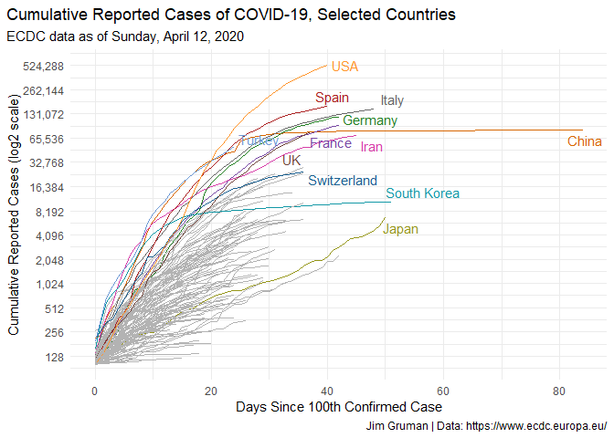
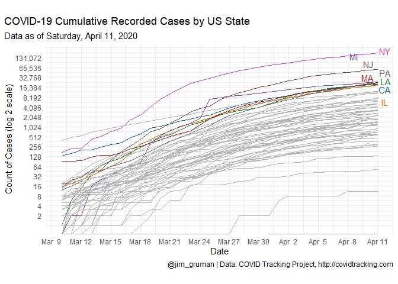
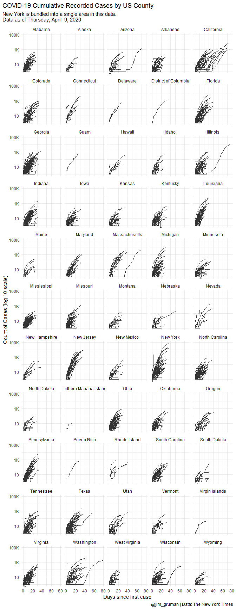
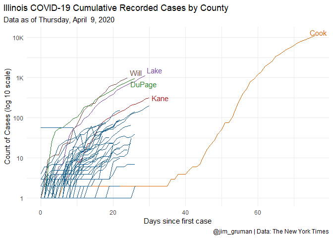
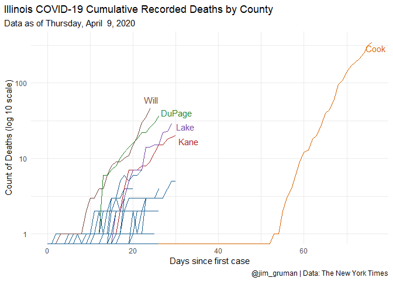
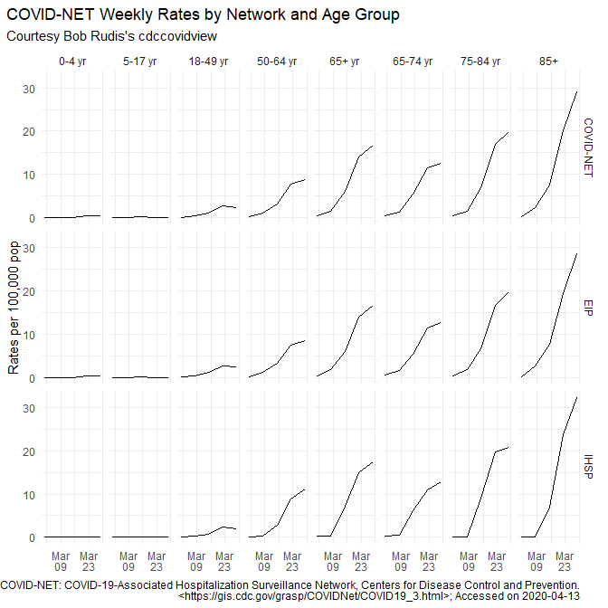

Corona By County
================
Jim Gruman
Monday, April 13, 2020

``` r
knitr::opts_chunk$set(echo = TRUE, message = FALSE)
library(tidyverse)
library(lubridate)

library(covdata)          # By Kieran Healy https://kjhealy.github.io/covdata/

library(ggplot2)
library(gt)

## Libraries for the graphs
library(ggrepel)
library(paletteer)
library(prismatic)

theme_set(theme_minimal())
```

> Inspired by Kieran Healy’s R package `covdata` at
> [](https://github.com/kjhealy/covdata/)

<center>


</center>

## Country-Level Data from ECDC

``` r
end_date <- max(covnat$date)

covnat %>%
   as_tibble() %>%
   dplyr::filter( date == end_date)%>%
   select(Country = cname, `New Cases` = cases, `New Deaths` = deaths, `Cumulative Cases` = cu_cases, `Cumulative Deaths` = cu_deaths) %>%
   slice_max(order_by = `Cumulative Deaths`, n=10) %>%
   gt() %>%
   tab_header(
     title = "Country Level Data from ECDC",
     subtitle = glue::glue("As of {end_date}")
   ) %>%
  fmt_number(
    columns = vars(`New Cases`, `New Deaths`, `Cumulative Cases`, `Cumulative Deaths`),
    decimals = 0,
    suffixing = TRUE
  )
```

<!--html_preserve-->

<style>html {
  font-family: -apple-system, BlinkMacSystemFont, 'Segoe UI', Roboto, Oxygen, Ubuntu, Cantarell, 'Helvetica Neue', 'Fira Sans', 'Droid Sans', Arial, sans-serif;
}

#pkpcgzjthq .gt_table {
  display: table;
  border-collapse: collapse;
  margin-left: auto;
  margin-right: auto;
  color: #333333;
  font-size: 16px;
  background-color: #FFFFFF;
  width: auto;
  border-top-style: solid;
  border-top-width: 2px;
  border-top-color: #A8A8A8;
  border-right-style: none;
  border-right-width: 2px;
  border-right-color: #D3D3D3;
  border-bottom-style: solid;
  border-bottom-width: 2px;
  border-bottom-color: #A8A8A8;
  border-left-style: none;
  border-left-width: 2px;
  border-left-color: #D3D3D3;
}

#pkpcgzjthq .gt_heading {
  background-color: #FFFFFF;
  text-align: center;
  border-bottom-color: #FFFFFF;
  border-left-style: none;
  border-left-width: 1px;
  border-left-color: #D3D3D3;
  border-right-style: none;
  border-right-width: 1px;
  border-right-color: #D3D3D3;
}

#pkpcgzjthq .gt_title {
  color: #333333;
  font-size: 125%;
  font-weight: initial;
  padding-top: 4px;
  padding-bottom: 4px;
  border-bottom-color: #FFFFFF;
  border-bottom-width: 0;
}

#pkpcgzjthq .gt_subtitle {
  color: #333333;
  font-size: 85%;
  font-weight: initial;
  padding-top: 0;
  padding-bottom: 4px;
  border-top-color: #FFFFFF;
  border-top-width: 0;
}

#pkpcgzjthq .gt_bottom_border {
  border-bottom-style: solid;
  border-bottom-width: 2px;
  border-bottom-color: #D3D3D3;
}

#pkpcgzjthq .gt_col_headings {
  border-top-style: solid;
  border-top-width: 2px;
  border-top-color: #D3D3D3;
  border-bottom-style: solid;
  border-bottom-width: 2px;
  border-bottom-color: #D3D3D3;
  border-left-style: none;
  border-left-width: 1px;
  border-left-color: #D3D3D3;
  border-right-style: none;
  border-right-width: 1px;
  border-right-color: #D3D3D3;
}

#pkpcgzjthq .gt_col_heading {
  color: #333333;
  background-color: #FFFFFF;
  font-size: 100%;
  font-weight: normal;
  text-transform: inherit;
  border-left-style: none;
  border-left-width: 1px;
  border-left-color: #D3D3D3;
  border-right-style: none;
  border-right-width: 1px;
  border-right-color: #D3D3D3;
  vertical-align: bottom;
  padding-top: 5px;
  padding-bottom: 6px;
  padding-left: 5px;
  padding-right: 5px;
  overflow-x: hidden;
}

#pkpcgzjthq .gt_column_spanner_outer {
  color: #333333;
  background-color: #FFFFFF;
  font-size: 100%;
  font-weight: normal;
  text-transform: inherit;
  padding-top: 0;
  padding-bottom: 0;
  padding-left: 4px;
  padding-right: 4px;
}

#pkpcgzjthq .gt_column_spanner_outer:first-child {
  padding-left: 0;
}

#pkpcgzjthq .gt_column_spanner_outer:last-child {
  padding-right: 0;
}

#pkpcgzjthq .gt_column_spanner {
  border-bottom-style: solid;
  border-bottom-width: 2px;
  border-bottom-color: #D3D3D3;
  vertical-align: bottom;
  padding-top: 5px;
  padding-bottom: 6px;
  overflow-x: hidden;
  display: inline-block;
  width: 100%;
}

#pkpcgzjthq .gt_group_heading {
  padding: 8px;
  color: #333333;
  background-color: #FFFFFF;
  font-size: 100%;
  font-weight: initial;
  text-transform: inherit;
  border-top-style: solid;
  border-top-width: 2px;
  border-top-color: #D3D3D3;
  border-bottom-style: solid;
  border-bottom-width: 2px;
  border-bottom-color: #D3D3D3;
  border-left-style: none;
  border-left-width: 1px;
  border-left-color: #D3D3D3;
  border-right-style: none;
  border-right-width: 1px;
  border-right-color: #D3D3D3;
  vertical-align: middle;
}

#pkpcgzjthq .gt_empty_group_heading {
  padding: 0.5px;
  color: #333333;
  background-color: #FFFFFF;
  font-size: 100%;
  font-weight: initial;
  border-top-style: solid;
  border-top-width: 2px;
  border-top-color: #D3D3D3;
  border-bottom-style: solid;
  border-bottom-width: 2px;
  border-bottom-color: #D3D3D3;
  vertical-align: middle;
}

#pkpcgzjthq .gt_striped {
  background-color: rgba(128, 128, 128, 0.05);
}

#pkpcgzjthq .gt_from_md > :first-child {
  margin-top: 0;
}

#pkpcgzjthq .gt_from_md > :last-child {
  margin-bottom: 0;
}

#pkpcgzjthq .gt_row {
  padding-top: 8px;
  padding-bottom: 8px;
  padding-left: 5px;
  padding-right: 5px;
  margin: 10px;
  border-top-style: solid;
  border-top-width: 1px;
  border-top-color: #D3D3D3;
  border-left-style: none;
  border-left-width: 1px;
  border-left-color: #D3D3D3;
  border-right-style: none;
  border-right-width: 1px;
  border-right-color: #D3D3D3;
  vertical-align: middle;
  overflow-x: hidden;
}

#pkpcgzjthq .gt_stub {
  color: #333333;
  background-color: #FFFFFF;
  font-size: 100%;
  font-weight: initial;
  text-transform: inherit;
  border-right-style: solid;
  border-right-width: 2px;
  border-right-color: #D3D3D3;
  padding-left: 12px;
}

#pkpcgzjthq .gt_summary_row {
  color: #333333;
  background-color: #FFFFFF;
  text-transform: inherit;
  padding-top: 8px;
  padding-bottom: 8px;
  padding-left: 5px;
  padding-right: 5px;
}

#pkpcgzjthq .gt_first_summary_row {
  padding-top: 8px;
  padding-bottom: 8px;
  padding-left: 5px;
  padding-right: 5px;
  border-top-style: solid;
  border-top-width: 2px;
  border-top-color: #D3D3D3;
}

#pkpcgzjthq .gt_grand_summary_row {
  color: #333333;
  background-color: #FFFFFF;
  text-transform: inherit;
  padding-top: 8px;
  padding-bottom: 8px;
  padding-left: 5px;
  padding-right: 5px;
}

#pkpcgzjthq .gt_first_grand_summary_row {
  padding-top: 8px;
  padding-bottom: 8px;
  padding-left: 5px;
  padding-right: 5px;
  border-top-style: double;
  border-top-width: 6px;
  border-top-color: #D3D3D3;
}

#pkpcgzjthq .gt_table_body {
  border-top-style: solid;
  border-top-width: 2px;
  border-top-color: #D3D3D3;
  border-bottom-style: solid;
  border-bottom-width: 2px;
  border-bottom-color: #D3D3D3;
}

#pkpcgzjthq .gt_footnotes {
  color: #333333;
  background-color: #FFFFFF;
  border-bottom-style: none;
  border-bottom-width: 2px;
  border-bottom-color: #D3D3D3;
  border-left-style: none;
  border-left-width: 2px;
  border-left-color: #D3D3D3;
  border-right-style: none;
  border-right-width: 2px;
  border-right-color: #D3D3D3;
}

#pkpcgzjthq .gt_footnote {
  margin: 0px;
  font-size: 90%;
  padding: 4px;
}

#pkpcgzjthq .gt_sourcenotes {
  color: #333333;
  background-color: #FFFFFF;
  border-bottom-style: none;
  border-bottom-width: 2px;
  border-bottom-color: #D3D3D3;
  border-left-style: none;
  border-left-width: 2px;
  border-left-color: #D3D3D3;
  border-right-style: none;
  border-right-width: 2px;
  border-right-color: #D3D3D3;
}

#pkpcgzjthq .gt_sourcenote {
  font-size: 90%;
  padding: 4px;
}

#pkpcgzjthq .gt_left {
  text-align: left;
}

#pkpcgzjthq .gt_center {
  text-align: center;
}

#pkpcgzjthq .gt_right {
  text-align: right;
  font-variant-numeric: tabular-nums;
}

#pkpcgzjthq .gt_font_normal {
  font-weight: normal;
}

#pkpcgzjthq .gt_font_bold {
  font-weight: bold;
}

#pkpcgzjthq .gt_font_italic {
  font-style: italic;
}

#pkpcgzjthq .gt_super {
  font-size: 65%;
}

#pkpcgzjthq .gt_footnote_marks {
  font-style: italic;
  font-size: 65%;
}
</style>

<div id="pkpcgzjthq" style="overflow-x:auto;overflow-y:auto;width:auto;height:auto;">

<table class="gt_table">

<thead class="gt_header">

<tr>

<th colspan="5" class="gt_heading gt_title gt_font_normal" style>

Country Level Data from ECDC

</th>

</tr>

<tr>

<th colspan="5" class="gt_heading gt_subtitle gt_font_normal gt_bottom_border" style>

As of 2020-04-12

</th>

</tr>

</thead>

<thead class="gt_col_headings">

<tr>

<th class="gt_col_heading gt_columns_bottom_border gt_left" rowspan="1" colspan="1">

Country

</th>

<th class="gt_col_heading gt_columns_bottom_border gt_right" rowspan="1" colspan="1">

New Cases

</th>

<th class="gt_col_heading gt_columns_bottom_border gt_right" rowspan="1" colspan="1">

New Deaths

</th>

<th class="gt_col_heading gt_columns_bottom_border gt_right" rowspan="1" colspan="1">

Cumulative Cases

</th>

<th class="gt_col_heading gt_columns_bottom_border gt_right" rowspan="1" colspan="1">

Cumulative Deaths

</th>

</tr>

</thead>

<tbody class="gt_table_body">

<tr>

<td class="gt_row gt_left">

United States

</td>

<td class="gt_row gt_right">

28K

</td>

<td class="gt_row gt_right">

2K

</td>

<td class="gt_row gt_right">

530K

</td>

<td class="gt_row gt_right">

21K

</td>

</tr>

<tr>

<td class="gt_row gt_left">

Italy

</td>

<td class="gt_row gt_right">

5K

</td>

<td class="gt_row gt_right">

619

</td>

<td class="gt_row gt_right">

152K

</td>

<td class="gt_row gt_right">

19K

</td>

</tr>

<tr>

<td class="gt_row gt_left">

Spain

</td>

<td class="gt_row gt_right">

5K

</td>

<td class="gt_row gt_right">

510

</td>

<td class="gt_row gt_right">

162K

</td>

<td class="gt_row gt_right">

16K

</td>

</tr>

<tr>

<td class="gt_row gt_left">

France

</td>

<td class="gt_row gt_right">

3K

</td>

<td class="gt_row gt_right">

635

</td>

<td class="gt_row gt_right">

94K

</td>

<td class="gt_row gt_right">

14K

</td>

</tr>

<tr>

<td class="gt_row gt_left">

United Kingdom

</td>

<td class="gt_row gt_right">

9K

</td>

<td class="gt_row gt_right">

917

</td>

<td class="gt_row gt_right">

79K

</td>

<td class="gt_row gt_right">

10K

</td>

</tr>

<tr>

<td class="gt_row gt_left">

Iran, Islamic Republic of

</td>

<td class="gt_row gt_right">

2K

</td>

<td class="gt_row gt_right">

125

</td>

<td class="gt_row gt_right">

70K

</td>

<td class="gt_row gt_right">

4K

</td>

</tr>

<tr>

<td class="gt_row gt_left">

Belgium

</td>

<td class="gt_row gt_right">

1K

</td>

<td class="gt_row gt_right">

327

</td>

<td class="gt_row gt_right">

28K

</td>

<td class="gt_row gt_right">

3K

</td>

</tr>

<tr>

<td class="gt_row gt_left">

China

</td>

<td class="gt_row gt_right">

93

</td>

<td class="gt_row gt_right">

0

</td>

<td class="gt_row gt_right">

83K

</td>

<td class="gt_row gt_right">

3K

</td>

</tr>

<tr>

<td class="gt_row gt_left">

Germany

</td>

<td class="gt_row gt_right">

3K

</td>

<td class="gt_row gt_right">

129

</td>

<td class="gt_row gt_right">

120K

</td>

<td class="gt_row gt_right">

3K

</td>

</tr>

<tr>

<td class="gt_row gt_left">

Netherlands

</td>

<td class="gt_row gt_right">

1K

</td>

<td class="gt_row gt_right">

132

</td>

<td class="gt_row gt_right">

24K

</td>

<td class="gt_row gt_right">

3K

</td>

</tr>

</tbody>

</table>

</div>

<!--/html_preserve-->

### A log-linear graph of cumulative reported cases by country

``` r
## Convenince "Not in" operator
"%nin%" <- function(x, y) {
  return( !(x %in% y) )
}

## Countries to highlight
focus_cn <- c("CHN", "DEU", "GBR", "USA", "IRN", "JPN",
              "KOR", "ITA", "FRA", "ESP", "CHE", "TUR")

## Colors
cgroup_cols <- c(clr_darken(paletteer_d("ggsci::category20_d3"), 0.2)[1:length(focus_cn)], "gray70")

covnat %>%
  filter(cu_cases > 99) %>%
  mutate(days_elapsed = date - min(date),
        end_label = ifelse(date == max(date), cname, NA),
        end_label = recode(end_label, `United States` = "USA",
                            `Iran, Islamic Republic of` = "Iran",
                            `Korea, Republic of` = "South Korea",
                            `United Kingdom` = "UK"),
         cname = recode(cname, `United States` = "USA",
                        `Iran, Islamic Republic of` = "Iran",
                        `Korea, Republic of` = "South Korea",
                        `United Kingdom` = "UK"),
         end_label = case_when(iso3 %in% focus_cn ~ end_label,
                               TRUE ~ NA_character_),
         cgroup = case_when(iso3 %in% focus_cn ~ iso3,
                            TRUE ~ "ZZOTHER")) %>%
  ggplot(mapping = aes(x = days_elapsed, y = cu_cases,
         color = cgroup, label = end_label,
         group = cname)) +
  geom_line(size = 0.5) +
  geom_text_repel(nudge_x = 0.75,
                  segment.color = NA) +
  guides(color = FALSE) +
  scale_color_manual(values = cgroup_cols) +
  scale_y_continuous(labels = scales::comma_format(accuracy = 1),
                     breaks = 2^seq(4, 19, 1),
                     trans = "log2") +
  labs(x = "Days Since 100th Confirmed Case",
       y = "Cumulative Reported Cases (log2 scale)",
       title = "Cumulative Reported Cases of COVID-19, Selected Countries",
       subtitle = paste("ECDC data as of", format(max(covnat$date), "%A, %B %e, %Y")),
       caption = "Jim Gruman | Data: https://www.ecdc.europa.eu/") +
  theme(plot.title.position = "plot")
```

    ## Warning: Removed 3018 rows containing missing values (geom_text_repel).

<!-- -->

## State-Level Data from the COVID Tracking Project

``` r
end_date <- max(covus$date)

covus %>%
   as_tibble() %>%
   dplyr::filter( date == end_date, state == "IL")%>%
   select(-date, -pos_neg, -state, -fips) %>%
   gt() %>%
   tab_header(
     title = "State Level Data from COVID Tracking Project",
     subtitle = glue::glue("Snapshot of Illinois As of {end_date}")
   ) 
```

<!--html_preserve-->

<style>html {
  font-family: -apple-system, BlinkMacSystemFont, 'Segoe UI', Roboto, Oxygen, Ubuntu, Cantarell, 'Helvetica Neue', 'Fira Sans', 'Droid Sans', Arial, sans-serif;
}

#heptcfyuue .gt_table {
  display: table;
  border-collapse: collapse;
  margin-left: auto;
  margin-right: auto;
  color: #333333;
  font-size: 16px;
  background-color: #FFFFFF;
  width: auto;
  border-top-style: solid;
  border-top-width: 2px;
  border-top-color: #A8A8A8;
  border-right-style: none;
  border-right-width: 2px;
  border-right-color: #D3D3D3;
  border-bottom-style: solid;
  border-bottom-width: 2px;
  border-bottom-color: #A8A8A8;
  border-left-style: none;
  border-left-width: 2px;
  border-left-color: #D3D3D3;
}

#heptcfyuue .gt_heading {
  background-color: #FFFFFF;
  text-align: center;
  border-bottom-color: #FFFFFF;
  border-left-style: none;
  border-left-width: 1px;
  border-left-color: #D3D3D3;
  border-right-style: none;
  border-right-width: 1px;
  border-right-color: #D3D3D3;
}

#heptcfyuue .gt_title {
  color: #333333;
  font-size: 125%;
  font-weight: initial;
  padding-top: 4px;
  padding-bottom: 4px;
  border-bottom-color: #FFFFFF;
  border-bottom-width: 0;
}

#heptcfyuue .gt_subtitle {
  color: #333333;
  font-size: 85%;
  font-weight: initial;
  padding-top: 0;
  padding-bottom: 4px;
  border-top-color: #FFFFFF;
  border-top-width: 0;
}

#heptcfyuue .gt_bottom_border {
  border-bottom-style: solid;
  border-bottom-width: 2px;
  border-bottom-color: #D3D3D3;
}

#heptcfyuue .gt_col_headings {
  border-top-style: solid;
  border-top-width: 2px;
  border-top-color: #D3D3D3;
  border-bottom-style: solid;
  border-bottom-width: 2px;
  border-bottom-color: #D3D3D3;
  border-left-style: none;
  border-left-width: 1px;
  border-left-color: #D3D3D3;
  border-right-style: none;
  border-right-width: 1px;
  border-right-color: #D3D3D3;
}

#heptcfyuue .gt_col_heading {
  color: #333333;
  background-color: #FFFFFF;
  font-size: 100%;
  font-weight: normal;
  text-transform: inherit;
  border-left-style: none;
  border-left-width: 1px;
  border-left-color: #D3D3D3;
  border-right-style: none;
  border-right-width: 1px;
  border-right-color: #D3D3D3;
  vertical-align: bottom;
  padding-top: 5px;
  padding-bottom: 6px;
  padding-left: 5px;
  padding-right: 5px;
  overflow-x: hidden;
}

#heptcfyuue .gt_column_spanner_outer {
  color: #333333;
  background-color: #FFFFFF;
  font-size: 100%;
  font-weight: normal;
  text-transform: inherit;
  padding-top: 0;
  padding-bottom: 0;
  padding-left: 4px;
  padding-right: 4px;
}

#heptcfyuue .gt_column_spanner_outer:first-child {
  padding-left: 0;
}

#heptcfyuue .gt_column_spanner_outer:last-child {
  padding-right: 0;
}

#heptcfyuue .gt_column_spanner {
  border-bottom-style: solid;
  border-bottom-width: 2px;
  border-bottom-color: #D3D3D3;
  vertical-align: bottom;
  padding-top: 5px;
  padding-bottom: 6px;
  overflow-x: hidden;
  display: inline-block;
  width: 100%;
}

#heptcfyuue .gt_group_heading {
  padding: 8px;
  color: #333333;
  background-color: #FFFFFF;
  font-size: 100%;
  font-weight: initial;
  text-transform: inherit;
  border-top-style: solid;
  border-top-width: 2px;
  border-top-color: #D3D3D3;
  border-bottom-style: solid;
  border-bottom-width: 2px;
  border-bottom-color: #D3D3D3;
  border-left-style: none;
  border-left-width: 1px;
  border-left-color: #D3D3D3;
  border-right-style: none;
  border-right-width: 1px;
  border-right-color: #D3D3D3;
  vertical-align: middle;
}

#heptcfyuue .gt_empty_group_heading {
  padding: 0.5px;
  color: #333333;
  background-color: #FFFFFF;
  font-size: 100%;
  font-weight: initial;
  border-top-style: solid;
  border-top-width: 2px;
  border-top-color: #D3D3D3;
  border-bottom-style: solid;
  border-bottom-width: 2px;
  border-bottom-color: #D3D3D3;
  vertical-align: middle;
}

#heptcfyuue .gt_striped {
  background-color: rgba(128, 128, 128, 0.05);
}

#heptcfyuue .gt_from_md > :first-child {
  margin-top: 0;
}

#heptcfyuue .gt_from_md > :last-child {
  margin-bottom: 0;
}

#heptcfyuue .gt_row {
  padding-top: 8px;
  padding-bottom: 8px;
  padding-left: 5px;
  padding-right: 5px;
  margin: 10px;
  border-top-style: solid;
  border-top-width: 1px;
  border-top-color: #D3D3D3;
  border-left-style: none;
  border-left-width: 1px;
  border-left-color: #D3D3D3;
  border-right-style: none;
  border-right-width: 1px;
  border-right-color: #D3D3D3;
  vertical-align: middle;
  overflow-x: hidden;
}

#heptcfyuue .gt_stub {
  color: #333333;
  background-color: #FFFFFF;
  font-size: 100%;
  font-weight: initial;
  text-transform: inherit;
  border-right-style: solid;
  border-right-width: 2px;
  border-right-color: #D3D3D3;
  padding-left: 12px;
}

#heptcfyuue .gt_summary_row {
  color: #333333;
  background-color: #FFFFFF;
  text-transform: inherit;
  padding-top: 8px;
  padding-bottom: 8px;
  padding-left: 5px;
  padding-right: 5px;
}

#heptcfyuue .gt_first_summary_row {
  padding-top: 8px;
  padding-bottom: 8px;
  padding-left: 5px;
  padding-right: 5px;
  border-top-style: solid;
  border-top-width: 2px;
  border-top-color: #D3D3D3;
}

#heptcfyuue .gt_grand_summary_row {
  color: #333333;
  background-color: #FFFFFF;
  text-transform: inherit;
  padding-top: 8px;
  padding-bottom: 8px;
  padding-left: 5px;
  padding-right: 5px;
}

#heptcfyuue .gt_first_grand_summary_row {
  padding-top: 8px;
  padding-bottom: 8px;
  padding-left: 5px;
  padding-right: 5px;
  border-top-style: double;
  border-top-width: 6px;
  border-top-color: #D3D3D3;
}

#heptcfyuue .gt_table_body {
  border-top-style: solid;
  border-top-width: 2px;
  border-top-color: #D3D3D3;
  border-bottom-style: solid;
  border-bottom-width: 2px;
  border-bottom-color: #D3D3D3;
}

#heptcfyuue .gt_footnotes {
  color: #333333;
  background-color: #FFFFFF;
  border-bottom-style: none;
  border-bottom-width: 2px;
  border-bottom-color: #D3D3D3;
  border-left-style: none;
  border-left-width: 2px;
  border-left-color: #D3D3D3;
  border-right-style: none;
  border-right-width: 2px;
  border-right-color: #D3D3D3;
}

#heptcfyuue .gt_footnote {
  margin: 0px;
  font-size: 90%;
  padding: 4px;
}

#heptcfyuue .gt_sourcenotes {
  color: #333333;
  background-color: #FFFFFF;
  border-bottom-style: none;
  border-bottom-width: 2px;
  border-bottom-color: #D3D3D3;
  border-left-style: none;
  border-left-width: 2px;
  border-left-color: #D3D3D3;
  border-right-style: none;
  border-right-width: 2px;
  border-right-color: #D3D3D3;
}

#heptcfyuue .gt_sourcenote {
  font-size: 90%;
  padding: 4px;
}

#heptcfyuue .gt_left {
  text-align: left;
}

#heptcfyuue .gt_center {
  text-align: center;
}

#heptcfyuue .gt_right {
  text-align: right;
  font-variant-numeric: tabular-nums;
}

#heptcfyuue .gt_font_normal {
  font-weight: normal;
}

#heptcfyuue .gt_font_bold {
  font-weight: bold;
}

#heptcfyuue .gt_font_italic {
  font-style: italic;
}

#heptcfyuue .gt_super {
  font-size: 65%;
}

#heptcfyuue .gt_footnote_marks {
  font-style: italic;
  font-size: 65%;
}
</style>

<div id="heptcfyuue" style="overflow-x:auto;overflow-y:auto;width:auto;height:auto;">

<table class="gt_table">

<thead class="gt_header">

<tr>

<th colspan="7" class="gt_heading gt_title gt_font_normal" style>

State Level Data from COVID Tracking Project

</th>

</tr>

<tr>

<th colspan="7" class="gt_heading gt_subtitle gt_font_normal gt_bottom_border" style>

Snapshot of Illinois As of 2020-04-11

</th>

</tr>

</thead>

<thead class="gt_col_headings">

<tr>

<th class="gt_col_heading gt_columns_bottom_border gt_left" rowspan="1" colspan="1">

measure

</th>

<th class="gt_col_heading gt_columns_bottom_border gt_right" rowspan="1" colspan="1">

count

</th>

<th class="gt_col_heading gt_columns_bottom_border gt_right" rowspan="1" colspan="1">

death\_increase

</th>

<th class="gt_col_heading gt_columns_bottom_border gt_right" rowspan="1" colspan="1">

hospitalized\_increase

</th>

<th class="gt_col_heading gt_columns_bottom_border gt_right" rowspan="1" colspan="1">

negative\_increase

</th>

<th class="gt_col_heading gt_columns_bottom_border gt_right" rowspan="1" colspan="1">

positive\_increase

</th>

<th class="gt_col_heading gt_columns_bottom_border gt_right" rowspan="1" colspan="1">

total\_test\_results\_increase

</th>

</tr>

</thead>

<tbody class="gt_table_body">

<tr>

<td class="gt_row gt_left">

positive

</td>

<td class="gt_row gt_right">

19180

</td>

<td class="gt_row gt_right">

81

</td>

<td class="gt_row gt_right">

0

</td>

<td class="gt_row gt_right">

3329

</td>

<td class="gt_row gt_right">

1293

</td>

<td class="gt_row gt_right">

4622

</td>

</tr>

<tr>

<td class="gt_row gt_left">

negative

</td>

<td class="gt_row gt_right">

72969

</td>

<td class="gt_row gt_right">

81

</td>

<td class="gt_row gt_right">

0

</td>

<td class="gt_row gt_right">

3329

</td>

<td class="gt_row gt_right">

1293

</td>

<td class="gt_row gt_right">

4622

</td>

</tr>

<tr>

<td class="gt_row gt_left">

pending

</td>

<td class="gt_row gt_right">

NA

</td>

<td class="gt_row gt_right">

81

</td>

<td class="gt_row gt_right">

0

</td>

<td class="gt_row gt_right">

3329

</td>

<td class="gt_row gt_right">

1293

</td>

<td class="gt_row gt_right">

4622

</td>

</tr>

<tr>

<td class="gt_row gt_left">

hospitalized\_currently

</td>

<td class="gt_row gt_right">

3680

</td>

<td class="gt_row gt_right">

81

</td>

<td class="gt_row gt_right">

0

</td>

<td class="gt_row gt_right">

3329

</td>

<td class="gt_row gt_right">

1293

</td>

<td class="gt_row gt_right">

4622

</td>

</tr>

<tr>

<td class="gt_row gt_left">

hospitalized\_cumulative

</td>

<td class="gt_row gt_right">

NA

</td>

<td class="gt_row gt_right">

81

</td>

<td class="gt_row gt_right">

0

</td>

<td class="gt_row gt_right">

3329

</td>

<td class="gt_row gt_right">

1293

</td>

<td class="gt_row gt_right">

4622

</td>

</tr>

<tr>

<td class="gt_row gt_left">

in\_icu\_currently

</td>

<td class="gt_row gt_right">

1166

</td>

<td class="gt_row gt_right">

81

</td>

<td class="gt_row gt_right">

0

</td>

<td class="gt_row gt_right">

3329

</td>

<td class="gt_row gt_right">

1293

</td>

<td class="gt_row gt_right">

4622

</td>

</tr>

<tr>

<td class="gt_row gt_left">

in\_icu\_cumulative

</td>

<td class="gt_row gt_right">

NA

</td>

<td class="gt_row gt_right">

81

</td>

<td class="gt_row gt_right">

0

</td>

<td class="gt_row gt_right">

3329

</td>

<td class="gt_row gt_right">

1293

</td>

<td class="gt_row gt_right">

4622

</td>

</tr>

<tr>

<td class="gt_row gt_left">

on\_ventilator\_currently

</td>

<td class="gt_row gt_right">

821

</td>

<td class="gt_row gt_right">

81

</td>

<td class="gt_row gt_right">

0

</td>

<td class="gt_row gt_right">

3329

</td>

<td class="gt_row gt_right">

1293

</td>

<td class="gt_row gt_right">

4622

</td>

</tr>

<tr>

<td class="gt_row gt_left">

on\_ventilator\_cumulative

</td>

<td class="gt_row gt_right">

NA

</td>

<td class="gt_row gt_right">

81

</td>

<td class="gt_row gt_right">

0

</td>

<td class="gt_row gt_right">

3329

</td>

<td class="gt_row gt_right">

1293

</td>

<td class="gt_row gt_right">

4622

</td>

</tr>

<tr>

<td class="gt_row gt_left">

recovered

</td>

<td class="gt_row gt_right">

NA

</td>

<td class="gt_row gt_right">

81

</td>

<td class="gt_row gt_right">

0

</td>

<td class="gt_row gt_right">

3329

</td>

<td class="gt_row gt_right">

1293

</td>

<td class="gt_row gt_right">

4622

</td>

</tr>

<tr>

<td class="gt_row gt_left">

death

</td>

<td class="gt_row gt_right">

677

</td>

<td class="gt_row gt_right">

81

</td>

<td class="gt_row gt_right">

0

</td>

<td class="gt_row gt_right">

3329

</td>

<td class="gt_row gt_right">

1293

</td>

<td class="gt_row gt_right">

4622

</td>

</tr>

<tr>

<td class="gt_row gt_left">

hospitalized

</td>

<td class="gt_row gt_right">

NA

</td>

<td class="gt_row gt_right">

81

</td>

<td class="gt_row gt_right">

0

</td>

<td class="gt_row gt_right">

3329

</td>

<td class="gt_row gt_right">

1293

</td>

<td class="gt_row gt_right">

4622

</td>

</tr>

<tr>

<td class="gt_row gt_left">

total

</td>

<td class="gt_row gt_right">

92149

</td>

<td class="gt_row gt_right">

81

</td>

<td class="gt_row gt_right">

0

</td>

<td class="gt_row gt_right">

3329

</td>

<td class="gt_row gt_right">

1293

</td>

<td class="gt_row gt_right">

4622

</td>

</tr>

<tr>

<td class="gt_row gt_left">

total\_test\_results

</td>

<td class="gt_row gt_right">

92149

</td>

<td class="gt_row gt_right">

81

</td>

<td class="gt_row gt_right">

0

</td>

<td class="gt_row gt_right">

3329

</td>

<td class="gt_row gt_right">

1293

</td>

<td class="gt_row gt_right">

4622

</td>

</tr>

</tbody>

</table>

</div>

<!--/html_preserve-->

### Draw a log-linear graph of cumulative reported US cases

``` r
## Which n states are leading the count of positive cases or deaths?
top_n_states <- function(data, n = 8, measure = c("positive", "death")) {
  meas <- match.arg(measure)
  data %>%
  group_by(state) %>%
  filter(measure == meas, date == max(date)) %>%
  drop_na() %>%
  ungroup() %>%
  top_n(n, wt = count) %>%
  pull(state)
}

state_cols <- c("gray70",
                prismatic::clr_darken(paletteer_d("ggsci::category20_d3"), 0.2))

covus %>%
  group_by(state) %>%
  mutate(core = case_when(state %nin% top_n_states(covus) ~ "",
                          TRUE ~ state),
         end_label = ifelse(date == max(date), core, NA)) %>%
  arrange(date) %>%
  filter(measure == "positive", date > "2020-03-09") %>%
  ggplot(aes(x = date, y = count, group = state, color = core, label = end_label)) +
  geom_line(size = 0.5) +
  geom_text_repel(segment.color = NA, nudge_x = 0.2, nudge_y = 0.1) +
  scale_color_manual(values = state_cols) +
  scale_x_date(date_breaks = "3 days", date_labels = "%b %e" ) +
  scale_y_continuous(trans = "log2",
                     labels = scales::comma_format(accuracy = 1),
                     breaks = 2^c(seq(1, 17, 1))) +
  guides(color = FALSE) +
  coord_equal() +
  labs(title = "COVID-19 Cumulative Recorded Cases by US State",
       subtitle = paste("Data as of", format(max(covus$date), "%A, %B %e, %Y")),
       x = "Date", y = "Count of Cases (log 2 scale)",
       caption = "@jim_gruman | Data: COVID Tracking Project, http://covidtracking.com")+
  theme(plot.title.position = "plot")
```

    ## Warning: Transformation introduced infinite values in continuous y-axis
    
    ## Warning: Transformation introduced infinite values in continuous y-axis

    ## Warning: Removed 15 row(s) containing missing values (geom_path).

    ## Warning: Removed 1762 rows containing missing values (geom_text_repel).

<!-- -->

## State-Level and County-Level (Cumulative) Data from the *New York Times*

``` r
nytcovstate
```

    ## # A tibble: 2,105 x 5
    ##    date       state      fips  cases deaths
    ##    <date>     <chr>      <chr> <dbl>  <dbl>
    ##  1 2020-01-21 Washington 53        1      0
    ##  2 2020-01-22 Washington 53        1      0
    ##  3 2020-01-23 Washington 53        1      0
    ##  4 2020-01-24 Illinois   17        1      0
    ##  5 2020-01-24 Washington 53        1      0
    ##  6 2020-01-25 California 06        1      0
    ##  7 2020-01-25 Illinois   17        1      0
    ##  8 2020-01-25 Washington 53        1      0
    ##  9 2020-01-26 Arizona    04        1      0
    ## 10 2020-01-26 California 06        2      0
    ## # ... with 2,095 more rows

``` r
nytcovcounty
```

    ## # A tibble: 45,880 x 6
    ##    date       county      state      fips  cases deaths
    ##    <date>     <chr>       <chr>      <chr> <dbl>  <dbl>
    ##  1 2020-01-21 Snohomish   Washington 53061     1      0
    ##  2 2020-01-22 Snohomish   Washington 53061     1      0
    ##  3 2020-01-23 Snohomish   Washington 53061     1      0
    ##  4 2020-01-24 Cook        Illinois   17031     1      0
    ##  5 2020-01-24 Snohomish   Washington 53061     1      0
    ##  6 2020-01-25 Orange      California 06059     1      0
    ##  7 2020-01-25 Cook        Illinois   17031     1      0
    ##  8 2020-01-25 Snohomish   Washington 53061     1      0
    ##  9 2020-01-26 Maricopa    Arizona    04013     1      0
    ## 10 2020-01-26 Los Angeles California 06037     1      0
    ## # ... with 45,870 more rows

### Draw a log-linear graph of cumulative US cases by county

``` r
nytcovcounty %>%
  mutate(uniq_name = paste(county, state)) %>% # Can't use FIPS because of how the NYT bundled cities
  group_by(uniq_name) %>%
  mutate(days_elapsed = date - min(date)) %>%
  ggplot(aes(x = days_elapsed, y = cases, group = uniq_name)) +
  geom_line(size = 0.25, color = "gray20") +
  scale_y_log10(labels = scales::label_number_si()) +
  guides(color = FALSE) +
  facet_wrap(~ state, ncol = 5) +
  labs(title = "COVID-19 Cumulative Recorded Cases by US County",
       subtitle = paste("New York is bundled into a single area in this data.\nData as of", format(max(nytcovcounty$date), "%A, %B %e, %Y")),
       x = "Days since first case", y = "Count of Cases (log 10 scale)",
       caption = "@jim_gruman | Data: The New York Times")+
  theme(plot.title.position = "plot")
```

    ## Warning: Transformation introduced infinite values in continuous y-axis

<!-- -->

### Draw a log-linear graph of cumulative Illinois cases by county

``` r
## Counties to highlight
focus_ct <- c("Cook", "DuPage", "Lake", "Will", "Kane")

## Colors
cgroup_cols <- c(clr_darken(paletteer_d("ggsci::category20_d3"), 0.2)[1:length(focus_cn)], "gray70")

nytcovcounty %>%
  filter(state == "Illinois") %>%
  group_by(county) %>%
  mutate(core = case_when(county %nin% focus_ct ~ "",
                          TRUE ~ county),
         end_label = ifelse(date == max(date), core, NA), 
         days_elapsed = date - min(date)) %>% 
  ggplot(aes(x = days_elapsed, y = cases, group = county, color = core, label = end_label)) +
  geom_line(size = 0.25) +
  geom_text_repel(nudge_x = 0.75,
                  segment.color = NA) +
  guides(color = FALSE) +
  scale_color_manual(values = cgroup_cols) +
  scale_y_log10(labels = scales::label_number_si()) +
  guides(color = FALSE) +
  labs(title = "Illinois COVID-19 Cumulative Recorded Cases by County",
       subtitle = paste("Data as of", format(max(nytcovcounty$date), "%A, %B %e, %Y")),
       x = "Days since first case", y = "Count of Cases (log 10 scale)",
       caption = "@jim_gruman | Data: The New York Times")+
  theme(plot.title.position = "plot")
```

    ## Warning: Removed 1171 rows containing missing values (geom_text_repel).

<!-- -->

### Draw a log-linear graph of cumulative Illinois deaths by county

``` r
## Counties to highlight
focus_ct <- c("Cook", "DuPage", "Lake", "Will", "Kane")

## Colors
cgroup_cols <- c(clr_darken(paletteer_d("ggsci::category20_d3"), 0.2)[1:length(focus_cn)], "gray70")

nytcovcounty %>%
  filter(state == "Illinois") %>%
  group_by(county) %>%
  mutate(core = case_when(county %nin% focus_ct ~ "",
                          TRUE ~ county),
         end_label = ifelse(date == max(date), core, NA), 
         days_elapsed = date - min(date)) %>% 
  ggplot(aes(x = days_elapsed, y = deaths, group = county, color = core, label = end_label)) +
  geom_line(size = 0.25) +
  geom_text_repel(nudge_x = 0.75,
                  segment.color = NA) +
  guides(color = FALSE) +
  scale_color_manual(values = cgroup_cols) +
  scale_y_log10(labels = scales::label_number_si()) +
  guides(color = FALSE) +
  labs(title = "Illinois COVID-19 Cumulative Recorded Deaths by County",
       subtitle = paste("Data as of", format(max(nytcovcounty$date), "%A, %B %e, %Y")),
       x = "Days since first case", y = "Count of Deaths (log 10 scale)",
       caption = "@jim_gruman | Data: The New York Times")+
  theme(plot.title.position = "plot")
```

    ## Warning: Transformation introduced infinite values in continuous y-axis
    
    ## Warning: Transformation introduced infinite values in continuous y-axis

    ## Warning: Removed 1171 rows containing missing values (geom_text_repel).

<!-- -->

## US CDC Surveillance Network Data

This US Centers for Disase Control surveillance network conducts
population-based surveillance for laboratory-confirmed
COVID-19-associated hospitalizations in children (persons younger than
18 years) and adults in the United States. The current network covers
nearly 100 counties in the 10 Emerging Infections Program (EIP) states
(CA, CO, CT, GA, MD, MN, NM, NY, OR, and TN) and four additional states
through the Influenza Hospitalization Surveillance Project (IA, MI, OH,
and UT). The network represents approximately 10% of US population (\~32
million people). Cases are identified by reviewing hospital, laboratory,
and admission databases and infection control logs for patients
hospitalized with a documented positive SARS-CoV-2 test. Data gathered
are used to estimate age-specific hospitalization rates on a weekly
basis and describe characteristics of persons hospitalized with
COVID-19. Laboratory confirmation is dependent on clinician-ordered
SARS-CoV-2 testing. Therefore, the unadjusted rates provided are likely
to be underestimated as COVID-19-associated hospitalizations can be
missed due to test availability and provider or facility testing
practices. COVID-NET hospitalization data are preliminary and subject to
change as more data become available. All incidence rates are
unadjusted. Please use the following citation when referencing these
data: “COVID-NET: COVID-19-Associated Hospitalization Surveillance
Network, Centers for Disease Control and Prevention. WEBSITE. Accessed
on DATE”.

``` r
cdc_hospitalizations
```

    ## # A tibble: 4,590 x 8
    ##    catchment network year  mmwr_year mmwr_week age_category cumulative_rate
    ##    <chr>     <chr>   <chr> <chr>     <chr>     <chr>                  <dbl>
    ##  1 Entire N~ COVID-~ 2020  2020      10        0-4 yr                   0  
    ##  2 Entire N~ COVID-~ 2020  2020      11        0-4 yr                   0  
    ##  3 Entire N~ COVID-~ 2020  2020      12        0-4 yr                   0  
    ##  4 Entire N~ COVID-~ 2020  2020      13        0-4 yr                   0.3
    ##  5 Entire N~ COVID-~ 2020  2020      14        0-4 yr                   0.6
    ##  6 Entire N~ COVID-~ 2020  2020      15        0-4 yr                  NA  
    ##  7 Entire N~ COVID-~ 2020  2020      16        0-4 yr                  NA  
    ##  8 Entire N~ COVID-~ 2020  2020      17        0-4 yr                  NA  
    ##  9 Entire N~ COVID-~ 2020  2020      18        0-4 yr                  NA  
    ## 10 Entire N~ COVID-~ 2020  2020      19        0-4 yr                  NA  
    ## # ... with 4,580 more rows, and 1 more variable: weekly_rate <dbl>

``` r
cdc_catchments
```

    ## # A tibble: 17 x 2
    ##    name      area          
    ##  * <chr>     <chr>         
    ##  1 COVID-NET Entire Network
    ##  2 EIP       California    
    ##  3 EIP       Colorado      
    ##  4 EIP       Connecticut   
    ##  5 EIP       Entire Network
    ##  6 EIP       Georgia       
    ##  7 EIP       Maryland      
    ##  8 EIP       Minnesota     
    ##  9 EIP       New Mexico    
    ## 10 EIP       New York      
    ## 11 EIP       Oregon        
    ## 12 EIP       Tennessee     
    ## 13 IHSP      Entire Network
    ## 14 IHSP      Iowa          
    ## 15 IHSP      Michigan      
    ## 16 IHSP      Ohio          
    ## 17 IHSP      Utah

``` r
cdc_deaths_by_state
```

    ## # A tibble: 53 x 7
    ##    state covid_deaths total_deaths percent_expecte~ pneumonia_deaths
    ##    <chr>        <int>        <int>            <dbl>            <int>
    ##  1 Alab~           14         9220             0.87              539
    ##  2 Alas~            1          627             0.75               31
    ##  3 Ariz~           26        11862             0.97              748
    ##  4 Arka~            3         5938             0.92              372
    ##  5 Cali~          175        52505             0.94             4170
    ##  6 Colo~           62         7787             0.98              493
    ##  7 Conn~            0            0             0                   0
    ##  8 Dela~            1         1333             0.71               65
    ##  9 Dist~            4         1074             0.88               91
    ## 10 Flor~          145        41586             0.97             2722
    ## # ... with 43 more rows, and 2 more variables:
    ## #   pneumonia_and_covid_deaths <int>, all_influenza_deaths_j09_j11 <int>

``` r
nssp_covid_er_reg
```

    ## # A tibble: 538 x 9
    ##     week num_fac total_ed_visits visits pct_visits visit_type region source
    ##    <int>   <int> <chr>            <int>      <dbl> <chr>      <chr>  <chr> 
    ##  1    41     202 130377             814    0.006   ili        Regio~ Emerg~
    ##  2    42     202 132385             912    0.00700 ili        Regio~ Emerg~
    ##  3    43     202 131866             883    0.00700 ili        Regio~ Emerg~
    ##  4    44     203 128256             888    0.00700 ili        Regio~ Emerg~
    ##  5    45     203 127466             979    0.008   ili        Regio~ Emerg~
    ##  6    46     202 125306            1188    0.009   ili        Regio~ Emerg~
    ##  7    47     202 128877            1235    0.01    ili        Regio~ Emerg~
    ##  8    48     202 124781            1451    0.012   ili        Regio~ Emerg~
    ##  9    49     202 125939            1362    0.011   ili        Regio~ Emerg~
    ## 10    50     202 130430            1405    0.011   ili        Regio~ Emerg~
    ## # ... with 528 more rows, and 1 more variable: year <int>

``` r
# install.packages("cdccovidview", repos = c("https://cinc.rud.is", "https://cloud.r-project.org/"))

age_f <- c(
  "0-4 yr", "5-17 yr", "18-49 yr",
  "50-64 yr", "65+ yr", "65-74 yr",
  "75-84 yr", "85+")

cdc_hospitalizations %>%
  mutate(start = cdccovidview::mmwr_week_to_date(mmwr_year, mmwr_week)) %>%
  filter(!is.na(weekly_rate)) %>%
  filter(catchment == "Entire Network") %>%
  select(start, network, age_category, weekly_rate) %>%
  filter(age_category != "Overall") %>%
  mutate(age_category = factor(age_category, levels = age_f)) %>%
  ggplot() +
  geom_line(aes(start, weekly_rate)) +
  scale_x_date(
    date_breaks = "2 weeks", date_labels = "%b\n%d"
  ) +
  facet_grid(network ~ age_category) +
  labs(x = NULL, y = "Rates per 100,000 pop",
    title = "COVID-NET Weekly Rates by Network and Age Group",
    subtitle = "Courtesy Bob Rudis's cdccovidview",
    caption = sprintf("Source: COVID-NET: COVID-19-Associated Hospitalization Surveillance Network, Centers for Disease Control and Prevention.\n<https://gis.cdc.gov/grasp/COVIDNet/COVID19_3.html>; Accessed on %s", Sys.Date())) +
  theme(plot.title.position = "plot")
```

<!-- -->

Citations:

Kieran Healy. 2020. covdata: COVID-19 Case and Mortality Time Series. R
package version 0.1.0, <http://kjhealy.github.io/covdata>.
