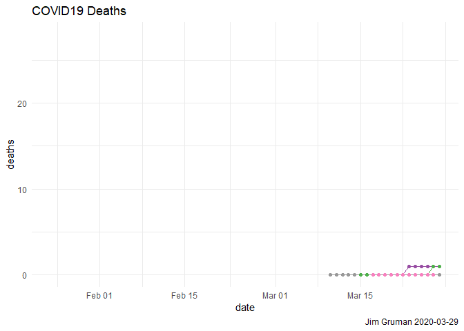

CoronaByCounty
================
Jim Gruman
2020-03-29

``` r
knitr::opts_chunk$set(echo = TRUE, message = FALSE)
library(tidyverse)
library(lubridate)
library(ggplot2)
library(plotly)
library(rjson)
theme_set(theme_minimal())
```

# New York Times COVID19 Dataset

``` r
url<-"https://raw.githubusercontent.com/nytimes/covid-19-data/master/us-counties.csv"
download.file(url = url, destfile = "counties.csv", method = "curl")
NYT<-read_csv("./counties.csv")


df<-NYT%>% 
  mutate(re = stringr::str_c(stringr::str_to_lower(county),
                             " ", 
                             stringr::str_to_lower(state)))
  

county_df<-map_data("county") %>%
  mutate(re = stringr::str_c(stringr::str_to_lower(subregion),
                             " ", 
                             stringr::str_to_lower(region)))

corona_df<-inner_join(df, county_df, by = "re") %>%
  select(cases, deaths, lat, long, county, state, fips)

url = 'https://raw.githubusercontent.com/plotly/datasets/master/geojson-counties-fips.json'
counties <- rjson::fromJSON(file=url)

fig <- plot_ly()

fig <- fig %>% add_trace(
  type="choroplethmapbox",
  geojson=counties,
  locations=corona_df$fips,
  z=corona_df$cases,
  colorscale="Viridis",
  zmin=0,
  zmax=12,
  marker=list(line=list(
    width=0),
    opacity=0.5
  )
)

fig <- fig %>% layout(
  mapbox=list(
    style="carto-positron",
    zoom =2,
    center=list(lon= -95.71, lat=37.09)),
  title = paste0("COVID-19 Cases, NYT ", Sys.Date())
)

fig
```

    ## Warning: `arrange_()` is deprecated as of dplyr 0.7.0.
    ## Please use `arrange()` instead.
    ## See vignette('programming') for more help
    ## This warning is displayed once every 8 hours.
    ## Call `lifecycle::last_warnings()` to see where this warning was generated.

<!-- -->

``` r
NYT %>%
  group_by(state) %>%
  summarize(total_deaths = max(deaths)) %>%
  arrange(desc(total_deaths))
```

    ## # A tibble: 55 x 2
    ##    state       total_deaths
    ##    <chr>              <dbl>
    ##  1 New York             672
    ##  2 Washington           138
    ##  3 Louisiana             70
    ##  4 Michigan              46
    ##  5 New Jersey            35
    ##  6 California            33
    ##  7 Illinois              28
    ##  8 Georgia               23
    ##  9 Connecticut           20
    ## 10 Nevada                14
    ## # ... with 45 more rows

``` r
sum(.Last.value$total_deaths)
```

    ## [1] 0

``` r
# Latest data from:

max(NYT$date)
```

    ## [1] "2020-03-28"

``` r
NYT.local<-
  NYT %>%
  filter(state %in% c("Illinois", "Iowa", "Indiana")) %>%
  mutate(county = factor(county))

NYT.local%>%
  ggplot(aes(x = date, y = cases, group = county, col = county)) +
  geom_line() +
  geom_point() +
  facet_wrap(~ state) +
  scale_y_log10() +
  scale_color_brewer(palette = "Set1")+
  theme(legend.position = "") +
  labs(title = "COVID19 Cases",
        caption = paste0("Jim Gruman ", Sys.Date()))
```

    ## Warning in RColorBrewer::brewer.pal(n, pal): n too large, allowed maximum for palette Set1 is 9
    ## Returning the palette you asked for with that many colors

    ## Warning: Removed 1257 row(s) containing missing values (geom_path).

    ## Warning: Removed 1257 rows containing missing values (geom_point).

<!-- -->

``` r
NYT.local%>%
  ggplot(aes(x = date, y = deaths, group = county, col = county)) +
  geom_line() +
  geom_point() +
  scale_color_brewer(palette = "Set1")+
  theme(legend.position = "") +
  labs(title = "COVID19 Deaths",
        caption = paste0("Jim Gruman ", Sys.Date()))
```

    ## Warning in RColorBrewer::brewer.pal(n, pal): n too large, allowed maximum for palette Set1 is 9
    ## Returning the palette you asked for with that many colors

    ## Warning: Removed 1257 row(s) containing missing values (geom_path).

    ## Warning: Removed 1257 rows containing missing values (geom_point).

<!-- -->
