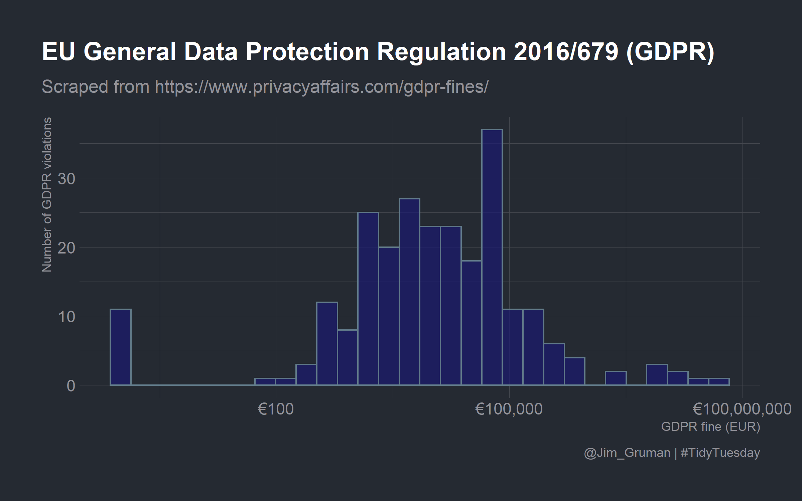
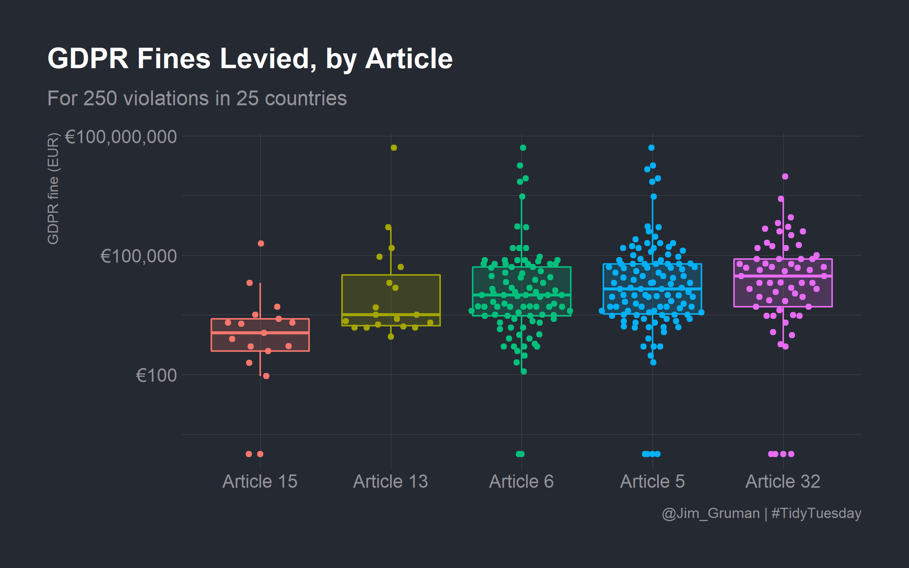
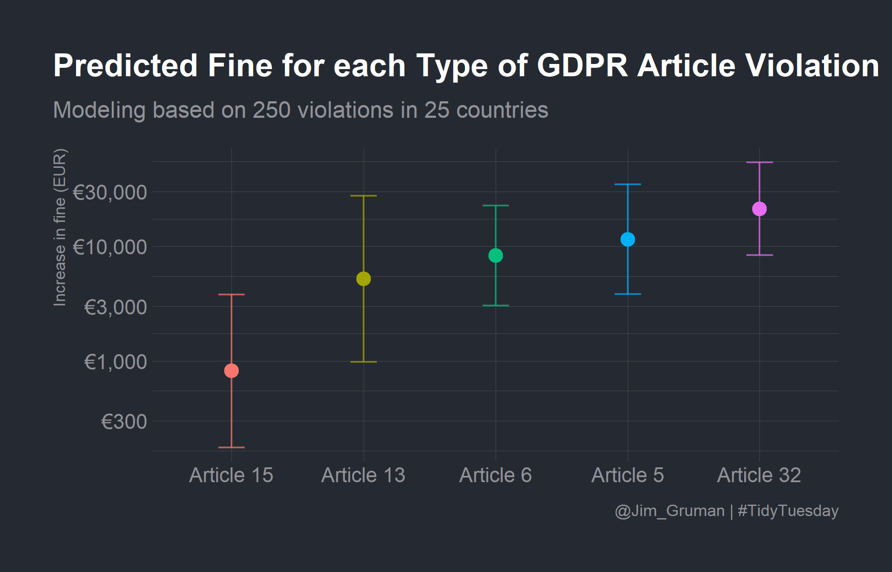

GDPR Fines
================
Jim Gruman
28 April 2020

This week’s [`#TidyTuesday`
dataset](https://github.com/rfordatascience/tidytuesday) is on EU GDPR
violations.

In addition, R version 4.0.0 **Arbor Day** was just released. I am
re-installing packages as-required while going through projects like
this one.

The R Studio team recently launched
[`tidymodels.org`](https://www.tidymodels.org/), a new central location
with resources and documentation for tidymodels packages. Check out the
[official blog
post](https://www.tidyverse.org/blog/2020/04/tidymodels-org/) for more
details.

Julia Silge published a great blog post with [another screencast
demonstrating how to use
`tidymodels`](https://juliasilge.com/category/tidymodels/). She includes
a good video for folks getting started with `tidymodels`.

## Explore the data

Our modeling goal here is to understand what kind of GDPR violations are
associated with higher fines in the [\#TidyTuesday
dataset](https://github.com/rfordatascience/tidytuesday/blob/master/data/2020/2020-04-21/readme.md)
for this week. Before we start, what are the most common GDPR articles
actually about? Roughly speaking:

  - **Article 5:** principles for processing personal data (legitimate
    purpose, limited)
  - **Article 6:** lawful processing of personal data (i.e. consent,
    etc)
  - **Article 13:** inform subject when personal data is collected
  - **Article 15:** right of access by data subject
  - **Article 32:** security of processing (i.e. data breaches)

Let’s get started by looking at the data on violations.

``` r
gdpr_raw <- readr::read_tsv("https://raw.githubusercontent.com/rfordatascience/tidytuesday/master/data/2020/2020-04-21/gdpr_violations.tsv")

gdpr_raw %>%
  head() %>%
  knitr::kable("html") %>%
  kableExtra::kable_styling(
    bootstrap_options = c("striped", "condensed"),
    full_width = F, fixed_thead = T
  ) %>%
  kableExtra::scroll_box(width = "800px", height = "200px")
```

<div style="border: 1px solid #ddd; padding: 0px; overflow-y: scroll; height:200px; overflow-x: scroll; width:800px; ">

<table class="table table-striped table-condensed" style="width: auto !important; margin-left: auto; margin-right: auto;">

<thead>

<tr>

<th style="text-align:right;position: sticky; top:0; background-color: #FFFFFF;position: sticky; top:0; background-color: #FFFFFF;">

id

</th>

<th style="text-align:left;position: sticky; top:0; background-color: #FFFFFF;position: sticky; top:0; background-color: #FFFFFF;">

picture

</th>

<th style="text-align:left;position: sticky; top:0; background-color: #FFFFFF;position: sticky; top:0; background-color: #FFFFFF;">

name

</th>

<th style="text-align:right;position: sticky; top:0; background-color: #FFFFFF;position: sticky; top:0; background-color: #FFFFFF;">

price

</th>

<th style="text-align:left;position: sticky; top:0; background-color: #FFFFFF;position: sticky; top:0; background-color: #FFFFFF;">

authority

</th>

<th style="text-align:left;position: sticky; top:0; background-color: #FFFFFF;position: sticky; top:0; background-color: #FFFFFF;">

date

</th>

<th style="text-align:left;position: sticky; top:0; background-color: #FFFFFF;position: sticky; top:0; background-color: #FFFFFF;">

controller

</th>

<th style="text-align:left;position: sticky; top:0; background-color: #FFFFFF;position: sticky; top:0; background-color: #FFFFFF;">

article\_violated

</th>

<th style="text-align:left;position: sticky; top:0; background-color: #FFFFFF;position: sticky; top:0; background-color: #FFFFFF;">

type

</th>

<th style="text-align:left;position: sticky; top:0; background-color: #FFFFFF;position: sticky; top:0; background-color: #FFFFFF;">

source

</th>

<th style="text-align:left;position: sticky; top:0; background-color: #FFFFFF;position: sticky; top:0; background-color: #FFFFFF;">

summary

</th>

</tr>

</thead>

<tbody>

<tr>

<td style="text-align:right;">

1

</td>

<td style="text-align:left;">

<https://www.privacyaffairs.com/wp-content/uploads/2019/10/republic-of-poland.svg>

</td>

<td style="text-align:left;">

Poland

</td>

<td style="text-align:right;">

9380

</td>

<td style="text-align:left;">

Polish National Personal Data Protection Office (UODO)

</td>

<td style="text-align:left;">

10/18/2019

</td>

<td style="text-align:left;">

Polish Mayor

</td>

<td style="text-align:left;">

Art. 28 GDPR

</td>

<td style="text-align:left;">

Non-compliance with lawful basis for data processing

</td>

<td style="text-align:left;">

<https://uodo.gov.pl/decyzje/ZSPU.421.3.2019>

</td>

<td style="text-align:left;">

No data processing agreement has been concluded with the company whose
servers contained the resources of the Public Information Bulletin (BIP)
of the Municipal Office in Aleksandrów Kujawski. For this reason, a fine
of 40.000 PLN (9400 EUR) was imposed on the mayor of the city.

</td>

</tr>

<tr>

<td style="text-align:right;">

2

</td>

<td style="text-align:left;">

<https://www.privacyaffairs.com/wp-content/uploads/2019/10/romania.svg>

</td>

<td style="text-align:left;">

Romania

</td>

<td style="text-align:right;">

2500

</td>

<td style="text-align:left;">

Romanian National Supervisory Authority for Personal Data Processing
(ANSPDCP)

</td>

<td style="text-align:left;">

10/17/2019

</td>

<td style="text-align:left;">

UTTIS INDUSTRIES

</td>

<td style="text-align:left;">

Art. 12 GDPR|Art. 13 GDPR|Art. 5 (1) c) GDPR|Art. 6 GDPR

</td>

<td style="text-align:left;">

Information obligation non-compliance

</td>

<td style="text-align:left;">

<https://www.dataprotection.ro/?page=A_patra_amenda&lang=ro>

</td>

<td style="text-align:left;">

A controller was sanctioned because he had unlawfully processed the
personal data (CNP), and images of employees obtained through the
surveillance system. The disclosure of the CNP in a report for the ISCIR
training in 2018 wasn’t legal, as per Art.6 GDPR.

</td>

</tr>

<tr>

<td style="text-align:right;">

3

</td>

<td style="text-align:left;">

<https://www.privacyaffairs.com/wp-content/uploads/2019/10/spain.svg>

</td>

<td style="text-align:left;">

Spain

</td>

<td style="text-align:right;">

60000

</td>

<td style="text-align:left;">

Spanish Data Protection Authority (AEPD)

</td>

<td style="text-align:left;">

10/16/2019

</td>

<td style="text-align:left;">

Xfera Moviles S.A.

</td>

<td style="text-align:left;">

Art. 5 GDPR|Art. 6 GDPR

</td>

<td style="text-align:left;">

Non-compliance with lawful basis for data processing

</td>

<td style="text-align:left;">

<https://www.aepd.es/resoluciones/PS-00262-2019_ORI.pdf>

</td>

<td style="text-align:left;">

The company had unlawfully processed the personal data despite the
subject’s request to stop doing so.

</td>

</tr>

<tr>

<td style="text-align:right;">

4

</td>

<td style="text-align:left;">

<https://www.privacyaffairs.com/wp-content/uploads/2019/10/spain.svg>

</td>

<td style="text-align:left;">

Spain

</td>

<td style="text-align:right;">

8000

</td>

<td style="text-align:left;">

Spanish Data Protection Authority (AEPD)

</td>

<td style="text-align:left;">

10/16/2019

</td>

<td style="text-align:left;">

Iberdrola Clientes

</td>

<td style="text-align:left;">

Art. 31 GDPR

</td>

<td style="text-align:left;">

Failure to cooperate with supervisory authority

</td>

<td style="text-align:left;">

<https://www.aepd.es/resoluciones/PS-00304-2019_ORI.pdf>

</td>

<td style="text-align:left;">

Iberdrola Clientes violated Article 13 of the GDPR when it showed a
complete lack of cooperation with the AEPD. The latter had requested
Iberdrola Clientes to provide the necessary information needed to add a
person to the solvency list.

</td>

</tr>

<tr>

<td style="text-align:right;">

5

</td>

<td style="text-align:left;">

<https://www.privacyaffairs.com/wp-content/uploads/2019/10/romania.svg>

</td>

<td style="text-align:left;">

Romania

</td>

<td style="text-align:right;">

150000

</td>

<td style="text-align:left;">

Romanian National Supervisory Authority for Personal Data Processing
(ANSPDCP)

</td>

<td style="text-align:left;">

10/09/2019

</td>

<td style="text-align:left;">

Raiffeisen Bank SA

</td>

<td style="text-align:left;">

Art. 32 GDPR

</td>

<td style="text-align:left;">

Failure to implement sufficient measures to ensure information security

</td>

<td style="text-align:left;">

<https://www.dataprotection.ro/?page=Comunicat_Presa_09_10_2019&lang=ro>

</td>

<td style="text-align:left;">

Raiffeisen Bank Romania did not observe the necessary security measures
required by the GDPR when it assessed the scores of individuals on the
WhatsApp platform. The personal data was exchanged via WhatsApp.

</td>

</tr>

<tr>

<td style="text-align:right;">

6

</td>

<td style="text-align:left;">

<https://www.privacyaffairs.com/wp-content/uploads/2019/10/romania.svg>

</td>

<td style="text-align:left;">

Romania

</td>

<td style="text-align:right;">

20000

</td>

<td style="text-align:left;">

Romanian National Supervisory Authority for Personal Data Processing
(ANSPDCP)

</td>

<td style="text-align:left;">

10/09/2019

</td>

<td style="text-align:left;">

Vreau Credit SRL

</td>

<td style="text-align:left;">

Art. 32 GDPR|Art. 33 GDPR

</td>

<td style="text-align:left;">

Failure to implement sufficient measures to ensure information security

</td>

<td style="text-align:left;">

<https://www.dataprotection.ro/?page=Comunicat_Presa_09_10_2019&lang=ro>

</td>

<td style="text-align:left;">

The Company sent personal information through the WhatsApp platform to
Raiffeisen Bank in order to facilitate the assessment of personal
scores. The results were returned on the same platform.

</td>

</tr>

</tbody>

</table>

</div>

How are the fines distributed?

``` r
gdpr_raw_histogram <- gdpr_raw %>%
  ggplot(aes(price + 1)) +
  geom_histogram(fill = "midnightblue", alpha = 0.7) +
  scale_x_log10(labels = scales::dollar_format(prefix = "€")) +
  labs(
    title = "EU General Data Protection Regulation 2016/679 (GDPR)",
    subtitle = "Scraped from https://www.privacyaffairs.com/gdpr-fines/",
    x = "GDPR fine (EUR)", y = "Number of GDPR violations",
    caption = "@Jim_Gruman | #TidyTuesday"
  ) +
  theme(plot.title.position = "plot")
gdpr_raw_histogram
```

<!-- -->

Some of the violations were fined zero EUR. Let’s make a
one-article-per-row version of this dataset.

``` r
gdpr_tidy <- gdpr_raw %>%
  transmute(id,
    price,
    country = name,
    article_violated,
    articles = str_extract_all(article_violated, "Art.[:digit:]+|Art. [:digit:]+")
  ) %>%
  mutate(total_articles = map_int(articles, length)) %>%
  unnest(articles) %>%
  add_count(articles) %>%
  filter(n > 10) %>%
  select(-n)

gdpr_tidy %>%
  head() %>%
  knitr::kable("html") %>%
  kableExtra::kable_styling(
    bootstrap_options = c("striped", "condensed"),
    full_width = F, fixed_thead = T
  ) %>%
  kableExtra::scroll_box(width = "800px", height = "200px")
```

<div style="border: 1px solid #ddd; padding: 0px; overflow-y: scroll; height:200px; overflow-x: scroll; width:800px; ">

<table class="table table-striped table-condensed" style="width: auto !important; margin-left: auto; margin-right: auto;">

<thead>

<tr>

<th style="text-align:right;position: sticky; top:0; background-color: #FFFFFF;position: sticky; top:0; background-color: #FFFFFF;">

id

</th>

<th style="text-align:right;position: sticky; top:0; background-color: #FFFFFF;position: sticky; top:0; background-color: #FFFFFF;">

price

</th>

<th style="text-align:left;position: sticky; top:0; background-color: #FFFFFF;position: sticky; top:0; background-color: #FFFFFF;">

country

</th>

<th style="text-align:left;position: sticky; top:0; background-color: #FFFFFF;position: sticky; top:0; background-color: #FFFFFF;">

article\_violated

</th>

<th style="text-align:left;position: sticky; top:0; background-color: #FFFFFF;position: sticky; top:0; background-color: #FFFFFF;">

articles

</th>

<th style="text-align:right;position: sticky; top:0; background-color: #FFFFFF;position: sticky; top:0; background-color: #FFFFFF;">

total\_articles

</th>

</tr>

</thead>

<tbody>

<tr>

<td style="text-align:right;">

2

</td>

<td style="text-align:right;">

2500

</td>

<td style="text-align:left;">

Romania

</td>

<td style="text-align:left;">

Art. 12 GDPR|Art. 13 GDPR|Art. 5 (1) c) GDPR|Art. 6 GDPR

</td>

<td style="text-align:left;">

Art. 13

</td>

<td style="text-align:right;">

4

</td>

</tr>

<tr>

<td style="text-align:right;">

2

</td>

<td style="text-align:right;">

2500

</td>

<td style="text-align:left;">

Romania

</td>

<td style="text-align:left;">

Art. 12 GDPR|Art. 13 GDPR|Art. 5 (1) c) GDPR|Art. 6 GDPR

</td>

<td style="text-align:left;">

Art. 5

</td>

<td style="text-align:right;">

4

</td>

</tr>

<tr>

<td style="text-align:right;">

2

</td>

<td style="text-align:right;">

2500

</td>

<td style="text-align:left;">

Romania

</td>

<td style="text-align:left;">

Art. 12 GDPR|Art. 13 GDPR|Art. 5 (1) c) GDPR|Art. 6 GDPR

</td>

<td style="text-align:left;">

Art. 6

</td>

<td style="text-align:right;">

4

</td>

</tr>

<tr>

<td style="text-align:right;">

3

</td>

<td style="text-align:right;">

60000

</td>

<td style="text-align:left;">

Spain

</td>

<td style="text-align:left;">

Art. 5 GDPR|Art. 6 GDPR

</td>

<td style="text-align:left;">

Art. 5

</td>

<td style="text-align:right;">

2

</td>

</tr>

<tr>

<td style="text-align:right;">

3

</td>

<td style="text-align:right;">

60000

</td>

<td style="text-align:left;">

Spain

</td>

<td style="text-align:left;">

Art. 5 GDPR|Art. 6 GDPR

</td>

<td style="text-align:left;">

Art. 6

</td>

<td style="text-align:right;">

2

</td>

</tr>

<tr>

<td style="text-align:right;">

5

</td>

<td style="text-align:right;">

150000

</td>

<td style="text-align:left;">

Romania

</td>

<td style="text-align:left;">

Art. 32 GDPR

</td>

<td style="text-align:left;">

Art. 32

</td>

<td style="text-align:right;">

1

</td>

</tr>

</tbody>

</table>

</div>

How are the fines distributed by article?

``` r
library(ggbeeswarm)

gdpr_fines_levied <- gdpr_tidy %>%
  mutate(
    articles = str_replace_all(articles, "Art. ", "Article "),
    articles = fct_reorder(articles, price)
  ) %>%
  ggplot(aes(articles, price + 1, color = articles, fill = articles)) +
  geom_boxplot(alpha = 0.2, outlier.colour = NA) +
  geom_quasirandom() +
  scale_y_log10(labels = scales::dollar_format(prefix = "€")) +
  labs(
    x = NULL, y = "GDPR fine (EUR)",
    title = "GDPR Fines Levied, by Article",
    subtitle = "For 250 violations in 25 countries",
    caption = "@Jim_Gruman | #TidyTuesday"
  ) +
  theme(
    legend.position = "none",
    plot.title.position = "plot"
  )
gdpr_fines_levied
```

<!-- -->

Now let’s create a dataset for modeling.

``` r
gdpr_violations <- gdpr_tidy %>%
  mutate(value = 1) %>%
  select(-article_violated) %>%
  pivot_wider(
    names_from = articles, values_from = value,
    values_fn = list(value = max), values_fill = list(value = 0)
  ) %>%
  janitor::clean_names()

gdpr_violations %>%
  head() %>%
  knitr::kable("html") %>%
  kableExtra::kable_styling(
    bootstrap_options = c("striped", "condensed"),
    full_width = F, fixed_thead = T
  ) %>%
  kableExtra::scroll_box(width = "800px", height = "200px")
```

<div style="border: 1px solid #ddd; padding: 0px; overflow-y: scroll; height:200px; overflow-x: scroll; width:800px; ">

<table class="table table-striped table-condensed" style="width: auto !important; margin-left: auto; margin-right: auto;">

<thead>

<tr>

<th style="text-align:right;position: sticky; top:0; background-color: #FFFFFF;position: sticky; top:0; background-color: #FFFFFF;">

id

</th>

<th style="text-align:right;position: sticky; top:0; background-color: #FFFFFF;position: sticky; top:0; background-color: #FFFFFF;">

price

</th>

<th style="text-align:left;position: sticky; top:0; background-color: #FFFFFF;position: sticky; top:0; background-color: #FFFFFF;">

country

</th>

<th style="text-align:right;position: sticky; top:0; background-color: #FFFFFF;position: sticky; top:0; background-color: #FFFFFF;">

total\_articles

</th>

<th style="text-align:right;position: sticky; top:0; background-color: #FFFFFF;position: sticky; top:0; background-color: #FFFFFF;">

art\_13

</th>

<th style="text-align:right;position: sticky; top:0; background-color: #FFFFFF;position: sticky; top:0; background-color: #FFFFFF;">

art\_5

</th>

<th style="text-align:right;position: sticky; top:0; background-color: #FFFFFF;position: sticky; top:0; background-color: #FFFFFF;">

art\_6

</th>

<th style="text-align:right;position: sticky; top:0; background-color: #FFFFFF;position: sticky; top:0; background-color: #FFFFFF;">

art\_32

</th>

<th style="text-align:right;position: sticky; top:0; background-color: #FFFFFF;position: sticky; top:0; background-color: #FFFFFF;">

art\_15

</th>

</tr>

</thead>

<tbody>

<tr>

<td style="text-align:right;">

2

</td>

<td style="text-align:right;">

2500

</td>

<td style="text-align:left;">

Romania

</td>

<td style="text-align:right;">

4

</td>

<td style="text-align:right;">

1

</td>

<td style="text-align:right;">

1

</td>

<td style="text-align:right;">

1

</td>

<td style="text-align:right;">

0

</td>

<td style="text-align:right;">

0

</td>

</tr>

<tr>

<td style="text-align:right;">

3

</td>

<td style="text-align:right;">

60000

</td>

<td style="text-align:left;">

Spain

</td>

<td style="text-align:right;">

2

</td>

<td style="text-align:right;">

0

</td>

<td style="text-align:right;">

1

</td>

<td style="text-align:right;">

1

</td>

<td style="text-align:right;">

0

</td>

<td style="text-align:right;">

0

</td>

</tr>

<tr>

<td style="text-align:right;">

5

</td>

<td style="text-align:right;">

150000

</td>

<td style="text-align:left;">

Romania

</td>

<td style="text-align:right;">

1

</td>

<td style="text-align:right;">

0

</td>

<td style="text-align:right;">

0

</td>

<td style="text-align:right;">

0

</td>

<td style="text-align:right;">

1

</td>

<td style="text-align:right;">

0

</td>

</tr>

<tr>

<td style="text-align:right;">

6

</td>

<td style="text-align:right;">

20000

</td>

<td style="text-align:left;">

Romania

</td>

<td style="text-align:right;">

2

</td>

<td style="text-align:right;">

0

</td>

<td style="text-align:right;">

0

</td>

<td style="text-align:right;">

0

</td>

<td style="text-align:right;">

1

</td>

<td style="text-align:right;">

0

</td>

</tr>

<tr>

<td style="text-align:right;">

7

</td>

<td style="text-align:right;">

200000

</td>

<td style="text-align:left;">

Greece

</td>

<td style="text-align:right;">

2

</td>

<td style="text-align:right;">

0

</td>

<td style="text-align:right;">

1

</td>

<td style="text-align:right;">

0

</td>

<td style="text-align:right;">

0

</td>

<td style="text-align:right;">

0

</td>

</tr>

<tr>

<td style="text-align:right;">

9

</td>

<td style="text-align:right;">

30000

</td>

<td style="text-align:left;">

Spain

</td>

<td style="text-align:right;">

2

</td>

<td style="text-align:right;">

0

</td>

<td style="text-align:right;">

1

</td>

<td style="text-align:right;">

1

</td>

<td style="text-align:right;">

0

</td>

<td style="text-align:right;">

0

</td>

</tr>

</tbody>

</table>

</div>

We are ready to go\!

## Build a model

Let’s preprocess our data to get it ready for modeling.

``` r
gdpr_rec <- recipe(price ~ ., data = gdpr_violations) %>%
  update_role(id, new_role = "id") %>%
  step_log(price, base = 10, offset = 1, skip = TRUE) %>%
  step_other(country, other = "Other") %>%
  step_dummy(all_nominal()) %>%
  step_zv(all_predictors())

gdpr_prep <- prep(gdpr_rec)

gdpr_prep
```

    ## Data Recipe
    ## 
    ## Inputs:
    ## 
    ##       role #variables
    ##         id          1
    ##    outcome          1
    ##  predictor          7
    ## 
    ## Training data contained 219 data points and no missing data.
    ## 
    ## Operations:
    ## 
    ## Log transformation on price [trained]
    ## Collapsing factor levels for country [trained]
    ## Dummy variables from country [trained]
    ## Zero variance filter removed no terms [trained]

Let’s walk through the steps in this recipe.

  - First, we must tell the `recipe()` what our model is going to be
    (using a formula here) and what data we are using.
  - Next, we update the role for `id`, since this variable is not a
    predictor or outcome but I would like to keep it in the data for
    convenience.
  - Next, we take the log of the outcome (`price`, the amount of the
    fine).
  - There are a lot of countries in this dataset, so let’s collapse some
    of the less frequently occurring countries into another `"Other"`
    category.
  - Finally, we can create indicator variables and remove varibles with
    zero variance.

Before using `prep()` these steps have been defined but not actually run
or implemented. The `prep()` function is where everything gets
evaluated.

Now it’s time to specify our model. I am using a
[`workflow()`](https://tidymodels.github.io/workflows/) in this example
for convenience; these are objects that can help you manage modeling
pipelines more easily, with pieces that fit together like Lego blocks.
This `workflow()` contains both the recipe and the model (a
straightforward Ordinary Least Squares linear regression).

``` r
gdpr_wf <- workflow() %>%
  add_recipe(gdpr_rec) %>%
  add_model(linear_reg() %>%
    set_engine("lm"))

gdpr_wf
```

    ## == Workflow ============================================================================
    ## Preprocessor: Recipe
    ## Model: linear_reg()
    ## 
    ## -- Preprocessor ------------------------------------------------------------------------
    ## 4 Recipe Steps
    ## 
    ## * step_log()
    ## * step_other()
    ## * step_dummy()
    ## * step_zv()
    ## 
    ## -- Model -------------------------------------------------------------------------------
    ## Linear Regression Model Specification (regression)
    ## 
    ## Computational engine: lm

You can `fit()` a workflow, much like you can fit a model, and then you
can pull out the fit object and `tidy()` it\!

``` r
gdpr_fit <- gdpr_wf %>%
  fit(data = gdpr_violations)

# gdpr_fit %>%
#  workflows::pull_workflow_fit() %>%
#  tidy() %>%
#  arrange(estimate) %>%
#  kable()
```

GDPR violations of more than one article have higher fines.

## Explore results

Lots of those coefficients have big p-values (for example, all the
countries) but I think the best way to understand these results will be
to visualize some predictions. You can predict on new data in tidymodels
with either a model or a `workflow()`.

Let’s create some example new data that we are interested in.

``` r
new_gdpr <- crossing(
  country = "Other",
  art_5 = 0:1,
  art_6 = 0:1,
  art_13 = 0:1,
  art_15 = 0:1,
  art_32 = 0:1
) %>%
  mutate(
    id = row_number(),
    total_articles = art_5 + art_6 + art_13 + art_15 + art_32
  )

new_gdpr %>%
  head() %>%
  knitr::kable("html") %>%
  kableExtra::kable_styling(
    bootstrap_options = c("striped", "condensed"),
    full_width = F, fixed_thead = T
  ) %>%
  kableExtra::scroll_box(width = "800px", height = "200px")
```

<div style="border: 1px solid #ddd; padding: 0px; overflow-y: scroll; height:200px; overflow-x: scroll; width:800px; ">

<table class="table table-striped table-condensed" style="width: auto !important; margin-left: auto; margin-right: auto;">

<thead>

<tr>

<th style="text-align:left;position: sticky; top:0; background-color: #FFFFFF;position: sticky; top:0; background-color: #FFFFFF;">

country

</th>

<th style="text-align:right;position: sticky; top:0; background-color: #FFFFFF;position: sticky; top:0; background-color: #FFFFFF;">

art\_5

</th>

<th style="text-align:right;position: sticky; top:0; background-color: #FFFFFF;position: sticky; top:0; background-color: #FFFFFF;">

art\_6

</th>

<th style="text-align:right;position: sticky; top:0; background-color: #FFFFFF;position: sticky; top:0; background-color: #FFFFFF;">

art\_13

</th>

<th style="text-align:right;position: sticky; top:0; background-color: #FFFFFF;position: sticky; top:0; background-color: #FFFFFF;">

art\_15

</th>

<th style="text-align:right;position: sticky; top:0; background-color: #FFFFFF;position: sticky; top:0; background-color: #FFFFFF;">

art\_32

</th>

<th style="text-align:right;position: sticky; top:0; background-color: #FFFFFF;position: sticky; top:0; background-color: #FFFFFF;">

id

</th>

<th style="text-align:right;position: sticky; top:0; background-color: #FFFFFF;position: sticky; top:0; background-color: #FFFFFF;">

total\_articles

</th>

</tr>

</thead>

<tbody>

<tr>

<td style="text-align:left;">

Other

</td>

<td style="text-align:right;">

0

</td>

<td style="text-align:right;">

0

</td>

<td style="text-align:right;">

0

</td>

<td style="text-align:right;">

0

</td>

<td style="text-align:right;">

0

</td>

<td style="text-align:right;">

1

</td>

<td style="text-align:right;">

0

</td>

</tr>

<tr>

<td style="text-align:left;">

Other

</td>

<td style="text-align:right;">

0

</td>

<td style="text-align:right;">

0

</td>

<td style="text-align:right;">

0

</td>

<td style="text-align:right;">

0

</td>

<td style="text-align:right;">

1

</td>

<td style="text-align:right;">

2

</td>

<td style="text-align:right;">

1

</td>

</tr>

<tr>

<td style="text-align:left;">

Other

</td>

<td style="text-align:right;">

0

</td>

<td style="text-align:right;">

0

</td>

<td style="text-align:right;">

0

</td>

<td style="text-align:right;">

1

</td>

<td style="text-align:right;">

0

</td>

<td style="text-align:right;">

3

</td>

<td style="text-align:right;">

1

</td>

</tr>

<tr>

<td style="text-align:left;">

Other

</td>

<td style="text-align:right;">

0

</td>

<td style="text-align:right;">

0

</td>

<td style="text-align:right;">

0

</td>

<td style="text-align:right;">

1

</td>

<td style="text-align:right;">

1

</td>

<td style="text-align:right;">

4

</td>

<td style="text-align:right;">

2

</td>

</tr>

<tr>

<td style="text-align:left;">

Other

</td>

<td style="text-align:right;">

0

</td>

<td style="text-align:right;">

0

</td>

<td style="text-align:right;">

1

</td>

<td style="text-align:right;">

0

</td>

<td style="text-align:right;">

0

</td>

<td style="text-align:right;">

5

</td>

<td style="text-align:right;">

1

</td>

</tr>

<tr>

<td style="text-align:left;">

Other

</td>

<td style="text-align:right;">

0

</td>

<td style="text-align:right;">

0

</td>

<td style="text-align:right;">

1

</td>

<td style="text-align:right;">

0

</td>

<td style="text-align:right;">

1

</td>

<td style="text-align:right;">

6

</td>

<td style="text-align:right;">

2

</td>

</tr>

</tbody>

</table>

</div>

Let’s find both the mean predictions and the confidence intervals.

``` r
mean_pred <- predict(gdpr_fit,
  new_data = new_gdpr
)

conf_int_pred <- predict(gdpr_fit,
  new_data = new_gdpr,
  type = "conf_int"
)

gdpr_res <- new_gdpr %>%
  bind_cols(mean_pred) %>%
  bind_cols(conf_int_pred)

gdpr_res %>%
  head() %>%
  knitr::kable("html") %>%
  kableExtra::kable_styling(
    bootstrap_options = c("striped", "condensed"),
    full_width = F, fixed_thead = T
  ) %>%
  kableExtra::scroll_box(width = "800px", height = "200px")
```

<div style="border: 1px solid #ddd; padding: 0px; overflow-y: scroll; height:200px; overflow-x: scroll; width:800px; ">

<table class="table table-striped table-condensed" style="width: auto !important; margin-left: auto; margin-right: auto;">

<thead>

<tr>

<th style="text-align:left;position: sticky; top:0; background-color: #FFFFFF;position: sticky; top:0; background-color: #FFFFFF;">

country

</th>

<th style="text-align:right;position: sticky; top:0; background-color: #FFFFFF;position: sticky; top:0; background-color: #FFFFFF;">

art\_5

</th>

<th style="text-align:right;position: sticky; top:0; background-color: #FFFFFF;position: sticky; top:0; background-color: #FFFFFF;">

art\_6

</th>

<th style="text-align:right;position: sticky; top:0; background-color: #FFFFFF;position: sticky; top:0; background-color: #FFFFFF;">

art\_13

</th>

<th style="text-align:right;position: sticky; top:0; background-color: #FFFFFF;position: sticky; top:0; background-color: #FFFFFF;">

art\_15

</th>

<th style="text-align:right;position: sticky; top:0; background-color: #FFFFFF;position: sticky; top:0; background-color: #FFFFFF;">

art\_32

</th>

<th style="text-align:right;position: sticky; top:0; background-color: #FFFFFF;position: sticky; top:0; background-color: #FFFFFF;">

id

</th>

<th style="text-align:right;position: sticky; top:0; background-color: #FFFFFF;position: sticky; top:0; background-color: #FFFFFF;">

total\_articles

</th>

<th style="text-align:right;position: sticky; top:0; background-color: #FFFFFF;position: sticky; top:0; background-color: #FFFFFF;">

.pred

</th>

<th style="text-align:right;position: sticky; top:0; background-color: #FFFFFF;position: sticky; top:0; background-color: #FFFFFF;">

.pred\_lower

</th>

<th style="text-align:right;position: sticky; top:0; background-color: #FFFFFF;position: sticky; top:0; background-color: #FFFFFF;">

.pred\_upper

</th>

</tr>

</thead>

<tbody>

<tr>

<td style="text-align:left;">

Other

</td>

<td style="text-align:right;">

0

</td>

<td style="text-align:right;">

0

</td>

<td style="text-align:right;">

0

</td>

<td style="text-align:right;">

0

</td>

<td style="text-align:right;">

0

</td>

<td style="text-align:right;">

1

</td>

<td style="text-align:right;">

0

</td>

<td style="text-align:right;">

4.000446

</td>

<td style="text-align:right;">

3.410428

</td>

<td style="text-align:right;">

4.590464

</td>

</tr>

<tr>

<td style="text-align:left;">

Other

</td>

<td style="text-align:right;">

0

</td>

<td style="text-align:right;">

0

</td>

<td style="text-align:right;">

0

</td>

<td style="text-align:right;">

0

</td>

<td style="text-align:right;">

1

</td>

<td style="text-align:right;">

2

</td>

<td style="text-align:right;">

1

</td>

<td style="text-align:right;">

4.326841

</td>

<td style="text-align:right;">

3.922444

</td>

<td style="text-align:right;">

4.731237

</td>

</tr>

<tr>

<td style="text-align:left;">

Other

</td>

<td style="text-align:right;">

0

</td>

<td style="text-align:right;">

0

</td>

<td style="text-align:right;">

0

</td>

<td style="text-align:right;">

1

</td>

<td style="text-align:right;">

0

</td>

<td style="text-align:right;">

3

</td>

<td style="text-align:right;">

1

</td>

<td style="text-align:right;">

2.912359

</td>

<td style="text-align:right;">

2.245405

</td>

<td style="text-align:right;">

3.579314

</td>

</tr>

<tr>

<td style="text-align:left;">

Other

</td>

<td style="text-align:right;">

0

</td>

<td style="text-align:right;">

0

</td>

<td style="text-align:right;">

0

</td>

<td style="text-align:right;">

1

</td>

<td style="text-align:right;">

1

</td>

<td style="text-align:right;">

4

</td>

<td style="text-align:right;">

2

</td>

<td style="text-align:right;">

3.238753

</td>

<td style="text-align:right;">

2.407347

</td>

<td style="text-align:right;">

4.070160

</td>

</tr>

<tr>

<td style="text-align:left;">

Other

</td>

<td style="text-align:right;">

0

</td>

<td style="text-align:right;">

0

</td>

<td style="text-align:right;">

1

</td>

<td style="text-align:right;">

0

</td>

<td style="text-align:right;">

0

</td>

<td style="text-align:right;">

5

</td>

<td style="text-align:right;">

1

</td>

<td style="text-align:right;">

3.717506

</td>

<td style="text-align:right;">

2.992813

</td>

<td style="text-align:right;">

4.442199

</td>

</tr>

<tr>

<td style="text-align:left;">

Other

</td>

<td style="text-align:right;">

0

</td>

<td style="text-align:right;">

0

</td>

<td style="text-align:right;">

1

</td>

<td style="text-align:right;">

0

</td>

<td style="text-align:right;">

1

</td>

<td style="text-align:right;">

6

</td>

<td style="text-align:right;">

2

</td>

<td style="text-align:right;">

4.043900

</td>

<td style="text-align:right;">

3.336772

</td>

<td style="text-align:right;">

4.751029

</td>

</tr>

</tbody>

</table>

</div>

There are lots of things we can do wtih these results\! For example,
what are the predicted GDPR fines for violations of each article type
(violating only one article)?

``` r
pred_fine <- gdpr_res %>%
  filter(total_articles == 1) %>%
  pivot_longer(art_5:art_32) %>%
  filter(value > 0) %>%
  mutate(
    name = str_replace_all(name, "art_", "Article "),
    name = fct_reorder(name, .pred)
  ) %>%
  ggplot(aes(name, 10^.pred, color = name)) +
  geom_point(size = 3.5) +
  geom_errorbar(aes(
    ymin = 10^.pred_lower,
    ymax = 10^.pred_upper
  ),
  width = 0.2, alpha = 0.7
  ) +
  labs(
    x = NULL, y = "Increase in fine (EUR)",
    title = "Predicted Fine for each Type of GDPR Article Violation",
    subtitle = "Modeling based on 250 violations in 25 countries",
    caption = "@Jim_Gruman | #TidyTuesday"
  ) +
  scale_y_log10(labels = scales::dollar_format(prefix = "€", accuracy = 1)) +
  theme(
    legend.position = "none",
    plot.title.position = "plot"
  )
pred_fine
```

<!-- -->

We can see here that violations such as data breaches have higher fines
on average than violations about rights of access.

``` r
# Get countries in dataset as a vector
gdpr_countries <- gdpr_raw %>%
  distinct(name) %>%
  pull()

# Get sf objects, filter by countries in dataset
countries_sf <- rnaturalearth::ne_countries(country = c(gdpr_countries, "Czechia"), scale = "large", returnclass = "sf") %>%
  select(name, geometry) %>%
  mutate(name = replace(name, name == "Czechia", "Czech Republic"))

# Group fines by country, merge with sf
countries_map <- gdpr_raw %>%
  mutate(name = stringr::str_to_title(name)) %>%
  group_by(name) %>%
  mutate(
    price_sum = sum(price),
    price_label = case_when(
      round(price_sum / 1e6) > 0 ~ paste0(round(price_sum / 1e6), "M"),
      round(price_sum / 1e5) > 0 ~ paste0(round(price_sum / 1e6, 1), "M"),
      round(price_sum / 1e3) > 0 ~ paste0(round(price_sum / 1e3), "K"),
      price_sum > 0 ~ paste0(round(price_sum / 1e3, 1), " K"),
      TRUE ~ "0"
    )
  ) %>%
  left_join(countries_sf) %>%
  select(name, price_sum, price_label, geometry)

# Copied from https://developers.google.com/public-data/docs/canonical/countries_csv
centroids <- read_html("https://developers.google.com/public-data/docs/canonical/countries_csv") %>%
  html_node("table") %>%
  html_table()

# Dataset for red "arrows" (to draw with geom_polygon)
price_arrows <- countries_map %>%
  select(name, price_sum, price_label) %>%
  left_join(centroids) %>%
  mutate(
    arrow_x = list(c(longitude - 0.5, longitude, longitude + 0.5, longitude)),
    arrow_y = list(c(latitude - 0.03, latitude, latitude - 0.03, latitude + price_sum / 1.5e6))
  ) %>%
  unnest(c(arrow_x, arrow_y))

gdpr_map <- ggplot() +
  # map
  geom_sf(data = countries_map, aes(geometry = geometry), fill = "#EBE9E1", colour = "grey70", size = 0.25) +
  # country name
  geom_text(data = price_arrows, aes(x = longitude - 0.2, y = latitude - 0.4, label = name), check_overlap = TRUE, hjust = 0, vjust = 1, size = 3.5) +
  # red price, over 10M
  geom_text(data = subset(price_arrows, price_sum > 10e6), aes(x = longitude - 0.2, y = latitude - 2, label = price_label), check_overlap = TRUE, hjust = 0, vjust = 1, size = 3.5, colour = "#BA4E35") +
  # black price, under 10M
  geom_text(data = subset(price_arrows, price_sum < 10e6), aes(x = longitude - 0.2, y = latitude - 2, label = price_label), check_overlap = TRUE, hjust = 0, vjust = 1, size = 3.5, colour = "black") +
  # red arrows
  geom_polygon(data = price_arrows, aes(x = arrow_x, y = arrow_y, group = name), fill = "#BA4E35", colour = NA, alpha = 0.8) +
  # title and caption
  annotate("richtext",
    x = -26, y = 80, hjust = 0, vjust = 1,
    label = "**Total of GDPR fines by country**<br><span style = 'font-size:12pt'>Rounded to nearest million or thousand euro</span><br><span style = 'font-size:8pt'>Source: Privacy Affairs | Graphic: @Jim_Gruman</span>",
    family = "IBM Plex Serif", size = 8, lineheight = 1.1, fill = NA, label.color = NA
  ) +
  theme_void() +
  theme(
    #    plot.margin = margin(20, 20, 20, 20),
    plot.title.position = "plot"
  ) +
  coord_sf(xlim = c(-27.5, 37.5), ylim = c(32.5, 82.5), expand = FALSE)

gdpr_map +
  ggsave("GDPRmap.png", dpi = 320, width = 14, height = 11)
```

<!-- -->

``` r
library(patchwork)
png("GDPR.png", width = 8, height = 12, units = "in", res = 120)

(pred_fine + gdpr_raw_histogram / gdpr_fines_levied) + plot_layout(heights = c(1, 3))

dev.off()
```

    ## png 
    ##   2
