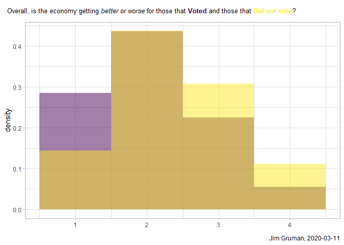
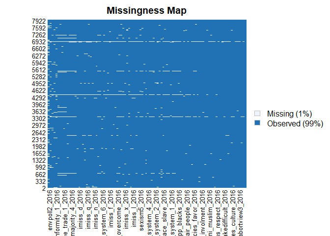

Get Out The Vote
================
Jim Gruman
2020-03-11

## Get Out The Vote Case Study

Adapted from the Julia Silge [Supervised ML
Course](https://supervised-ml-course.netlify.com/chapter3) and updated
with Tidymodels in place of Caret.

Objective: use data on attitudes and beliefs in the United States to
predict the 2016 voter turnout. Apply skills in dealing with imbalanced
data and explore resampling options.

The Data Source is the [Democracy Fund Voter
Survey](https://www.voterstudygroup.org/publication/2016-voter-survey)


``` r
voters %>%
  count(turnout16_2016)
```

    ## # A tibble: 2 x 2
    ##   turnout16_2016     n
    ##   <fct>          <int>
    ## 1 Voted           7611
    ## 2 Did.not.vote     341

Views captured in the survey included:

1.  Life in America today for people like you compared to fifty years
    ago is better? about the same? worse?

2.  Was your vote primarily a vote in favor of your choice or was it
    mostly a vote against his/her opponent?

3.  How important are the following issues to you?

<!-- end list -->

  - Crime
  - Immigration
  - The environment
  - Gay rights

How do the reponses on the survey vary with voting behavior, at least on
three survey metrics?

``` r
voters %>%
    group_by(turnout16_2016) %>%
    summarise(`Elections don't matter` = mean(rigged_system_1_2016 <= 2, na.rm=TRUE),
              `Economy is getting better` = mean(econtrend_2016 == 1, na.rm = TRUE),
              `Crime is very important` = mean(imiss_a_2016 == 2, na.rm = TRUE))
```

    ## # A tibble: 2 x 4
    ##   turnout16_2016 `Elections don't ma~ `Economy is getting ~ `Crime is very impo~
    ##   <fct>                         <dbl>                 <dbl>                <dbl>
    ## 1 Voted                         0.345                 0.285                0.338
    ## 2 Did.not.vote                  0.558                 0.144                0.294

``` r
library(ggplot2)
library(ggtext)
scales::show_col(viridis_pal()(2))
```

<!-- -->

``` r
voters %>%
  ggplot(aes(econtrend_2016, ..density.., fill = turnout16_2016))+
  geom_histogram(alpha = 0.5, position = "identity", binwidth = 1) +
  labs(title = "Overall, is the economy getting *better* or *worse* for those that <b><span style='color:#440154FF'>Voted</span></b> and those that <b><span style='color:#FDE725FF'>Did not vote</span></b>?", 
       caption = str_c("Jim Gruman, ", Sys.Date()),
       x = element_blank()) +
  theme(legend.position = "none"  ,
        plot.title.position = "plot",
         plot.title = element_textbox_simple(
      size = 10,
      padding = unit(c(5.5, 5.5, 5.5, 5.5), "pt"),
      margin = unit(c(0, 0, 5.5, 0), "pt"),
      fill = "white"
    ))+     #tip from William R Chase at RStudio Conference 2020
  scale_fill_viridis(discrete = TRUE)
```

<!-- -->

Check the data missing-ness and find features with nearly zero variance

``` r
Amelia::missmap(voters[,-1])
```

<!-- -->

``` r
#library(GGally)
#ggscatmat(voters, columns = 1:104, color = "asia", alpha = 0.5)
```

Split the data into training and testing, then center, scale, and impute
the missing fields with the recipes package functions. All the
predictors in this dataset are numeric, so no dummies are required. If
dummies were required, they would be created ahead of the centering,
scaling, and box-cox transformations.

``` r
voters_split<-voters %>% initial_split(strata = turnout16_2016)
voters_tr<-training(voters_split)
voters_te<-testing(voters_split)

voters_rec <- recipe(turnout16_2016 ~ .,
                    data = voters_tr) %>%
              step_knnimpute(all_predictors(), neighbors = 3) %>%
              step_center(all_predictors()) %>% 
              step_scale(all_predictors()) %>%
              check_missing(all_predictors()) %>%
              prep() 

# the steps taken
voters_rec
```

    ## Data Recipe
    ## 
    ## Inputs:
    ## 
    ##       role #variables
    ##    outcome          1
    ##  predictor        104
    ## 
    ## Training data contained 5964 data points and 2605 incomplete rows. 
    ## 
    ## Operations:
    ## 
    ## K-nearest neighbor imputation for rigged_system_2_2016, ... [trained]
    ## Centering for rigged_system_1_2016, ... [trained]
    ## Scaling for rigged_system_1_2016, ... [trained]
    ## Check missing values for rigged_system_1_2016, ... [trained]

``` r
# what the data looks like after pre-processing
juice(voters_rec) 
```

    ## # A tibble: 5,964 x 105
    ##    rigged_system_1~ rigged_system_2~ rigged_system_3~ rigged_system_4~
    ##               <dbl>            <dbl>            <dbl>            <dbl>
    ##  1            0.299            1.76           -1.02             2.14  
    ##  2           -0.900            1.76           -1.02             2.14  
    ##  3           -2.10             1.76           -1.02             2.14  
    ##  4            0.299           -1.55            1.19            -1.02  
    ##  5            0.299            0.659           0.0844           0.0363
    ##  6            0.299            1.76           -1.02            -1.02  
    ##  7           -0.900            0.659           1.19             0.0363
    ##  8            1.50             1.76           -1.02             1.09  
    ##  9           -0.900            0.659          -1.02             0.0363
    ## 10            1.50             0.659          -1.02             1.09  
    ## # ... with 5,954 more rows, and 101 more variables: rigged_system_5_2016 <dbl>,
    ## #   rigged_system_6_2016 <dbl>, track_2016 <dbl>, persfinretro_2016 <dbl>,
    ## #   econtrend_2016 <dbl>, americatrend_2016 <dbl>, futuretrend_2016 <dbl>,
    ## #   wealth_2016 <dbl>, values_culture_2016 <dbl>, us_respect_2016 <dbl>,
    ## #   trustgovt_2016 <dbl>, trust_people_2016 <dbl>, helpful_people_2016 <dbl>,
    ## #   fair_people_2016 <dbl>, imiss_a_2016 <dbl>, imiss_b_2016 <dbl>,
    ## #   imiss_c_2016 <dbl>, imiss_d_2016 <dbl>, imiss_e_2016 <dbl>,
    ## #   imiss_f_2016 <dbl>, imiss_g_2016 <dbl>, imiss_h_2016 <dbl>,
    ## #   imiss_i_2016 <dbl>, imiss_j_2016 <dbl>, imiss_k_2016 <dbl>,
    ## #   imiss_l_2016 <dbl>, imiss_m_2016 <dbl>, imiss_n_2016 <dbl>,
    ## #   imiss_o_2016 <dbl>, imiss_p_2016 <dbl>, imiss_q_2016 <dbl>,
    ## #   imiss_r_2016 <dbl>, imiss_s_2016 <dbl>, imiss_t_2016 <dbl>,
    ## #   imiss_u_2016 <dbl>, imiss_x_2016 <dbl>, imiss_y_2016 <dbl>,
    ## #   immi_contribution_2016 <dbl>, immi_naturalize_2016 <dbl>,
    ## #   immi_makedifficult_2016 <dbl>, immi_muslim_2016 <dbl>,
    ## #   abortview3_2016 <dbl>, gaymar_2016 <dbl>, view_transgender_2016 <dbl>,
    ## #   deathpen_2016 <dbl>, deathpenfreq_2016 <dbl>, police_threat_2016 <dbl>,
    ## #   conviction_accuracy_2016 <dbl>, univhealthcov_2016 <dbl>,
    ## #   healthreformbill_2016 <dbl>, envwarm_2016 <dbl>, envpoll2_2016 <dbl>,
    ## #   affirmact_gen_2016 <dbl>, taxdoug_2016 <dbl>, govt_reg_2016 <dbl>,
    ## #   gvmt_involment_2016 <dbl>, tradepolicy_2016 <dbl>, free_trade_1_2016 <dbl>,
    ## #   free_trade_2_2016 <dbl>, free_trade_3_2016 <dbl>, free_trade_4_2016 <dbl>,
    ## #   free_trade_5_2016 <dbl>, amcitizen_2016 <dbl>, amshamed_2016 <dbl>,
    ## #   belikeus_2016 <dbl>, prouddem_2016 <dbl>, proudhis_2016 <dbl>,
    ## #   proudgrp_2016 <dbl>, ambornin_2016 <dbl>, amcit_2016 <dbl>,
    ## #   amlived_2016 <dbl>, amenglish_2016 <dbl>, amchrstn_2016 <dbl>,
    ## #   amgovt_2016 <dbl>, amwhite_2016 <dbl>, amdiverse_2016 <dbl>,
    ## #   sexism1_2016 <dbl>, sexism2_2016 <dbl>, sexism3_2016 <dbl>,
    ## #   sexism4_2016 <dbl>, sexism5_2016 <dbl>, sexism6_2016 <dbl>,
    ## #   gender_equality_2016 <dbl>, race_deservemore_2016 <dbl>,
    ## #   race_overcome_2016 <dbl>, race_tryharder_2016 <dbl>, race_slave_2016 <dbl>,
    ## #   policies_favor_2016 <dbl>, reverse_discrimination_2016 <dbl>,
    ## #   inc_opp_blacks_2016 <dbl>, race_majority_1_2016 <dbl>,
    ## #   race_majority_2_2016 <dbl>, race_majority_3_2016 <dbl>,
    ## #   race_majority_4_2016 <dbl>, social_conformity_1_2016 <dbl>,
    ## #   social_conformity_2_2016 <dbl>, social_conformity_3_2016 <dbl>,
    ## #   social_conformity_4_2016 <dbl>, civic_participation_2016 <dbl>,
    ## #   political_correctness_2016 <dbl>, ...

``` r
x_train<- voters_rec %>% juice(all_predictors())
y_train<- voters_rec %>% juice(all_outcomes())

test_data<- bake(voters_rec, new_data=voters_te)
```

First fit a simple model, to take a quick look under the hood

``` r
glm_spec<-logistic_reg(mode = "classification") %>%
         set_engine("glm")

glm_fit<- glm_spec %>%
          fit(turnout16_2016 ~ ., data = train_data)
```

    ## Error in fit.model_spec(., turnout16_2016 ~ ., data = train_data): object 'train_data' not found

``` r
rf_spec<-rand_forest(mode = "classification") %>%
         set_engine("ranger")

rf_fit<- rf_spec %>%
          fit(turnout16_2016 ~ ., data = train_data)
```

    ## Error in fit.model_spec(., turnout16_2016 ~ ., data = train_data): object 'train_data' not found

``` r
results_train <- glm_fit %>%
   predict(new_data = train_data) %>%
   mutate(
     truth = train_data$turnout16_2016,
     model = "glm"
   ) %>%
   bind_rows(rf_fit %>%
            predict(new_data = train_data) %>%
            mutate(truth = train_data$turnout16_2016,
                   model = "rf"
  )) 
```

    ## Error in eval(lhs, parent, parent): object 'glm_fit' not found

``` r
results_test <- glm_fit %>%
   predict(new_data = test_data) %>%
   mutate(
     truth = test_data$turnout16_2016,
     model = "glm"
   ) %>%
   bind_rows(rf_fit %>%
            predict(new_data = test_data) %>%
            mutate(truth = test_data$turnout16_2016,
                   model = "rf"
  )) 
```

    ## Error in eval(lhs, parent, parent): object 'glm_fit' not found

``` r
results_train %>%
  group_by(model) %>%
  metrics(truth = truth, .pred_class)
```

    ## Error in eval(lhs, parent, parent): object 'results_train' not found

``` r
results_test %>%
  group_by(model)  %>%
  metrics(truth = truth, .pred_class)
```

    ## Error in eval(lhs, parent, parent): object 'results_test' not found

Let’s look for improvement with hyperparameter tuning on the random
forest models.

``` r
vote_boot <- bake(voters_rec, voters) %>%
        bootstraps(times = 10)

rf_spec <- rand_forest(
  mode = "classification",
  mtry = tune(),
  trees = 500,
  min_n = tune()
) %>%
  set_engine("ranger")

rf_grid <- tune_grid(
  rf_spec, 
  turnout16_2016 ~ .,
  resamples = vote_boot)
```

    ## i Creating pre-processing data to finalize unknown parameter: mtry

``` r
rf_grid %>%
  collect_metrics()
```

    ## # A tibble: 20 x 7
    ##     mtry min_n .metric  .estimator  mean     n std_err
    ##    <int> <int> <chr>    <chr>      <dbl> <int>   <dbl>
    ##  1     7     7 accuracy binary     0.957    10 0.00117
    ##  2     7     7 roc_auc  binary     0.772    10 0.00582
    ##  3    19    13 accuracy binary     0.957    10 0.00119
    ##  4    19    13 roc_auc  binary     0.760    10 0.00618
    ##  5    27    22 accuracy binary     0.957    10 0.00119
    ##  6    27    22 roc_auc  binary     0.757    10 0.00481
    ##  7    36    27 accuracy binary     0.957    10 0.00116
    ##  8    36    27 roc_auc  binary     0.754    10 0.00538
    ##  9    52    38 accuracy binary     0.957    10 0.00115
    ## 10    52    38 roc_auc  binary     0.750    10 0.00414
    ## 11    63    13 accuracy binary     0.957    10 0.00116
    ## 12    63    13 roc_auc  binary     0.743    10 0.00468
    ## 13    65     4 accuracy binary     0.957    10 0.00116
    ## 14    65     4 roc_auc  binary     0.744    10 0.00524
    ## 15    74    34 accuracy binary     0.958    10 0.00111
    ## 16    74    34 roc_auc  binary     0.742    10 0.00464
    ## 17    92    31 accuracy binary     0.957    10 0.00111
    ## 18    92    31 roc_auc  binary     0.740    10 0.00438
    ## 19    98    20 accuracy binary     0.957    10 0.00112
    ## 20    98    20 roc_auc  binary     0.739    10 0.00390

``` r
rf_grid %>%
  show_best("roc_auc")
```

    ## # A tibble: 5 x 7
    ##    mtry min_n .metric .estimator  mean     n std_err
    ##   <int> <int> <chr>   <chr>      <dbl> <int>   <dbl>
    ## 1     7     7 roc_auc binary     0.772    10 0.00582
    ## 2    19    13 roc_auc binary     0.760    10 0.00618
    ## 3    27    22 roc_auc binary     0.757    10 0.00481
    ## 4    36    27 roc_auc binary     0.754    10 0.00538
    ## 5    52    38 roc_auc binary     0.750    10 0.00414

So, choosing the random forest model with parameters `mtry = 5` and
`min_n = 18` and assessing performance on testing data:

``` r
rf_spec<-rand_forest(mode = "classification",
                     mtry = 5,
                     trees = 500,
                     min_n = 18) %>%
         set_engine("ranger")

rf_fit<- rf_spec %>%
          fit(turnout16_2016 ~ ., data = train_data)
```

    ## Error in fit.model_spec(., turnout16_2016 ~ ., data = train_data): object 'train_data' not found

``` r
rf_fit %>% predict(new_data = train_data) %>%
            mutate(truth = train_data$turnout16_2016,
                   model = "rf")%>%
  group_by(model)  %>%
  metrics(truth = truth, .pred_class)
```

    ## Error in eval(lhs, parent, parent): object 'rf_fit' not found
