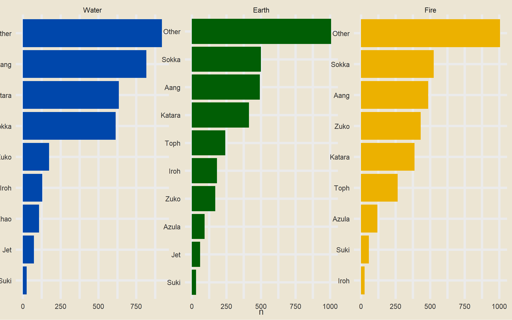
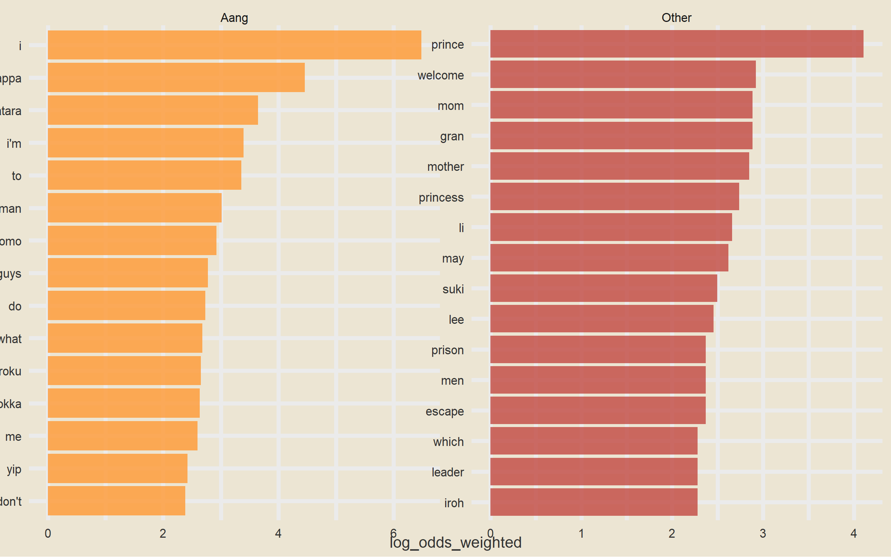
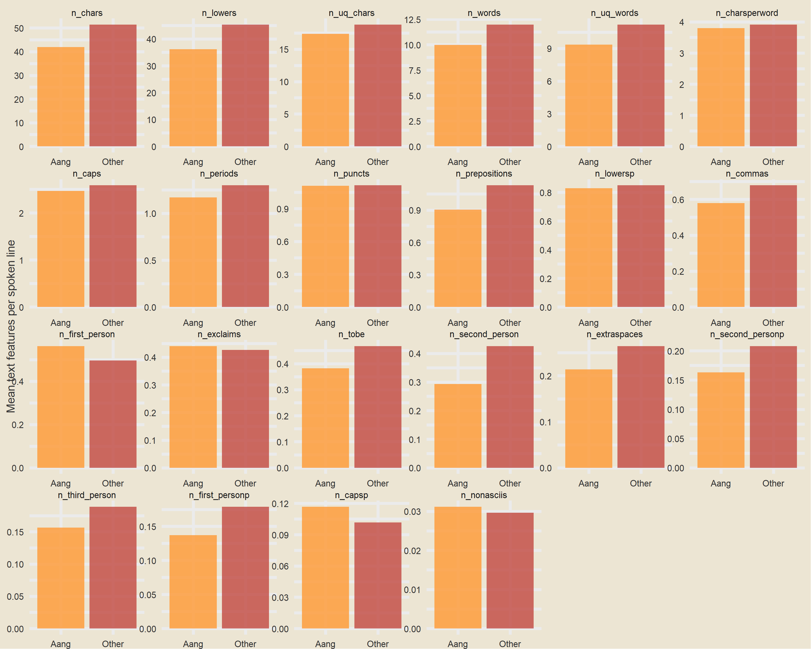
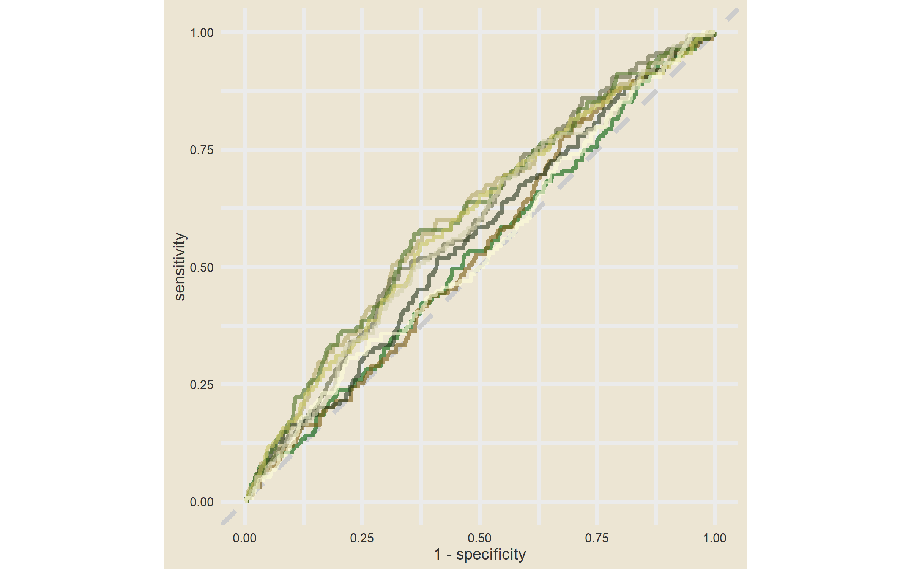
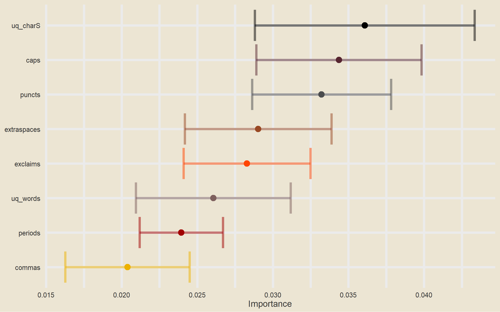

TheLastAirbender
================
Jim Gruman
8/11/2020

Lately Julia Silge has been publishing
[screencasts](https://juliasilge.com/category/tidymodels/) demonstrating
how to use the [tidymodels](https://www.tidymodels.org/) framework, from
first steps in modeling to how to evaluate complex models. Today’s
example admittedly does not result in the *best* performing model you’ll
ever see, but it is really fun and uses this week’s [`#TidyTuesday`
dataset](https://github.com/rfordatascience/tidytuesday) on *Avatar: The
Last Airbender*. 🔥 🌏 🌊 💨

## Explore the data

This week’s \#TidyTuesday dataset is from [episodes of *Avatar: The Last
Airbender*](https://github.com/rfordatascience/tidytuesday/blob/master/data/2020/2020-08-11/readme.md).
Our modeling goal is to predict the speaker of each line of dialogue.

``` r
library(tidyverse)

avatar <- tidytuesdayR::tt_load("2020-08-11")
```

    ## 
    ##  Downloading file 1 of 2: `avatar.csv`
    ##  Downloading file 2 of 2: `scene_description.csv`

``` r
avatar_raw <- avatar$avatar

avatar_raw %>%
  count(character, sort = TRUE)
```

    ## # A tibble: 374 x 2
    ##    character             n
    ##    <chr>             <int>
    ##  1 Scene Description  3393
    ##  2 Aang               1796
    ##  3 Sokka              1639
    ##  4 Katara             1437
    ##  5 Zuko                776
    ##  6 Toph                507
    ##  7 Iroh                337
    ##  8 Azula               211
    ##  9 Jet                 134
    ## 10 Suki                114
    ## # ... with 364 more rows

Rows with `Scene Description` are not dialogue; the main character Aang
speaks the most lines overall. How does this change through the three
“books” of the show?

``` r
library(tidytext)

avatar_raw %>%
  filter(!is.na(character_words)) %>%
  mutate(
    book = fct_inorder(book),
    character = fct_lump_n(character, 10)
  ) %>%
  count(book, character) %>%
  mutate(character = reorder_within(character, n, book)) %>%
  ggplot(aes(n, character, fill = book)) +
  geom_col(show.legend = FALSE) +
  facet_wrap(~book, scales = "free") +
  scale_y_reordered() +
  scale_fill_manual(values = c(
    avatar_pal("WaterTribe")(1),
    avatar_pal("EarthKingdom")(1),
    avatar_pal("FireNation")(1)
  )) +
  labs(y = NULL)
```

<!-- -->

Let’s create a dataset for our modeling question, and look at a few
example lines.

``` r
avatar <- avatar_raw %>%
  filter(!is.na(character_words)) %>%
  mutate(aang = if_else(character == "Aang", "Aang", "Other")) %>%
  select(aang, book, text = character_words)

avatar %>%
  filter(aang == "Aang") %>%
  sample_n(10) %>%
  pull(text)
```

    ##  [1] "I couldn't find any ginger root for the tea. But I found a map. There's an herbalist institute on top of that mountain. We could probably find a cure for Sokka there."
    ##  [2] "I'm going after Appa."                                                                                                                                                 
    ##  [3] "So, Toph thinks you give pretty good advice, and great tea!"                                                                                                           
    ##  [4] "I laugh at gravity all the time.  Gravity."                                                                                                                            
    ##  [5] "Why would I choose cosmic energy over Katara?  How could it be a bad thing that I feel an attachment to her? Three chakras ago that was a good thing!"                 
    ##  [6] "Nope!  Wrong way!"                                                                                                                                                     
    ##  [7] "The key, Sokka, is airbending."                                                                                                                                        
    ##  [8] "Everyone expects me to take the Fire Lord's life,  but I just don't know if I can do that."                                                                            
    ##  [9] "Katara, it's okay. I know I was upset about losing Appa before, but I just want to focus on getting to Ba Sing Se and telling the Earth King about the solar eclipse." 
    ## [10] "Oh, okay."

This… may be a challenge.

What are the highest log odds words from Aang and other speakers?

``` r
library(tidytext)
library(tidylo)

avatar_lo <- avatar %>%
  unnest_tokens(word, text) %>%
  count(aang, word) %>%
  bind_log_odds(aang, word, n) %>%
  arrange(-log_odds_weighted)

avatar_lo %>%
  group_by(aang) %>%
  top_n(15) %>%
  ungroup() %>%
  mutate(word = reorder(word, log_odds_weighted)) %>%
  ggplot(aes(log_odds_weighted, word, fill = aang)) +
  geom_col(alpha = 0.8, show.legend = FALSE) +
  facet_wrap(~aang, scales = "free") +
  scale_fill_avatar(palette = "AirNomads") +
  labs(y = NULL)
```

<!-- -->

These words make sense, but the counts are probably too low to build a
good model with. Instead, let’s try using [text
features](https://textfeatures.mikewk.com/) like the number of
punctuation characters, number of pronons, and so forth.

``` r
library(textfeatures)

tf <- textfeatures(
  avatar,
  sentiment = FALSE, word_dims = 0,
  normalize = FALSE, verbose = FALSE
)

tf %>%
  bind_cols(avatar) %>%
  group_by(aang) %>%
  summarise(across(starts_with("n_"), mean)) %>%
  pivot_longer(starts_with("n_"), names_to = "text_feature") %>%
  filter(value > 0.01) %>%
  mutate(text_feature = fct_reorder(text_feature, -value)) %>%
  ggplot(aes(aang, value, fill = aang)) +
  geom_col(position = "dodge", alpha = 0.8, show.legend = FALSE) +
  facet_wrap(~text_feature, scales = "free", ncol = 6) +
  scale_fill_avatar("AirNomads") +
  labs(x = NULL, y = "Mean text features per spoken line")
```

<!-- -->

You can [read the definitions of these counts
here](https://textfeatures.mikewk.com/reference/count_functions.html).
The differences in these features are what we want to build a model to
use in prediction.

## Build a model

We can start by loading the tidymodels metapackage, and splitting our
data into training and testing sets.

``` r
library(tidymodels)

set.seed(123)
avatar_split <- initial_split(avatar, strata = aang)
avatar_train <- training(avatar_split)
avatar_test <- testing(avatar_split)
```

Next, let’s create cross-validation resamples of the training data, to
evaluate our models.

``` r
set.seed(234)
avatar_folds <- vfold_cv(avatar_train, strata = aang)
avatar_folds
```

    ## #  10-fold cross-validation using stratification 
    ## # A tibble: 10 x 2
    ##    splits             id    
    ##    <list>             <chr> 
    ##  1 <split [6.7K/750]> Fold01
    ##  2 <split [6.7K/750]> Fold02
    ##  3 <split [6.7K/750]> Fold03
    ##  4 <split [6.7K/750]> Fold04
    ##  5 <split [6.7K/750]> Fold05
    ##  6 <split [6.7K/750]> Fold06
    ##  7 <split [6.7K/750]> Fold07
    ##  8 <split [6.7K/748]> Fold08
    ##  9 <split [6.7K/748]> Fold09
    ## 10 <split [6.7K/748]> Fold10

Next, let’s **preprocess** our data to get it ready for modeling.

``` r
library(textrecipes)
library(themis)

avatar_rec <- recipe(aang ~ text, data = avatar_train) %>%
  step_downsample(aang) %>%
  step_textfeature(text) %>%
  step_zv(all_predictors()) %>%
  step_normalize(all_predictors())

avatar_prep <- prep(avatar_rec)
avatar_prep
```

    ## Data Recipe
    ## 
    ## Inputs:
    ## 
    ##       role #variables
    ##    outcome          1
    ##  predictor          1
    ## 
    ## Training data contained 7494 data points and no missing data.
    ## 
    ## Operations:
    ## 
    ## Down-sampling based on aang [trained]
    ## Text feature extraction for text [trained]
    ## Zero variance filter removed 15 items [trained]
    ## Centering and scaling for 12 items [trained]

``` r
juice(avatar_prep)
```

    ## # A tibble: 2,694 x 13
    ##    aang  textfeature_tex~ textfeature_tex~ textfeature_tex~
    ##    <fct>            <dbl>            <dbl>            <dbl>
    ##  1 Aang            -0.382           -0.375         -0.492  
    ##  2 Aang            -0.676           -0.724         -0.608  
    ##  3 Aang            -0.382           -0.375         -0.353  
    ##  4 Aang            -0.676           -0.724         -0.655  
    ##  5 Aang            -0.676           -0.724         -0.747  
    ##  6 Aang            -0.284           -0.259         -0.307  
    ##  7 Aang            -0.676           -0.724         -0.678  
    ##  8 Aang             0.108            0.206          0.0879 
    ##  9 Aang            -0.872           -0.957         -0.910  
    ## 10 Aang            -0.186           -0.143         -0.00491
    ## # ... with 2,684 more rows, and 9 more variables:
    ## #   textfeature_text_n_uq_charS <dbl>,
    ## #   textfeature_text_n_commas <dbl>,
    ## #   textfeature_text_n_periods <dbl>,
    ## #   textfeature_text_n_exclaims <dbl>,
    ## #   textfeature_text_n_extraspaces <dbl>,
    ## #   textfeature_text_n_caps <dbl>, textfeature_text_n_lowers <dbl>,
    ## #   textfeature_text_n_nonasciis <dbl>,
    ## #   textfeature_text_n_puncts <dbl>

Let’s walk through the steps in this recipe.

  - First, we must tell the `recipe()` what our model is going to be
    (using a formula here) and what data we are using.
  - Next, we downsample for our predictor, since there are many more
    lines spoken by characters other than Aang than by Aang.
  - We create the text features using a step from the
    [textrecipes](https://textrecipes.tidymodels.org/) package.
  - Then we remove zero-variance variables, which includes variables
    like the text features about URLs and hashtags in this case.
  - Finally, we center and scale the predictors because of the specific
    kind of model we want to try out.

We’re mostly going to use this recipe in a `workflow()` so we don’t need
to stress too much about whether to `prep()` or not. Since we *are*
going to compute variable importance, we will need to come back to
`juice(avatar_prep)`.

Let’s compare *two* different models, a random forest model and a
support vector machine model. We start by creating the model
specifications.

``` r
rf_spec <- rand_forest(trees = 1000) %>%
  set_engine("ranger") %>%
  set_mode("classification")

rf_spec
```

    ## Random Forest Model Specification (classification)
    ## 
    ## Main Arguments:
    ##   trees = 1000
    ## 
    ## Computational engine: ranger

``` r
svm_spec <- svm_rbf(cost = 0.5) %>%
  set_engine("kernlab") %>%
  set_mode("classification")

svm_spec
```

    ## Radial Basis Function Support Vector Machine Specification (classification)
    ## 
    ## Main Arguments:
    ##   cost = 0.5
    ## 
    ## Computational engine: kernlab

Next let’s start putting together a tidymodels `workflow()`, a helper
object to help manage modeling pipelines with pieces that fit together
like Lego blocks. Notice that there is no model yet: `Model: None`.

``` r
avatar_wf <- workflow() %>%
  add_recipe(avatar_rec)

avatar_wf
```

    ## == Workflow ==========================================================
    ## Preprocessor: Recipe
    ## Model: None
    ## 
    ## -- Preprocessor ------------------------------------------------------
    ## 4 Recipe Steps
    ## 
    ## * step_downsample()
    ## * step_textfeature()
    ## * step_zv()
    ## * step_normalize()

Now we can add a model, and the fit to each of the resamples. First, we
can fit the random forest model.

``` r
# library(doParallel)
# cl <- makeCluster(detectCores(), type='PSOCK')
# registerDoParallel(cl)

set.seed(1234)
rf_rs <- avatar_wf %>%
  add_model(rf_spec) %>%
  fit_resamples(
    resamples = avatar_folds,
    metrics = metric_set(roc_auc, accuracy, sens, spec),
    control = control_grid(save_pred = TRUE)
  )
```

Second, we can fit the support vector machine model.

``` r
set.seed(2345)
svm_rs <- avatar_wf %>%
  add_model(svm_spec) %>%
  fit_resamples(
    resamples = avatar_folds,
    metrics = metric_set(roc_auc, accuracy, sens, spec),
    control = control_grid(save_pred = TRUE)
  )
```

We have fit each of our candidate models to our resampled training set\!

## Evaluate model

It’s time to see how we did.

``` r
collect_metrics(rf_rs)
```

    ## # A tibble: 4 x 5
    ##   .metric  .estimator  mean     n std_err
    ##   <chr>    <chr>      <dbl> <int>   <dbl>
    ## 1 accuracy binary     0.530    10 0.00429
    ## 2 roc_auc  binary     0.548    10 0.00512
    ## 3 sens     binary     0.543    10 0.0116 
    ## 4 spec     binary     0.527    10 0.00467

``` r
conf_mat_resampled(rf_rs)
```

    ## # A tibble: 4 x 3
    ##   Prediction Truth  Freq
    ##   <fct>      <fct> <dbl>
    ## 1 Aang       Aang   73.2
    ## 2 Aang       Other 291. 
    ## 3 Other      Aang   61.5
    ## 4 Other      Other 324

Well, that is underwhelming\!

``` r
collect_metrics(svm_rs)
```

    ## # A tibble: 4 x 5
    ##   .metric  .estimator  mean     n std_err
    ##   <chr>    <chr>      <dbl> <int>   <dbl>
    ## 1 accuracy binary     0.493    10 0.00877
    ## 2 roc_auc  binary     0.567    10 0.0101 
    ## 3 sens     binary     0.615    10 0.0128 
    ## 4 spec     binary     0.467    10 0.0110

``` r
conf_mat_resampled(svm_rs)
```

    ## # A tibble: 4 x 3
    ##   Prediction Truth  Freq
    ##   <fct>      <fct> <dbl>
    ## 1 Aang       Aang   82.8
    ## 2 Aang       Other 328. 
    ## 3 Other      Aang   51.9
    ## 4 Other      Other 287.

Different, but not really better\! The SVM model is better able to
identify the positive cases but at the expense of the negative cases.
Overall, we definitely see that this is a hard problem that we barely
are able to have any predictive ability for.

Let’s say we are more interested in detecting Aang’s lines, even at the
expense of the false positives.

``` r
svm_rs %>%
  collect_predictions() %>%
  group_by(id) %>%
  roc_curve(aang, .pred_Aang) %>%
  ggplot(aes(1 - specificity, sensitivity, color = id)) +
  geom_abline(lty = 2, color = "gray80", size = 1.5) +
  geom_path(show.legend = FALSE, alpha = 0.6, size = 1.2) +
  scale_color_avatar(palette = "EarthKingdom") +
  coord_equal()
```

<!-- -->

This plot highlights how this model is barely doing better than
guessing.

Keeping in mind the realities of our model performance, let’s talk about
how to compute variable importance for a model like an SVM, which does
not have information within it about variable importance like a linear
model or a tree-based model. In this case, we can use a method like
permutation of the variables.

``` r
library(vip)

set.seed(345)
avatar_imp <- avatar_wf %>%
  add_model(svm_spec) %>%
  fit(avatar_train) %>%
  pull_workflow_fit() %>%
  vi(
    method = "permute", nsim = 10,
    target = "aang", metric = "auc", reference_class = "Other",
    pred_wrapper = kernlab::predict, train = juice(avatar_prep)
  )

avatar_imp %>%
  slice_max(Importance, n = 8) %>%
  mutate(
    Variable = str_remove(Variable, "textfeature_text_n_"),
    Variable = fct_reorder(Variable, Importance)
  ) %>%
  ggplot(aes(Importance, Variable, color = Variable)) +
  geom_errorbar(aes(xmin = Importance - StDev, xmax = Importance + StDev),
    alpha = 0.5, size = 1.3
  ) +
  geom_point(size = 3) +
  theme(legend.position = "none") +
  scale_color_avatar(palette = "FireNation") +
  labs(y = NULL)
```

<!-- -->

These are the text features that are most important globally for whether
a line was spoken by Aang or not.

Finally, we can return to the testing data to confirm that our
(admittedly lackluster) performance is about the same.

``` r
avatar_final <- avatar_wf %>%
  add_model(svm_spec) %>%
  last_fit(avatar_split)

avatar_final %>%
  collect_metrics()
```

    ## # A tibble: 2 x 3
    ##   .metric  .estimator .estimate
    ##   <chr>    <chr>          <dbl>
    ## 1 accuracy binary         0.526
    ## 2 roc_auc  binary         0.565

``` r
avatar_final %>%
  collect_predictions() %>%
  conf_mat(aang, .pred_class)
```

    ##           Truth
    ## Prediction Aang Other
    ##      Aang   261   995
    ##      Other  188  1054
