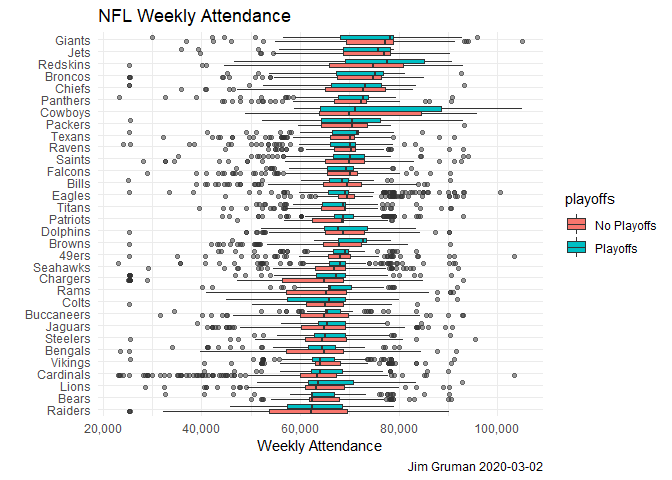
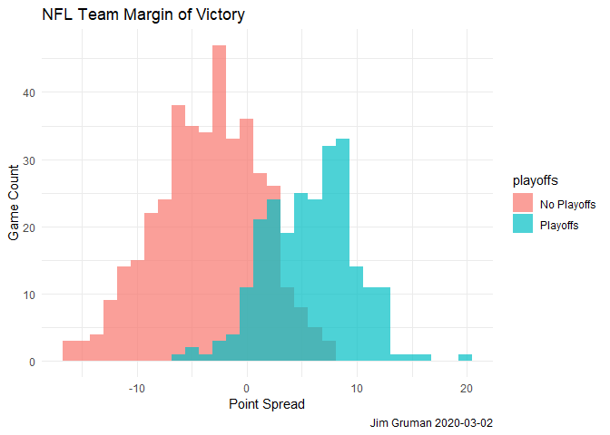
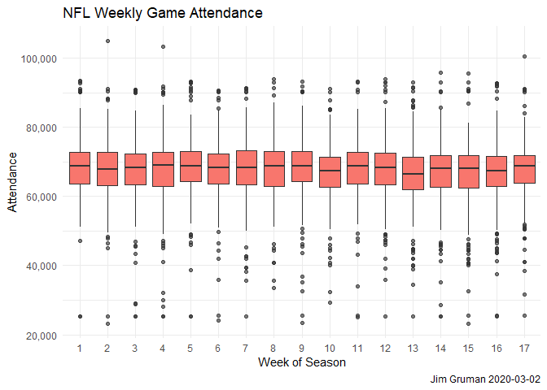
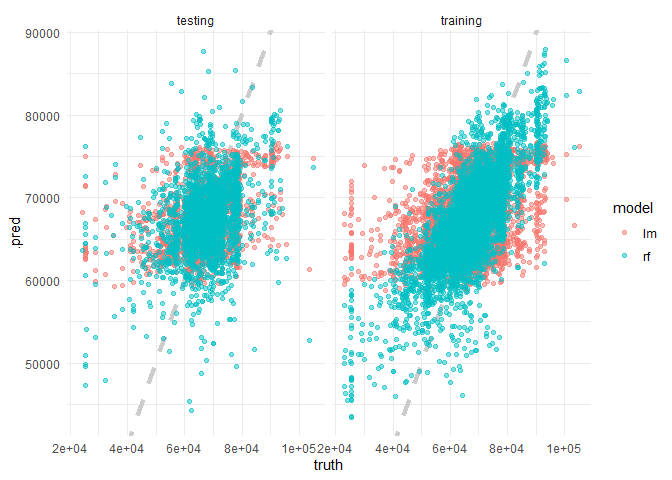
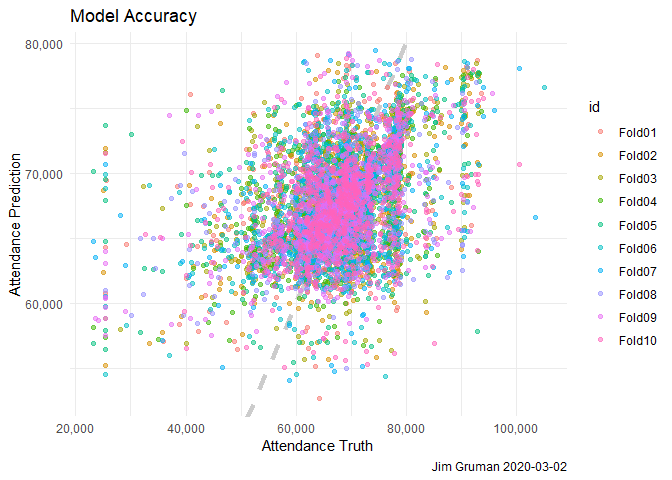

NFL attendance
================
Jim Gruman
2020-03-02

Let’s build a very simple model for [NFL attendance from the
\#tidytuesday data of 4
February 2020](https://github.com/rfordatascience/tidytuesday/blob/master/data/2020/2020-02-04/readme.md)

## Explore data

Load the attendance and team standings data from Github

``` r
attendance <- read_csv('https://raw.githubusercontent.com/rfordatascience/tidytuesday/master/data/2020/2020-02-04/attendance.csv')
```

    ## Parsed with column specification:
    ## cols(
    ##   team = col_character(),
    ##   team_name = col_character(),
    ##   year = col_double(),
    ##   total = col_double(),
    ##   home = col_double(),
    ##   away = col_double(),
    ##   week = col_double(),
    ##   weekly_attendance = col_double()
    ## )

``` r
standings <- read_csv('https://raw.githubusercontent.com/rfordatascience/tidytuesday/master/data/2020/2020-02-04/standings.csv')
```

    ## Parsed with column specification:
    ## cols(
    ##   team = col_character(),
    ##   team_name = col_character(),
    ##   year = col_double(),
    ##   wins = col_double(),
    ##   loss = col_double(),
    ##   points_for = col_double(),
    ##   points_against = col_double(),
    ##   points_differential = col_double(),
    ##   margin_of_victory = col_double(),
    ##   strength_of_schedule = col_double(),
    ##   simple_rating = col_double(),
    ##   offensive_ranking = col_double(),
    ##   defensive_ranking = col_double(),
    ##   playoffs = col_character(),
    ##   sb_winner = col_character()
    ## )

``` r
attendance_joined<-attendance %>%
  left_join(standings, by = c("year", "team_name", "team"))
```

Explore the files and look for trends. In this boxplot visual, some
teams certainly expect higher weekly attendance.

``` r
attendance_joined %>%
  filter(!is.na(weekly_attendance))%>%
 ggplot(aes(fct_reorder(team_name, weekly_attendance), 
            weekly_attendance, 
            fill = playoffs))+
 geom_boxplot(outlier.alpha = 0.5)+
 scale_y_continuous(labels = scales::label_comma())+
  labs(title = "NFL Weekly Attendance",
      caption = paste0("Jim Gruman ",Sys.Date()),
      x = "", y = "Weekly Attendance")+
  theme(plot.title.position = "plot",
        legend.position = "bottom")+
    coord_flip()+
   theme_minimal()
```

<!-- -->

In this histogram, playoff-bound teams generally have higher point
spread margins over the course of many games.

``` r
attendance_joined %>%
  distinct(team_name, year, margin_of_victory, playoffs)%>%
  ggplot(aes(margin_of_victory, fill = playoffs))+
  geom_histogram(position = "identity", alpha = 0.7)+
  labs(title = "NFL Team Margin of Victory",
      caption = paste0("Jim Gruman ",Sys.Date()),
      x = "Point Spread", y = "Game Count")+
  theme(plot.title.position = "plot",
        legend.position = "bottom")+
   theme_minimal()
```

    ## `stat_bin()` using `bins = 30`. Pick better value with `binwidth`.

<!-- -->

Across the weeks of the season, this data visualization shows the
distribution of attendance by week number.

``` r
attendance_joined %>%
  mutate(week = factor(week))%>%
  ggplot(aes(week, weekly_attendance, fill = "blue"))+
  geom_boxplot(show.legend = FALSE, outlier.alpha = 0.4)+
  labs(title = "NFL Weekly Game Attendance",
      caption = paste0("Jim Gruman ",Sys.Date()),
      x = "Week of Season", y = "Attendance")+
  theme(plot.title.position = "plot",
        legend.position = "bottom")+
  scale_y_continuous(labels = scales::label_comma())+
   theme_minimal()
```

    ## Warning: Removed 638 rows containing non-finite values (stat_boxplot).

<!-- -->

To build models for illustratign the prediction of weekly attendance, we
will select on the team\_name, the year, the week of the game, and the
margin of victory.

``` r
attendance_df<-attendance_joined  %>%
  filter(!is.na(weekly_attendance))%>%
  select(weekly_attendance, team_name, year, week, 
         margin_of_victory, strength_of_schedule, playoffs)
```

## Train a Model

First, the data are split into training and testing sets at about 75/25,
retaining similar playoff outcomes in both.

``` r
library(tidymodels)
```

    ## -- Attaching packages ------------------ tidymodels 0.1.0 --

    ## v broom     0.5.4     v rsample   0.0.5
    ## v dials     0.0.4     v tune      0.0.1
    ## v infer     0.5.1     v workflows 0.1.0
    ## v parsnip   0.0.5     v yardstick 0.0.5
    ## v recipes   0.1.9

    ## -- Conflicts --------------------- tidymodels_conflicts() --
    ## x scales::discard()   masks purrr::discard()
    ## x dplyr::filter()     masks stats::filter()
    ## x recipes::fixed()    masks stringr::fixed()
    ## x dplyr::lag()        masks stats::lag()
    ## x dials::margin()     masks ggplot2::margin()
    ## x yardstick::spec()   masks readr::spec()
    ## x recipes::step()     masks stats::step()
    ## x recipes::yj_trans() masks scales::yj_trans()

``` r
attendance_split<-attendance_df %>%
  initial_split(strata = playoffs)

nfl_train <-training(attendance_split)
nfl_test <- testing(attendance_split)
```

A simple linear model is specified and fit, and the estimates of
coefficients are shown here:

``` r
lm_spec<- linear_reg(mode = "regression")%>%
  set_engine(engine = "lm")

lm_fit<-lm_spec %>%
  fit(weekly_attendance ~ ., data = nfl_train)

tidy(lm_fit) %>% arrange(-estimate)
```

    ## # A tibble: 37 x 5
    ##    term              estimate std.error statistic  p.value
    ##    <chr>                <dbl>     <dbl>     <dbl>    <dbl>
    ##  1 team_nameCowboys     6971.      754.     9.25  2.98e-20
    ##  2 team_nameRedskins    6917.      754.     9.17  5.81e-20
    ##  3 team_nameGiants      6222.      750.     8.29  1.30e-16
    ##  4 team_nameJets        4541.      756.     6.00  2.02e- 9
    ##  5 team_nameBroncos     2947.      762.     3.87  1.11e- 4
    ##  6 team_nameChiefs      2002.      756.     2.65  8.07e- 3
    ##  7 team_nameEagles      1730.      759.     2.28  2.27e- 2
    ##  8 team_namePanthers    1359.      755.     1.80  7.21e- 2
    ##  9 team_namePackers     1202.      767.     1.57  1.17e- 1
    ## 10 team_nameDolphins     512.      753.     0.680 4.97e- 1
    ## # ... with 27 more rows

A comparable random forest regression is specified and fit here:

``` r
rf_spec<- rand_forest(mode = "regression") %>%
  set_engine(engine = "ranger")

rf_fit<-rf_spec %>%
  fit(weekly_attendance ~ ., data = nfl_train)

tidy(lm_fit) %>% arrange(-estimate)
```

    ## # A tibble: 37 x 5
    ##    term              estimate std.error statistic  p.value
    ##    <chr>                <dbl>     <dbl>     <dbl>    <dbl>
    ##  1 team_nameCowboys     6971.      754.     9.25  2.98e-20
    ##  2 team_nameRedskins    6917.      754.     9.17  5.81e-20
    ##  3 team_nameGiants      6222.      750.     8.29  1.30e-16
    ##  4 team_nameJets        4541.      756.     6.00  2.02e- 9
    ##  5 team_nameBroncos     2947.      762.     3.87  1.11e- 4
    ##  6 team_nameChiefs      2002.      756.     2.65  8.07e- 3
    ##  7 team_nameEagles      1730.      759.     2.28  2.27e- 2
    ##  8 team_namePanthers    1359.      755.     1.80  7.21e- 2
    ##  9 team_namePackers     1202.      767.     1.57  1.17e- 1
    ## 10 team_nameDolphins     512.      753.     0.680 4.97e- 1
    ## # ... with 27 more rows

## Evaluate Models

``` r
results_train<-lm_fit %>%
  predict(new_data = nfl_train) %>%
  mutate(truth = nfl_train$weekly_attendance,
         model = "lm")%>%
  bind_rows(rf_fit %>%
      predict(new_data = nfl_train) %>%
      mutate(truth = nfl_train$weekly_attendance,
         model = "rf"))

results_test<-lm_fit %>%
  predict(new_data = nfl_test) %>%
  mutate(truth = nfl_test$weekly_attendance,
         model = "lm")%>%
  bind_rows(rf_fit %>%
      predict(new_data = nfl_test) %>%
      mutate(truth = nfl_test$weekly_attendance,
         model = "rf"))
```

``` r
results_train %>%
  group_by(model)%>%
  rmse(truth = truth, estimate = .pred)
```

    ## # A tibble: 2 x 4
    ##   model .metric .estimator .estimate
    ##   <chr> <chr>   <chr>          <dbl>
    ## 1 lm    rmse    standard       8271.
    ## 2 rf    rmse    standard       6057.

``` r
results_test %>%
  group_by(model)%>%
  rmse(truth = truth, estimate = .pred)
```

    ## # A tibble: 2 x 4
    ##   model .metric .estimator .estimate
    ##   <chr> <chr>   <chr>          <dbl>
    ## 1 lm    rmse    standard       8459.
    ## 2 rf    rmse    standard       8762.

The random forest model here appears to overfit the training data set,
with disappointing results on new data.

``` r
results_test %>%
  mutate(train = "testing") %>%
  bind_rows(results_train %>%
              mutate(train = "training")) %>%
  ggplot(aes(truth, .pred, color = model))+
  geom_abline(lty = 2, color = "gray80", size = 1.5)+
  geom_point(alpha = 0.5)+
  facet_wrap(~train)+
  theme_minimal()
```

<!-- -->
\#\#\# Lets try again, with resampling on the training

``` r
library(furrr)
```

    ## Loading required package: future

``` r
nfl_folds<- vfold_cv(nfl_train, strata = playoffs)

rf_res<-fit_resamples(
  weekly_attendance ~ .,
  rf_spec,
  nfl_folds,
  control = control_resamples(save_pred = TRUE)
)

rf_res %>% 
  collect_metrics()
```

    ## # A tibble: 2 x 5
    ##   .metric .estimator     mean     n  std_err
    ##   <chr>   <chr>         <dbl> <int>    <dbl>
    ## 1 rmse    standard   8209.       10 109.    
    ## 2 rsq     standard      0.165    10   0.0100

``` r
rf_res %>%
  unnest(.predictions) %>%
  ggplot(aes(weekly_attendance, .pred, color = id))+
  geom_abline(lty = 2, color = "gray80", size = 1.5)+
  geom_point(alpha = 0.5)+
  labs(title = "Model Accuracy",
      caption = paste0("Jim Gruman ",Sys.Date()),
      x = "Attendance Truth", y = "Attendance Prediction")+
  theme(plot.title.position = "plot",
        legend.position = "bottom")+
  scale_y_continuous(labels = scales::label_comma())+
  scale_x_continuous(labels = scales::label_comma())+
     theme_minimal()
```

<!-- -->

Credits: Julia Silge, RStudio Thomas Mock, RStudio
