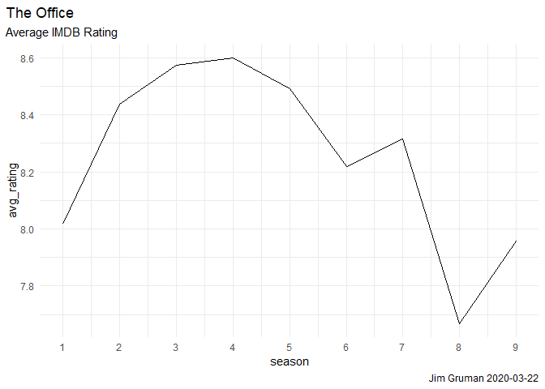
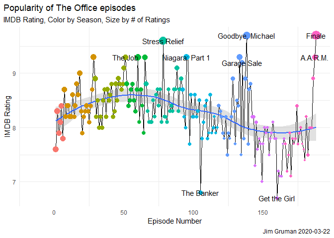
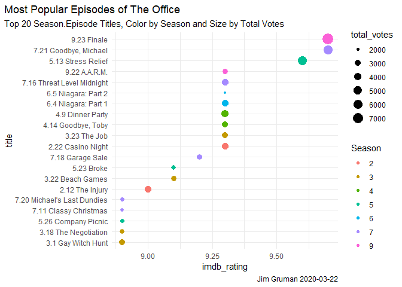
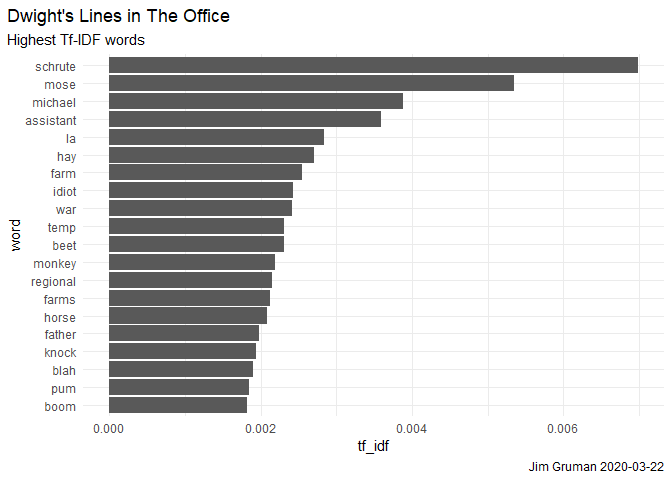
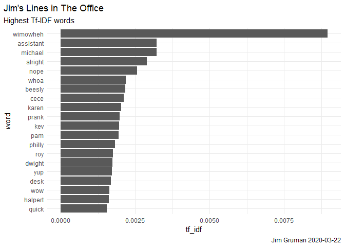
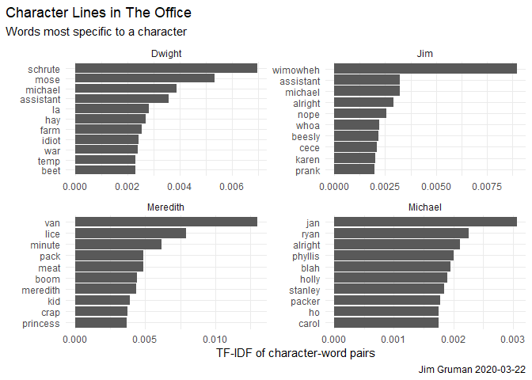
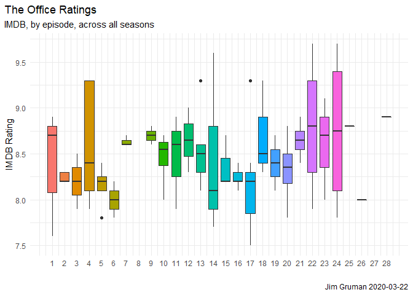
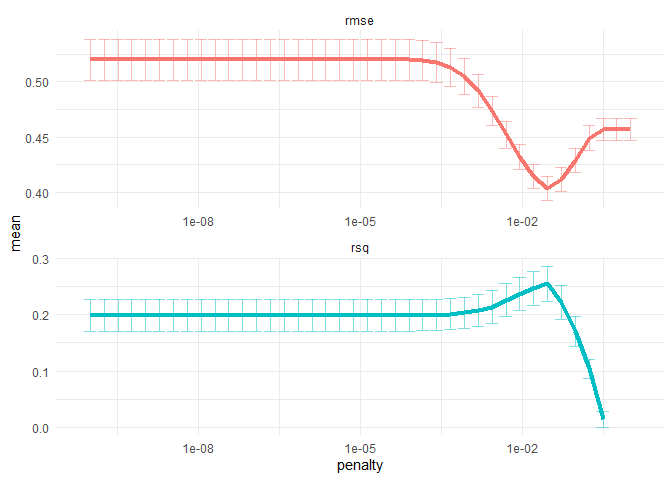
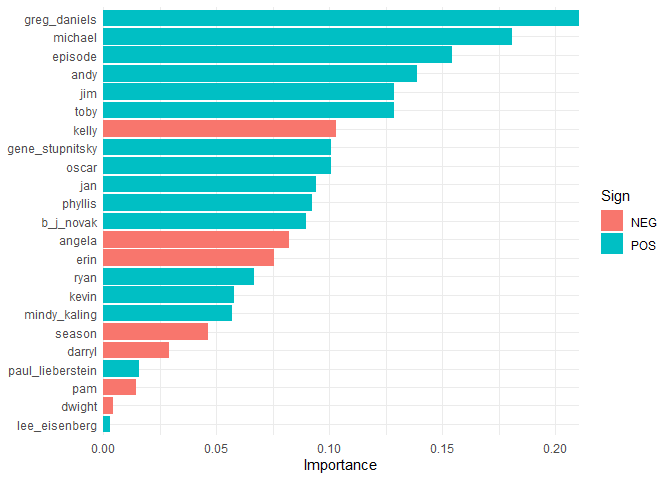

The Office for Tidy Tuesday
================
Jim Gruman
2020-03-22

# Lasso Regression using Tidymodels Workflows and The Office TidyTuesday DataSet

Our starting point is [Julia Silge’s
Blog](https://juliasilge.com/blog/lasso-the-office/), [David Robinson’s
screencast](https://www.youtube.com/watch?v=_IvAubTDQME&feature=youtu.be)
and the [R4DS 2020 week 12
dataset](https://github.com/rfordatascience/tidytuesday/tree/master/data/2020/2020-03-17).
Also, Jared Lander delivered [Many Ways To
Lasso](https://jaredlander.com/content/2018/11/ManyWaysToLasso2.html#1)
on a similar theme for the Chicago R User Group on 19 February, 2020. In
this exercise, I will demonstrate how to build a LASSO regression model
and choose regularization parameters.


## Get the data

The data this week comes from the `schrute` R package for **The Office**
transcripts and `data.world` for *IMDB* ratings of each episode.

``` r
# Get the Data
office_ratings <- readr::read_csv('https://raw.githubusercontent.com/rfordatascience/tidytuesday/master/data/2020/2020-03-17/office_ratings.csv')
```

    ## Parsed with column specification:
    ## cols(
    ##   season = col_double(),
    ##   episode = col_double(),
    ##   title = col_character(),
    ##   imdb_rating = col_double(),
    ##   total_votes = col_double(),
    ##   air_date = col_date(format = "")
    ## )

``` r
schrute::theoffice
```

    ## # A tibble: 55,130 x 12
    ##    index season episode episode_name director writer character text 
    ##    <int> <chr>  <chr>   <chr>        <chr>    <chr>  <chr>     <chr>
    ##  1     1 01     01      Pilot        Ken Kwa~ Ricky~ Michael   All ~
    ##  2     2 01     01      Pilot        Ken Kwa~ Ricky~ Jim       Oh, ~
    ##  3     3 01     01      Pilot        Ken Kwa~ Ricky~ Michael   So y~
    ##  4     4 01     01      Pilot        Ken Kwa~ Ricky~ Jim       Actu~
    ##  5     5 01     01      Pilot        Ken Kwa~ Ricky~ Michael   All ~
    ##  6     6 01     01      Pilot        Ken Kwa~ Ricky~ Michael   Yes,~
    ##  7     7 01     01      Pilot        Ken Kwa~ Ricky~ Michael   I've~
    ##  8     8 01     01      Pilot        Ken Kwa~ Ricky~ Pam       Well~
    ##  9     9 01     01      Pilot        Ken Kwa~ Ricky~ Michael   If y~
    ## 10    10 01     01      Pilot        Ken Kwa~ Ricky~ Pam       What?
    ## # ... with 55,120 more rows, and 4 more variables: text_w_direction <chr>,
    ## #   imdb_rating <dbl>, total_votes <int>, air_date <fct>

## Explore the data

Our modeling goal here is to predict the IMDB ratings for episodes of
**The Office** based on the other characteristics of the episodes in the
`#TidyTuesday` dataset. There are two datasets, one with the ratings and
one with information like director, writer, and which character spoke
which line. The episode numbers and titles are not consistent between
them, so we can use regular expressions to do a better job of matching
the datasets up for joining.

``` r
office_ratings %>%
  group_by(season) %>%
  summarize(avg_rating = mean(imdb_rating)) %>%
  ggplot(aes(season, avg_rating))+
  geom_line()+
  scale_x_continuous(breaks = 1:9)+
  labs(title = "The Office",
       subtitle = "Average IMDB Rating",
       caption = paste0("Jim Gruman ", Sys.Date()))+
  theme(plot.title.position = "plot")
```

<!-- -->

``` r
office_ratings %>%
  mutate(top_title = ifelse(imdb_rating >= 9.2 | imdb_rating <= 7,
                            title, ""),
         title = fct_inorder(title),
         episode_number = row_number()) %>%
  ggplot(aes(episode_number, imdb_rating))+
  geom_line()+
  geom_smooth(alpha = 0.3)+
  geom_point(aes(color = factor(season), size = total_votes))+
  geom_text(aes(label = top_title), check_overlap = TRUE, hjust = 0.5)+
  expand_limits(x = -15)+
  labs(title = "Popularity of The Office episodes",
       subtitle = "IMDB Rating, Color by Season, Size by # of Ratings",
       caption = paste0("Jim Gruman ", Sys.Date()))+
  theme(plot.title.position = "plot",
        panel.grid.major.x = element_blank(),
        legend.position = "none") +
  xlab("Episode Number")+ylab("IMDB Rating")
```

    ## `geom_smooth()` using method = 'loess' and formula 'y ~ x'

<!-- -->

``` r
office_ratings %>%
  arrange(desc(imdb_rating)) %>%
  mutate(title = paste0(season, ".", episode, " ", title),
         title = fct_reorder(title, imdb_rating)) %>%
  head(20) %>%
  ggplot(aes(title, imdb_rating, color = factor(season), size = total_votes))+
  geom_point()+
  coord_flip()+
  labs(color = "Season",
       title = "Most Popular Episodes of The Office",
       subtitle = "Top 20 Season.Episode Titles, Color by Season and Size by Total Votes", caption = paste0("Jim Gruman ", Sys.Date()))+
    theme(plot.title.position = "plot")
```

<!-- -->

To merge the datasets on episode, we have to clean the ratings file
field by removing punctuation, digits, the words “part” and “parts”, and
make all text lower case. Even after cleaning, three episode titles have
to be manually imputed with a case\_when statement to successfully join
every episode rating with the text of the episode.

``` r
remove_regex <- "[:punct:]|[:digit:]|parts |part |the |and"

office_ratings <- office_ratings %>%
  transmute(
    episode_name = str_to_lower(title),
    episode_name = str_remove_all(episode_name, remove_regex),
    episode_name = str_trim(episode_name),
    imdb_rating
  )

office_ratings <- office_ratings %>%
  mutate(episode_name = case_when(
    episode_name == "email surveillance" ~ "email surveilance",
    episode_name == "coverup" ~ "cover",
    episode_name == "sex ed" ~ "sx ed",
    TRUE ~ episode_name))

office_info <- schrute::theoffice %>%
  mutate(
    season = as.numeric(season),
    episode = as.numeric(episode),
    episode_name = str_to_lower(episode_name),
    episode_name = str_remove_all(episode_name, remove_regex),
    episode_name = str_trim(episode_name)
  ) %>%
  select(season, episode, episode_name, director, writer, character)

office_info
```

    ## # A tibble: 55,130 x 6
    ##    season episode episode_name director   writer                       character
    ##     <dbl>   <dbl> <chr>        <chr>      <chr>                        <chr>    
    ##  1      1       1 pilot        Ken Kwapis Ricky Gervais;Stephen Merch~ Michael  
    ##  2      1       1 pilot        Ken Kwapis Ricky Gervais;Stephen Merch~ Jim      
    ##  3      1       1 pilot        Ken Kwapis Ricky Gervais;Stephen Merch~ Michael  
    ##  4      1       1 pilot        Ken Kwapis Ricky Gervais;Stephen Merch~ Jim      
    ##  5      1       1 pilot        Ken Kwapis Ricky Gervais;Stephen Merch~ Michael  
    ##  6      1       1 pilot        Ken Kwapis Ricky Gervais;Stephen Merch~ Michael  
    ##  7      1       1 pilot        Ken Kwapis Ricky Gervais;Stephen Merch~ Michael  
    ##  8      1       1 pilot        Ken Kwapis Ricky Gervais;Stephen Merch~ Pam      
    ##  9      1       1 pilot        Ken Kwapis Ricky Gervais;Stephen Merch~ Michael  
    ## 10      1       1 pilot        Ken Kwapis Ricky Gervais;Stephen Merch~ Pam      
    ## # ... with 55,120 more rows

Lets explore words that individual characters say, that other characters
do not, that are most indicative of that person.

In information retrieval, tf–idf or TFIDF, short for term
frequency–inverse document frequency, is a numerical statistic that is
intended to reflect how important a word is to a document in a
collection or corpus. It is often used as a weighting factor in searches
of information retrieval, text mining, and user modeling. The tf–idf
value increases proportionally to the number of times a word appears in
the document and is offset by the number of documents in the corpus that
contain the word, which helps to adjust for the fact that some words
appear more frequently in general. tf–idf is one of the most popular
term-weighting schemes today.

``` r
office_transcripts <- as_tibble(schrute::theoffice)

blacklist <- c("yeah", "hey", "uh", "gonna", "lot", "ah", "huh", "hmm", "um", "ha", "na", "no", "nah", "ahh")
blacklist_character<-c("Group", "Everyone", "All")

transcript_words<-office_transcripts %>%
  group_by(character) %>%
  filter(n()>= 100,
         n_distinct(episode_name)>2)%>%
  ungroup()%>%
  select(-text_w_direction) %>%
  unnest_tokens(word,text) %>%
  anti_join(stop_words, by = "word") %>%
  filter(!word %in% blacklist,
         !character %in% blacklist_character)

character_tf_idf<-transcript_words %>%
  add_count(word)%>%
  filter(n>20)%>%
  count(word, character) %>%
  bind_tf_idf(word, character, n) %>%
  arrange(desc(tf_idf))

character_tf_idf
```

    ## # A tibble: 17,686 x 6
    ##    word     character     n     tf   idf tf_idf
    ##    <chr>    <chr>     <int>  <dbl> <dbl>  <dbl>
    ##  1 pum      Angela       27 0.0110 2.71  0.0298
    ##  2 andrew   Robert       15 0.0147 1.79  0.0263
    ##  3 mike     Darryl       46 0.0218 1.00  0.0219
    ##  4 printers Jo            8 0.0162 1.32  0.0214
    ##  5 michael  Jan         159 0.115  0.182 0.0210
    ##  6 hank     Charles       4 0.0118 1.61  0.0190
    ##  7 michael  David        67 0.0914 0.182 0.0167
    ##  8 michael  Charles      28 0.0828 0.182 0.0151
    ##  9 halpert  Roy           7 0.0211 0.693 0.0147
    ## 10 woah     Charles       4 0.0118 1.20  0.0142
    ## # ... with 17,676 more rows

Let’s explore the content of Dwight’s and Jim’s lines. What words are
most characteristic, or specific, to the character, with a high term
frequency and low overall IDF.

``` r
character_tf_idf %>%
  filter(character == "Dwight") %>%
  mutate(word = fct_reorder(word, tf_idf)) %>%
  head(20) %>%
  ggplot(aes(word, tf_idf))+
  geom_col()+
  coord_flip()+  
  labs(title = "Dwight's Lines in The Office",
       subtitle = "Highest Tf-IDF words", 
       caption = paste0("Jim Gruman ", Sys.Date()))+
  theme(plot.title.position = "plot")
```

<!-- -->

``` r
character_tf_idf %>%
  filter(character == "Jim") %>%
  mutate(word = fct_reorder(word, tf_idf)) %>%
  head(20) %>%
  ggplot(aes(word, tf_idf))+
  geom_col()+
  coord_flip()+  
  labs(title = "Jim's Lines in The Office",
       subtitle = "Highest Tf-IDF words", 
       caption = paste0("Jim Gruman ", Sys.Date()))+
  theme(plot.title.position = "plot")
```

<!-- -->

``` r
character_tf_idf %>%
  filter(character %in% c("Jim","Dwight","Michael","Meredith")) %>%
  group_by(character)%>%
  top_n(10, tf_idf)%>%
  ungroup()%>%
  mutate(word = reorder_within(word, tf_idf, character)) %>%
  ggplot(aes(word, tf_idf))+
  geom_col()+
  coord_flip()+  
  scale_x_reordered()+
  facet_wrap(~ character, scales = "free")+
  labs(title = "Character Lines in The Office",
       subtitle = "Words most specific to a character", 
       caption = paste0("Jim Gruman ", Sys.Date()),
       x="", y="TF-IDF of character-word pairs")+
  theme(plot.title.position = "plot")
```

<!-- -->

We are going to use several different kinds of features for modeling.
Let’s find out how many times characters speak per episode.

``` r
characters <- office_info %>%
  count(episode_name, character) %>%
  add_count(character, wt = n, name = "character_count") %>%
  filter(character_count > 800) %>%
  select(-character_count) %>%
  pivot_wider(
    names_from = character,
    values_from = n,
    values_fill = list(n = 0)
  )

characters
```

    ## # A tibble: 185 x 16
    ##    episode_name  Andy Angela Darryl Dwight   Jim Kelly Kevin Michael Oscar   Pam
    ##    <chr>        <int>  <int>  <int>  <int> <int> <int> <int>   <int> <int> <int>
    ##  1 a benihana ~    28     37      3     61    44     5    14     108     1    57
    ##  2 aarm            44     39     30     87    89     0    30       0    28    34
    ##  3 after hours     20     11     14     60    55     8     4       0    10    15
    ##  4 alliance         0      7      0     47    49     0     3      68    14    22
    ##  5 angry y         53      7      5     16    19    13     9       0     7    29
    ##  6 baby shower     13     13      9     35    27     2     4      79     3    25
    ##  7 back from v~     3      4      6     22    25     0     5      70     0    33
    ##  8 banker           1      2      0     17     0     0     2      44     0     5
    ##  9 basketball       0      3     15     25    21     0     1     104     2    14
    ## 10 beach games     18      8      0     38    22     9     5     105     5    23
    ## # ... with 175 more rows, and 5 more variables: Phyllis <int>, Ryan <int>,
    ## #   Toby <int>, Erin <int>, Jan <int>

And, let’s find which directors and writers are involved in each
episode. I’m choosing here to combine this into one category in
modeling, for a simpler model, since these are often the same
individuals. And we will only model on creators that were involved in at
least 15 distinct episodes.

``` r
creators <- office_info %>%
  distinct(episode_name, director, writer) %>%
  pivot_longer(director:writer, names_to = "role", values_to = "person") %>%
  separate_rows(person, sep = ";") %>%
  add_count(person) %>%
  filter(n > 15) %>%
  distinct(episode_name, person) %>%
  mutate(person_value = 1) %>%
  pivot_wider(
    names_from = person,
    values_from = person_value,
    values_fill = list(person_value = 0)
  )

creators
```

    ## # A tibble: 90 x 7
    ##    episode_name `Greg Daniels` `B.J. Novak` `Paul Lieberste~ `Mindy Kaling`
    ##    <chr>                 <dbl>        <dbl>            <dbl>          <dbl>
    ##  1 pilot                     1            0                0              0
    ##  2 diversity d~              0            1                0              0
    ##  3 health care               0            0                1              0
    ##  4 basketball                1            0                0              0
    ##  5 hot girl                  0            0                0              1
    ##  6 dundies                   1            0                0              1
    ##  7 sexual hara~              0            1                0              0
    ##  8 fire                      0            1                0              0
    ##  9 halloween                 1            0                0              0
    ## 10 fight                     0            0                0              0
    ## # ... with 80 more rows, and 2 more variables: `Gene Stupnitsky` <dbl>, `Lee
    ## #   Eisenberg` <dbl>

Next, let’s find the season and episode number for each episode, and
then finally put it all together into one dataset for modeling.

``` r
office <- office_info %>%
  distinct(season, episode, episode_name) %>%
  inner_join(characters) %>%
  inner_join(creators) %>%
  inner_join(office_ratings %>%
               select(episode_name, imdb_rating)) %>%
  janitor::clean_names()
```

    ## Joining, by = "episode_name"
    ## Joining, by = "episode_name"
    ## Joining, by = "episode_name"

``` r
office
```

    ## # A tibble: 94 x 25
    ##    season episode episode_name  andy angela darryl dwight   jim kelly kevin
    ##     <dbl>   <dbl> <chr>        <int>  <int>  <int>  <int> <int> <int> <int>
    ##  1      1       1 pilot            0      1      0     29    36     0     1
    ##  2      1       2 diversity d~     0      4      0     17    25     2     8
    ##  3      1       3 health care      0      5      0     62    42     0     6
    ##  4      1       5 basketball       0      3     15     25    21     0     1
    ##  5      1       6 hot girl         0      3      0     28    55     0     5
    ##  6      2       1 dundies          0      1      1     32    32     7     1
    ##  7      2       2 sexual hara~     0      2      9     11    16     0     6
    ##  8      2       4 fire             0     17      0     65    51     4     5
    ##  9      2       5 halloween        0     13      0     33    30     3     2
    ## 10      2       6 fight            0      3      0     64    49     3     3
    ## # ... with 84 more rows, and 15 more variables: michael <int>, oscar <int>,
    ## #   pam <int>, phyllis <int>, ryan <int>, toby <int>, erin <int>, jan <int>,
    ## #   greg_daniels <dbl>, b_j_novak <dbl>, paul_lieberstein <dbl>,
    ## #   mindy_kaling <dbl>, gene_stupnitsky <dbl>, lee_eisenberg <dbl>,
    ## #   imdb_rating <dbl>

One more quick peek into the dataset. This time, across all seasons, do
the ratings of the episodes follow a pattern through the course of the
season? Ratings appear to be higher for episodes later in the season.
What else is associated with higher ratings? Let’s use LASSO regression
to find out\!

``` r
office %>%
  ggplot(aes(episode, imdb_rating, fill = as.factor(episode))) +
  geom_boxplot(show.legend = FALSE)+
  scale_x_continuous(breaks = 1:28)+
  labs(title = "The Office Ratings",
       subtitle = "IMDB, by episode, across all seasons", 
       caption = paste0("Jim Gruman ", Sys.Date()),
       x="", y="IMDB Rating")+
  theme(plot.title.position = "plot")
```

<!-- -->

## Train a Model

We can start by splitting our data into training and testing sets.

``` r
office_split <- initial_split(office, strata = season)
office_train <- training(office_split)
office_test <- testing(office_split)
```

Then, we build a recipe for data preprocessing.

First, we must tell the `recipe()` what our model is going to be (using
a formula here) and what our training data is.

Next, we update the role for `episode_name`, since this is a variable we
might like to keep around for convenience as an identifier for rows but
is not a predictor or outcome.

Next, we remove any numeric variables that have zero variance.

As a last step, we normalize (center and scale) the numeric variables.
We need to do this because it’s important for LASSO regularization.

The object `office_rec` is a recipe that has not been trained on data
yet (for example, the centered and scaling has not been calculated) and
office\_prep is an object that has been trained on data. The reason I
use strings\_as\_factors = FALSE here is that my ID column episode\_name
is of type character (as opposed to, say, integers).

``` r
office_rec <- recipe(imdb_rating ~ ., data = office_train) %>%
  update_role(episode_name, new_role = "ID") %>%
  step_zv(all_numeric(), -all_outcomes()) %>%
  step_normalize(all_numeric(), -all_outcomes())

office_prep <- office_rec %>%
  prep(strings_as_factors = FALSE) # the episode ID column remains a string
```

Now it’s time to specify and then fit our models. Here I set up one
model specification for LASSO regression; I picked a value for penalty
(sort of randomly) and I set `mixture = 1` for LASSO. I am using a
`workflow()` in this example for convenience; these are objects that can
help you manage modeling pipelines more easily, with pieces that fit
together like Lego blocks. You can `fit()` a workflow, much like you can
fit a model, and then you can pull out the fit object and `tidy()` it\!

``` r
lasso_spec <- linear_reg(penalty = 0.1, mixture = 1) %>%
  set_engine("glmnet")

wf <- workflow() %>%
  add_recipe(office_rec)

lasso_fit <- wf %>%
  add_model(lasso_spec) %>%
  fit(data = office_train)

lasso_fit %>%
  pull_workflow_fit() %>%
  tidy()
```

    ## # A tibble: 1,348 x 5
    ##    term         step estimate lambda dev.ratio
    ##    <chr>       <dbl>    <dbl>  <dbl>     <dbl>
    ##  1 (Intercept)     1  8.41     0.207    0     
    ##  2 (Intercept)     2  8.41     0.188    0.0342
    ##  3 jim             2  0.0185   0.188    0.0342
    ##  4 (Intercept)     3  8.41     0.172    0.0663
    ##  5 jim             3  0.0347   0.172    0.0663
    ##  6 michael         3  0.00295  0.172    0.0663
    ##  7 (Intercept)     4  8.41     0.156    0.105 
    ##  8 jim             4  0.0473   0.156    0.105 
    ##  9 michael         4  0.0155   0.156    0.105 
    ## 10 (Intercept)     5  8.41     0.142    0.137 
    ## # ... with 1,338 more rows

If you have used `glmnet` before, this is the familiar output where we
can see (here, for the most regularized examples) the features that
contribute to higher IMDB ratings.

## Tune LASSO parameters

So we managed to fit one LASSO model, but how do we know the right
regularization parameter penalty? We can figure that out using
resampling and tuning the model. Let’s build a set of bootstrap
resamples, and set `penalty = tune()` instead of to a single value. We
can use a function `penalty()` to set up an appropriate grid for this
kind of regularization model.

``` r
set.seed(42)
office_boot <- bootstraps(office_train, strata = season)
```

    ## Warning: The number of observations in each quantile is below the recommended
    ## threshold of 20. Stratification will be done with 3 breaks instead.

``` r
tune_spec <- linear_reg(penalty = tune(), mixture = 1) %>%
  set_engine("glmnet")

lambda_grid <- grid_regular(penalty(), levels = 40)
```

Now it’s time to tune the grid, using our workflow object.

``` r
doParallel::registerDoParallel()

set.seed(42)
lasso_grid <- tune_grid(
  wf %>% add_model(tune_spec),
  resamples = office_boot,
  grid = lambda_grid
)
```

And the results?

``` r
lasso_grid %>%
  collect_metrics()
```

    ## # A tibble: 80 x 6
    ##     penalty .metric .estimator  mean     n std_err
    ##       <dbl> <chr>   <chr>      <dbl> <int>   <dbl>
    ##  1 1.00e-10 rmse    standard   0.520    25  0.0185
    ##  2 1.00e-10 rsq     standard   0.199    25  0.0277
    ##  3 1.80e-10 rmse    standard   0.520    25  0.0185
    ##  4 1.80e-10 rsq     standard   0.199    25  0.0277
    ##  5 3.26e-10 rmse    standard   0.520    25  0.0185
    ##  6 3.26e-10 rsq     standard   0.199    25  0.0277
    ##  7 5.88e-10 rmse    standard   0.520    25  0.0185
    ##  8 5.88e-10 rsq     standard   0.199    25  0.0277
    ##  9 1.06e- 9 rmse    standard   0.520    25  0.0185
    ## 10 1.06e- 9 rsq     standard   0.199    25  0.0277
    ## # ... with 70 more rows

That’s nice, but I would rather see a visualization of performance with
the regularization parameter.

``` r
lasso_grid %>%
  collect_metrics() %>%
  ggplot(aes(penalty, mean, color = .metric)) +
  geom_errorbar(aes(
    ymin = mean - std_err,
    ymax = mean + std_err
  ),
  alpha = 0.5
  ) +
  geom_line(size = 1.5) +
  facet_wrap(~.metric, scales = "free", nrow = 2) +
  scale_x_log10() +
  theme(legend.position = "none")
```

    ## Warning: Removed 2 row(s) containing missing values (geom_path).

<!-- -->

This is a great way to see that regularization helps this modeling a
lot. We have a couple of options for choosing our final parameter, such
as `select_by_pct_loss()` or `select_by_one_std_err()`, but for now
let’s stick with just picking the lowest RMSE. After we have that
parameter, we can finalize our workflow, i.e. update it with this value.

``` r
lowest_rmse <- lasso_grid %>%
  select_best("rmse")

final_lasso <- finalize_workflow(
  wf %>% add_model(tune_spec),
  lowest_rmse
)

final_lasso
```

    ## == Workflow ======================================================
    ## Preprocessor: Recipe
    ## Model: linear_reg()
    ## 
    ## -- Preprocessor --------------------------------------------------
    ## 2 Recipe Steps
    ## 
    ## * step_zv()
    ## * step_normalize()
    ## 
    ## -- Model ---------------------------------------------------------
    ## Linear Regression Model Specification (regression)
    ## 
    ## Main Arguments:
    ##   penalty = 0.0289426612471674
    ##   mixture = 1
    ## 
    ## Computational engine: glmnet

The optimal penalty is shown here as 0.0522

We can then fit this finalized workflow on our training data. While
we’re at it, let’s see what the most important variables are using the
`vip` package.

``` r
final_lasso %>%
  fit(office_train) %>%
  pull_workflow_fit() %>%
  vi(lambda = lowest_rmse$penalty) %>%
  mutate(
    Importance = abs(Importance),
    Variable = fct_reorder(Variable, Importance)
  ) %>%
  ggplot(aes(x = Importance, y = Variable, fill = Sign)) +
  geom_col() +
  scale_x_continuous(expand = c(0, 0)) +
  labs(y = NULL)
```

<!-- -->

Clearly, the features with the greatest importance in predicting IMDB
rating include the presence of Greg Daniels, Michael, the episode
itself, B J Novak, and Jan.

And then, finally, let’s return to our test data. The `tune` package has
a function `last_fit()` which is nice for situations when you have tuned
and finalized a model or workflow and want to fit it one last time on
your training data and evaluate it on your testing data. You only have
to pass this function your finalized model/workflow and your split.

``` r
last_fit(
  final_lasso,
  office_split
) %>%
  collect_metrics()
```

    ## # A tibble: 2 x 3
    ##   .metric .estimator .estimate
    ##   <chr>   <chr>          <dbl>
    ## 1 rmse    standard       0.480
    ## 2 rsq     standard       0.185
