TourDeFrance
================
Jim Gruman
20\. July 2020

## Visualising Tour De France Data

> Inspired by the work of Alastair Rushworth at [Visualising Tour De
> France Data In
> R](https://alastairrushworth.github.io/Visualising-Tour-de-France-data-in-R/)

> and [David Robinson’s live
> screencast](https://www.youtube.com/watch?v=vT-DElIaKtE)

> and [Dr. Margaret Siple’s
> work](https://github.com/mcsiple/tidytuesday/blob/master/TourdeFrance.R)

<center>


</center>

> and by the R4DS learning community \#TidyTuesday

### Importing Libraries and Datasets

``` r
library(tidyverse)
library(paletteer)
library(ggtext)
library(rvest)
theme_set(hrbrthemes::theme_ipsum())
library(lubridate)

library(patchwork)

tuesdata <- tidytuesdayR::tt_load('2020-04-07')
```

    ## 
    ##  Downloading file 1 of 3: `stage_data.csv`
    ##  Downloading file 2 of 3: `tdf_stages.csv`
    ##  Downloading file 3 of 3: `tdf_winners.csv`

``` r
tdf_winners <- tuesdata$tdf_winners %>%
       mutate(year = ymd(year(start_date),truncated = 2L),
              speed = distance / time_overall)

stage_data <- tuesdata$stage_data
tdf_stages <- tuesdata$tdf_stages %>%
  janitor::clean_names() %>%
  mutate(year = year(date))

showtext::showtext_auto()
```

``` r
library(rvest)

cf_io <- read_html("https://www.countryflags.io/")

country_ids <- cf_io %>% 
  html_nodes(".item_country") %>% 
  lapply(function(el){
    
    key <- el %>% 
      html_text %>% 
      str_split("\\n") %>% 
      `[[`(1) %>% 
      trimws() %>% 
      {
        .[nchar(.)>0]
      }
    
    data.frame(
      code = key[1],
      nationality = key[2]
    )
  }) %>% 
  bind_rows

get_country_flag <- function(x){
  
  urls <- sapply(x, function(x){
    code <- country_ids$code[which(country_ids$nationality == x)]
    file.path("https://www.countryflags.io", code, "flat/64.png")
  })
  
  paste0("")
  
}
```

### Nationalities of the Winners

``` r
tdf_nations<-tdf_winners %>%
  mutate(nationality = stringr::str_squish(nationality),
         nationality = case_when(
    nationality == "Great Britain" ~ "United Kingdom",
    TRUE ~ nationality
  )) %>%  
  count(nationality, sort = TRUE) %>%
  mutate(nationality = fct_reorder(nationality,n)) %>%
  top_n(8, n) 

flag_labels <- get_country_flag(tdf_nations$nationality)

pal <- RColorBrewer::brewer.pal('Set1',n=8)

nations<- tdf_nations %>%
  ggplot(aes(n, nationality))+
  geom_bar(fill = "green", stat = "identity") +
  scale_y_discrete(name = NULL, labels = flag_labels) +
  scale_fill_discrete(guide=FALSE)+
  theme(axis.text.y = ggtext::element_markdown(color = "black", size = 11),
        axis.title.y = element_blank(),
        plot.title.position = "plot") +
  expand_limits(x = c(0,45)) +
  labs( title = "National Wins",
        caption = paste0('@Jim_Gruman | #TidyTuesday | ', Sys.Date())) 

nations
```

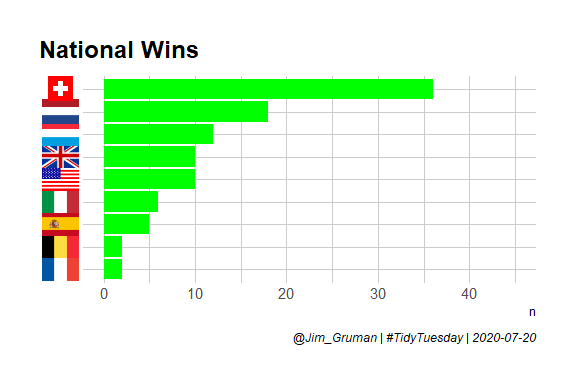<!-- -->

### Physical characteristics and race characteristics by decade

``` r
by_decade <-tdf_winners %>%
  group_by(decade = 10 * (year(year) %/% 10 )) %>%
  summarize(winner_age = mean(age, na.rm = TRUE),
            winner_height = mean(height, na.rm = TRUE),
            winner_weight = mean(weight, na.rm = TRUE),
            winner_margin = mean(time_margin, na.rm = TRUE),
            winner_time = mean(time_overall, na.rm = TRUE),
            winner_speed = mean(speed, na.rm = TRUE))

by_decade %>%  
  ggplot(aes(decade, winner_age)) +
  geom_line(color = "#9EB0FFFF", size = 3) +
  expand_limits(y = 0)+
  labs( y = "",
    title = "Average Age of Tour de France Winners By Decade",
    subtitle = 'source: Alastair Rushworths R Data Package tdf and Kaggle',
    caption = paste0('@Jim_Gruman | #TidyTuesday | ', Sys.Date())
  )+
  theme(legend.position = "",
        plot.title.position = "plot")+
  scale_color_paletteer_d("nord::aurora")
```

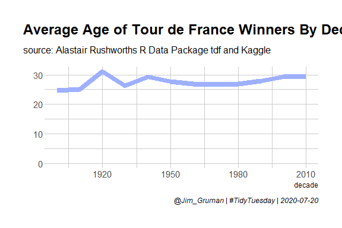<!-- -->

``` r
by_decade %>%  
  ggplot(aes(decade, winner_margin))+
  geom_line(color = "#5AA3DAFF", size = 3) +
  expand_limits(y = 0)+
  labs( y = "Hours",
    title = "Margin of Victory of Tour de France Winners By Decade",
    subtitle = 'source: Alastair Rushworths R Data Package tdf and Kaggle',
    caption = paste0('@Jim_Gruman | #TidyTuesday | ', Sys.Date())
  )+
  theme(legend.position = "",
        plot.title.position = "plot")
```

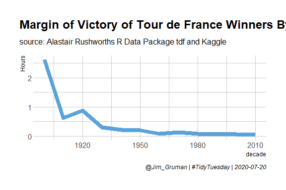<!-- -->

``` r
by_decade %>%  
  ggplot(aes(decade, winner_speed))+
  geom_line(color = "#2D7597FF", size = 3) +
  expand_limits(y = 0)+
  labs( y = "Hours",
    title = "Average Speed of Tour de France Winners By Decade",
    subtitle = 'source: Alastair Rushworths R Data Package tdf and Kaggle',
    caption = paste0('@Jim_Gruman | #TidyTuesday | ', Sys.Date())
  )+
  theme(legend.position = "",
        plot.title.position = "plot")
```

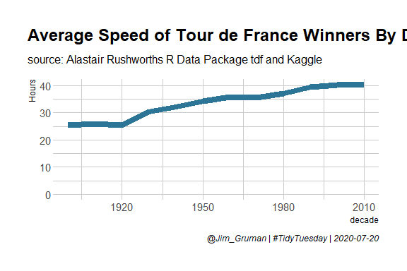<!-- -->

``` r
# average margin has been shrinking
```

### Life Expectancy of TDF winners with survival analysis

extrapolated for the riders 38 still alive (not yet dead)

``` r
library(survival)
surv_model <- tdf_winners %>%
  distinct(winner_name, .keep_all = TRUE)  %>%
  transmute(birth_year = year(born),
            death_year = year(died),
            dead =  as.integer(!is.na(death_year))) %>%
  mutate(age_at_death = coalesce(death_year, 2020)- birth_year) %>%
  survfit(Surv(age_at_death, dead) ~ 1, data = .) 

surv_model %>%
  plot()
```

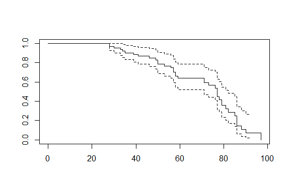<!-- -->

``` r
library(broom)

glance(surv_model)
```

    ## # A tibble: 1 x 10
    ##   records n.max n.start events rmean rmean.std.error median conf.low conf.high
    ##     <dbl> <dbl>   <dbl>  <dbl> <dbl>           <dbl>  <dbl>    <dbl>     <dbl>
    ## 1      63    63      63     38  69.6            2.69     77       71        82
    ## # ... with 1 more variable: nobs <int>

Of the 63 Tour De France winners, 38 are still alive. After accounting
for survival expectations for the living, the median life expectancy of
a Tour de France winner is estimated as 77 years old.

### Stage data

``` r
p1<-stage_data %>%
  group_by(decade = 10 * (year %/% 10 )) %>%
  distinct(rider, edition, age) %>%
    ggplot(aes(decade, age)) +
  geom_jitter(color = "#9EB0FFFF", size = 0.5, alpha = 0.1)

p1 + 
  geom_line(data = by_decade, aes(decade, winner_age), 
            color = "#2D7597FF", size = 3) +
  expand_limits(y = 0)+
  labs( y = "", x= "",
    title = "Average Age of Tour de France Winners By Decade",
    subtitle = 'source: Alastair Rushworths R Data Package tdf and Kaggle',
    caption = paste0('@Jim_Gruman | #TidyTuesday | ', Sys.Date())
  )+
  theme(legend.position = "",
        plot.title.position = "plot")
```

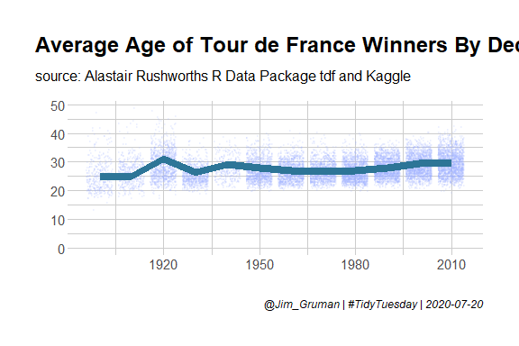<!-- -->

``` r
stages_joined<-stage_data  %>%
  tidyr::extract(stage_results_id, "stage", "stage-(.*)") %>%
  mutate(stage = if_else(year %in% 1967:1968 & stage == 0, "1a", stage),
         stage = if_else(year %in% 1967:1968 & stage == 1,"1b", stage),
         stage = if_else(year %in% 1969:2012 & stage == 0, "P", stage)) %>%
  filter(year < 2018) %>%
  left_join(tdf_stages, by = c("year","stage")) %>% 
  select(-winner, bib_number, winner_country) %>%
  mutate(rank = as.integer(rank)) %>%
  group_by(year, stage) %>%
  mutate(finishers = sum(!is.na(rank))) %>%
  ungroup() %>%
  mutate(percentile = 1- rank / finishers)


stages_joined %>%
  group_by(winner_country) %>%
  summarize(stages = n(), median_percentile = median(percentile, na.rm = TRUE)) %>%
  arrange(desc(stages))
```

    ## # A tibble: 41 x 3
    ##    winner_country stages median_percentile
    ##    <chr>           <int>             <dbl>
    ##  1 FRA             63231             0.495
    ##  2 BEL             45020             0.495
    ##  3 ITA             28970             0.496
    ##  4 NED             20185             0.496
    ##  5 ESP             17210             0.5  
    ##  6 GER             11659             0.497
    ##  7 GBR             10858             0.5  
    ##  8 SUI              6632             0.497
    ##  9 LUX              6100             0.5  
    ## 10 USA              6063             0.497
    ## # ... with 31 more rows

``` r
stages_joined %>%
  count(year, stage) %>%
  ggplot(aes(n)) +
  geom_histogram()
```

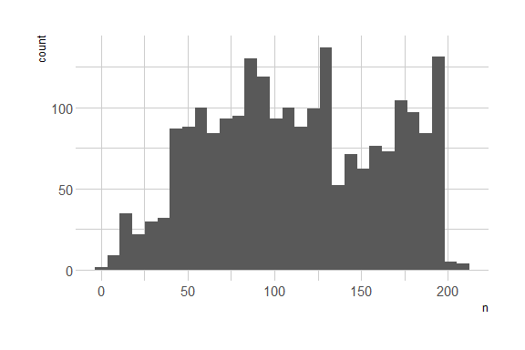<!-- -->

``` r
# it appears that some racers are eliminated or drop out as stages are completed

total_points <- stages_joined %>%
  group_by(year, rider) %>%
  summarize(total_points = sum(points, na.rm = TRUE)) %>%
  mutate(points_rank = percent_rank(total_points)) %>%
  ungroup()
```

### Does the winner of the first stage predict their final point ranking?

``` r
stages_joined %>%
  filter(stage == "1") %>%
  inner_join(total_points, by = c("year","rider")) %>%
  select(year, rider, 
         percentile_first_stage = percentile,
         points_rank) %>%
  filter(!is.na(percentile_first_stage)) %>%
  mutate(first_stage_bin = cut(percentile_first_stage, seq(0,1,0.1))) %>%
  filter(!is.na(first_stage_bin))%>%
  ggplot(aes(first_stage_bin, points_rank)) +
  geom_boxplot()+
  theme(axis.text.x = element_text(angle = 90, hjust = 1),
        plot.title.position = "plot")+
  scale_y_continuous(labels = scales::percent) +
  labs(x = "Decile Perforance in the First Stage",
       y = "Overall Points Percentile",
       title = "Relationship of TDF First Stage Finish w/ Overall Finish",
       subtitle = 'source: Alastair Rushworths R Data Package tdf and Kaggle',
       caption = paste0('@Jim_Gruman | #TidyTuesday | ', Sys.Date()))
```

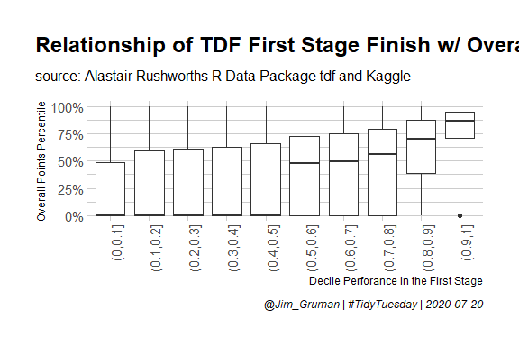<!-- -->

``` r
library(gganimate)
library(tidytext)

top_10_2016<-total_points %>%
  filter(year == 2016)%>%
  top_n(10, total_points)

p<-stages_joined %>%
  filter(year == 2016) %>%
  semi_join(top_10_2016, by = "rider")%>%
  mutate(stage = as.integer(stage),
         points = coalesce(points, 0)) %>%
  arrange(stage)%>%
  group_by(rider) %>%
  mutate(cumulative_points = cumsum(points))%>%
  ungroup() %>%
#  mutate(rider = reorder_within(rider, cumulative_points, stage))%>%
  ggplot(aes(cumulative_points, rider,fill = cumulative_points))+
  geom_col()+
  transition_time(stage)+
  theme(legend.position = "none",
        plot.title.position = "plot")+
  labs(title = "The 2016 Tour de France Stage: {frame_time}",
       x = "Cumulative Points at Stage",
       y = "")

animate(p,  width = 900, height = 750, end_pause = 50, renderer = gifski_renderer("./TourDeFrance/TourDeFrance_files/figure-gfm/animation-1.gif"))
```

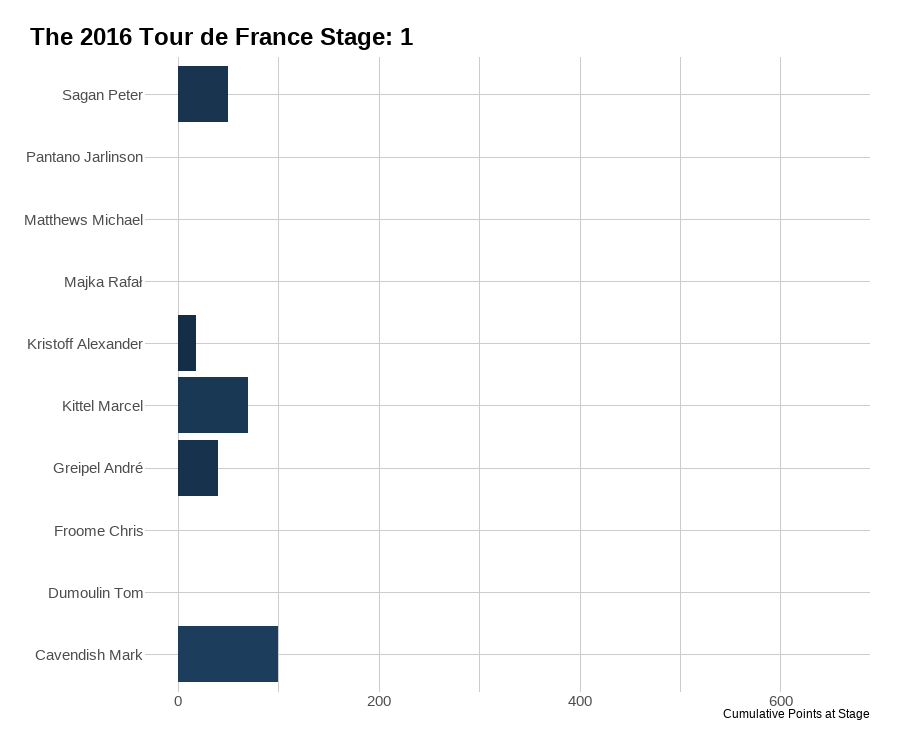<!-- -->

# Lets explore the names and life durations of the Tour de France winners

``` r
unique(tdf_winners$birth_country)
```

    ##  [1] "Italy"       "France"      "Belgium"     "Luxembourg"  "Switzerland"
    ##  [6] "Spain"       "Netherlands" "USA"         "Ireland"     "Denmark"    
    ## [11] "Germany"     "Australia"   "Kenya"       "Wales"       "Columbia"

``` r
winners<- tdf_winners %>%
  select(edition,winner_name,born,died,nickname,nationality,start_date, year) %>%
  # factor and reorder the winners by birth date
  mutate(winner_name = fct_reorder(winner_name, desc(born))) %>%
  # compute a life duration in numeric years
  mutate(life_duration = as.numeric(as.duration(ymd(born) %--%ymd(died)),"years")) %>%
  filter(!is.na(life_duration))

pal <- RColorBrewer::brewer.pal('Set1',n=3)

life_wins<-winners %>%
  ggplot()+
  geom_linerange(aes(ymin = born,
                     ymax = died,
                     x=winner_name,
                     color=life_duration),lwd=1.1) +
  coord_flip() +
  labs(x = "Winner",
       y = "Year") +
  geom_point(aes(x=winner_name,
                 y=year),
                 shape=19, size=2,color='grey')+
  scale_shape_identity('',
         labels = 'Won the \nTour de France',
         breaks=c(19),
         guide = 'legend') +
  scale_colour_gradient2('Lifetime \n(years)',
                         low = pal[1], mid = pal[2], high=pal[3], midpoint = 60) +
  labs(title='Lifespans', 
       subtitle = 'source: Alastair Rushworths R Data Package tdf and Kaggle')+
  guides(colour = guide_legend(order = 1),
         shape = guide_legend(order = 2)) +
  theme(plot.title.position = "plot")

life_wins
```

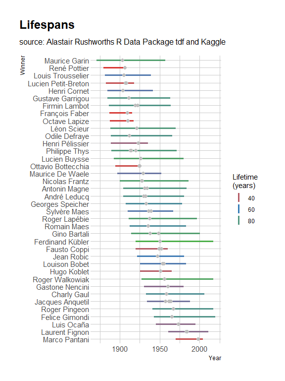<!-- -->

``` r
(life_wins / nations ) +
  plot_annotation("Tour de France Winners")
```

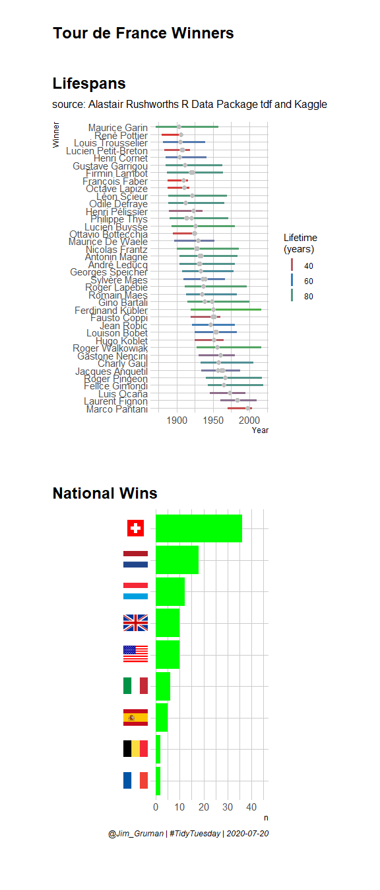<!-- -->

``` r
Sys.time()
```

    ## [1] "2020-07-20 14:27:06 CDT"

``` r
git2r::repository()
```

    ## Local:    master D:/myTidyTuesday
    ## Remote:   master @ origin (https://github.com/opus1993/myTidyTuesday.git)
    ## Head:     [faf32b6] 2020-07-15: put the Astronaut dataviz in the right folder this time

``` r
sessionInfo()
```

    ## R version 4.0.0 (2020-04-24)
    ## Platform: x86_64-w64-mingw32/x64 (64-bit)
    ## Running under: Windows 10 x64 (build 18363)
    ## 
    ## Matrix products: default
    ## 
    ## locale:
    ## [1] LC_COLLATE=English_United States.1252 
    ## [2] LC_CTYPE=English_United States.1252   
    ## [3] LC_MONETARY=English_United States.1252
    ## [4] LC_NUMERIC=C                          
    ## [5] LC_TIME=English_United States.1252    
    ## 
    ## attached base packages:
    ## [1] stats     graphics  grDevices utils     datasets  methods   base     
    ## 
    ## other attached packages:
    ##  [1] tidytext_0.2.5    gganimate_1.0.6   broom_0.7.0       survival_3.2-3   
    ##  [5] patchwork_1.0.1   lubridate_1.7.9   rvest_0.3.5       xml2_1.3.2       
    ##  [9] ggtext_0.1.0.9000 paletteer_1.2.0   forcats_0.5.0     stringr_1.4.0    
    ## [13] dplyr_1.0.0       purrr_0.3.4       readr_1.3.1       tidyr_1.1.0      
    ## [17] tibble_3.0.3      ggplot2_3.3.2     tidyverse_1.3.0  
    ## 
    ## loaded via a namespace (and not attached):
    ##  [1] bitops_1.0-6       fs_1.4.2           usethis_1.6.1      progress_1.2.2    
    ##  [5] RColorBrewer_1.1-2 httr_1.4.1         SnowballC_0.7.0    tools_4.0.0       
    ##  [9] backports_1.1.8    utf8_1.1.4         R6_2.4.1           DBI_1.1.0         
    ## [13] colorspace_1.4-1   withr_2.2.0        prettyunits_1.1.1  tidyselect_1.1.0  
    ## [17] git2r_0.27.1       curl_4.3           compiler_4.0.0     extrafontdb_1.0   
    ## [21] cli_2.0.2          labeling_0.3       scales_1.1.1       systemfonts_0.2.3 
    ## [25] digest_0.6.25      rmarkdown_2.3      tidytuesdayR_1.0.1 pkgconfig_2.0.3   
    ## [29] htmltools_0.5.0    showtext_0.8-1     extrafont_0.17     dbplyr_1.4.4      
    ## [33] rlang_0.4.7        readxl_1.3.1       rstudioapi_0.11    sysfonts_0.8.1    
    ## [37] generics_0.0.2     farver_2.0.3       jsonlite_1.7.0     tokenizers_0.2.1  
    ## [41] RCurl_1.98-1.2     magrittr_1.5       Matrix_1.2-18      Rcpp_1.0.5        
    ## [45] munsell_0.5.0      fansi_0.4.1        gdtools_0.2.2      lifecycle_0.2.0   
    ## [49] stringi_1.4.6      yaml_2.2.1         snakecase_0.11.0   plyr_1.8.6        
    ## [53] grid_4.0.0         hrbrthemes_0.8.0   blob_1.2.1         crayon_1.3.4      
    ## [57] lattice_0.20-41    haven_2.3.1        splines_4.0.0      gridtext_0.1.1    
    ## [61] hms_0.5.3          knitr_1.29         pillar_1.4.6       markdown_1.1      
    ## [65] reprex_0.3.0       glue_1.4.1         drat_0.1.8         evaluate_0.14     
    ## [69] gifski_0.8.6       modelr_0.1.8       tweenr_1.0.1       vctrs_0.3.2       
    ## [73] png_0.1-7          selectr_0.4-2      Rttf2pt1_1.3.8     cellranger_1.1.0  
    ## [77] gtable_0.3.0       rematch2_2.1.2     assertthat_0.2.1   xfun_0.15         
    ## [81] janitor_2.0.1      janeaustenr_0.1.5  showtextdb_3.0     ellipsis_0.3.1
