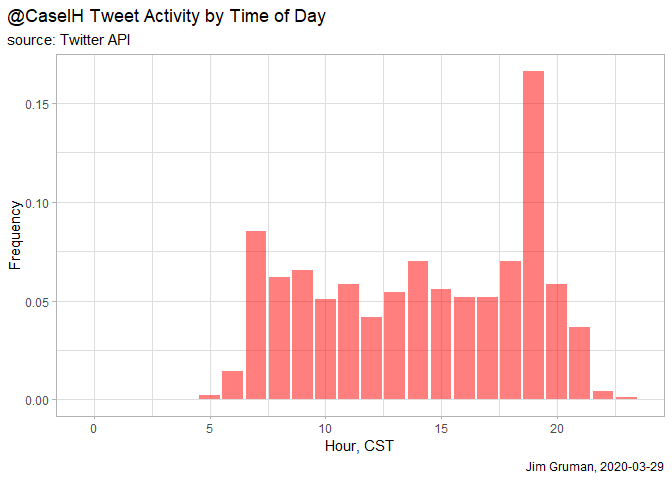
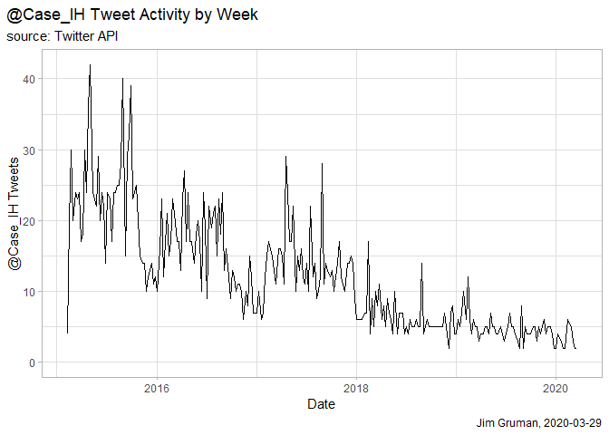
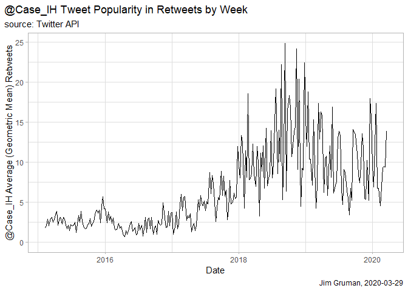
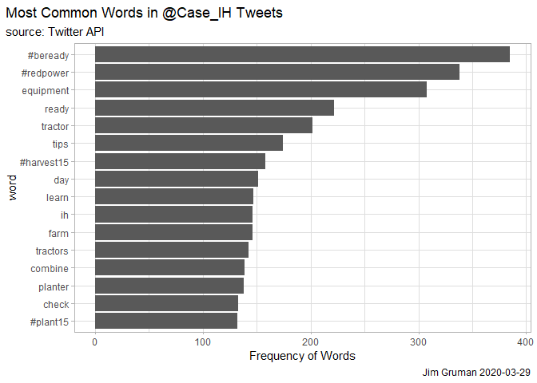
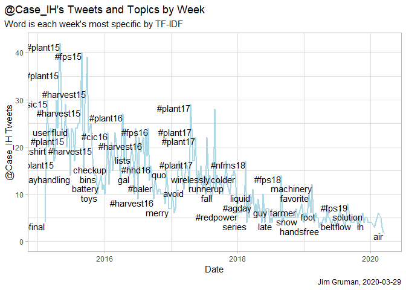
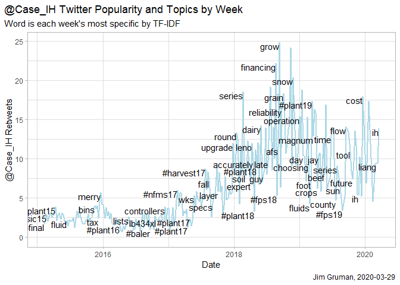
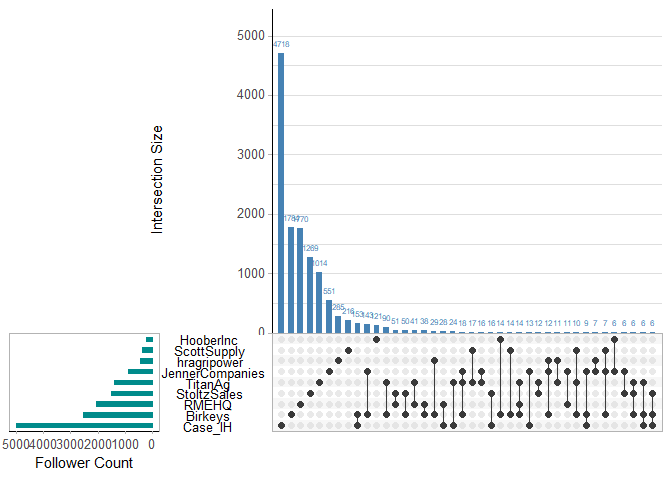
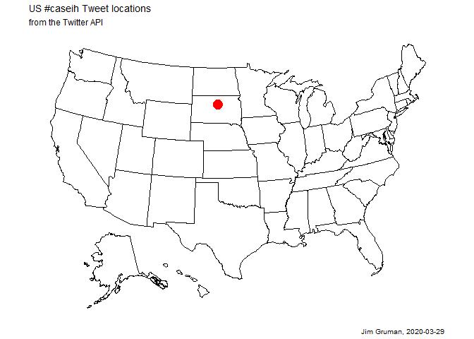

rtweet
================
Jim Gruman
2020-03-29

I set out to work with `rtweet` on some work-related Twitter handles and
ended up discovering a bug and a workaround for windows users.

``` r
knitr::opts_chunk$set(include = TRUE)
library(lubridate)
library(tidyverse)
library(rtweet)
theme_set(theme_light())
token<-rtweet::get_token()
```

The `rtweet` [Obtaining and using access
tokens](http://rtweet.info/articles/auth.html) vignette provides
instructions for creating tokens and writing them to `.Renviron`,
one-time only, as:

``` r
api_key <- "onthetwitterdeveloperpage"
api_secret_key <- "onthetwitterdeveloperpage"
access_token <- "onthetwitterdeveloperpage"
access_token_secret <- "onthetwitterdeveloperpage"

## authenticate via web browser
token <- create_token(
  app = "mytwitterapp_NDMSBA",
  consumer_key = api_key,
  consumer_secret = api_secret_key,
  access_token = access_token,
  access_secret = access_token_secret)
```

Unfortunately, the process currently works properly only in linux
environments, and not in Windows. Closely inspect the token created as
follows:

``` r
token<-rtweet::get_token()
token
```

You have found the bug when the token returned does not match the keys
created above.

The solution to the problem is to edit your local `.Renviron` file. In
the console, type

`usethis::edit_r_environ()`

Find the **TWITTER\_PAT** parameter and change every back slash `\` and
forward slash `/` to double backslashes `\\` to the rds file address. It
will resemble

`"C:\\Users\\<youruser>\\Documents\\.rtweet_token.rds"`

Save the `.Renviron` file. Then Restart R (Ctrl+Shift+F10). Closely
inspect the token again:

``` r
token<-rtweet::get_token()
token
```

-----

# CaseIH Twitter handle timeline

@Case\_IH is the global twitter handle of one of the agriculture brand
handles for CNHIndustrial. Their most recent 3200 tweets can be pulled
from the API as

``` r
case_ih_timeline <- get_timeline("case_ih", n=3200, token = token) %>%
    mutate(week = as.Date(floor_date(created_at, "week", week_start = 1)))
```

Plots describing some measures of @Case\_IH activity:

``` r
case_ih_timeline %>%
   mutate(hour=hour(with_tz(created_at, tz="America/Chicago")))  %>%
   group_by(hour) %>%
   summarize(n=n()) %>%
   mutate(frequency=n/sum(n)) %>%
   ggplot()+
   geom_col(aes(x=hour, y=frequency), 
             fill='red', alpha=0.5)+
   labs(title = "@CaseIH Tweet Activity by Time of Day",
     subtitle = "source: Twitter API",             
     x = "Hour, CST", y = "Frequency",
     caption = str_c("Jim Gruman, ", Sys.Date()))+
     theme(plot.title.position = "plot")  
```

<!-- -->

``` r
week_summary<- case_ih_timeline %>%
  group_by(week) %>%
  summarize(tweets = n(),
            avg_retweets =  exp(mean(log(retweet_count + 1))) -1)
# remove last week from summary calc

week_summary<- week_summary[-(nrow(week_summary)),]

week_summary %>%
  ggplot(aes(week, tweets))+
  geom_line()+
  expand_limits(y = 0)+
  labs(title = "@Case_IH Tweet Activity by Week",
       subtitle = "source: Twitter API",       
       x = "Date",
       y = "@Case_IH Tweets",
       caption = str_c("Jim Gruman, ", Sys.Date())) +
    theme(plot.title.position = "plot") 
```

<!-- -->

``` r
week_summary %>%
  ggplot(aes(week, avg_retweets))+
  geom_line()+
  expand_limits(y = 0)+
  labs(title = "@Case_IH Tweet Popularity in Retweets by Week",
       subtitle = "source: Twitter API",
       x = "Date",
       y = "@Case_IH Average (Geometric Mean) Retweets",
       caption = str_c("Jim Gruman, ", Sys.Date())) +
  theme(plot.title.position = "plot") 
```

<!-- -->

Which tweets get the most retweets, and thus the widest audience?

``` r
case_ih_timeline%>%
  select(screen_name, retweet_screen_name, retweet_count, status_id)%>%
  arrange(desc(retweet_count)) %>%
  head() 
```

    ## # A tibble: 6 x 4
    ##   screen_name retweet_screen_name retweet_count status_id          
    ##   <chr>       <chr>                       <int> <chr>              
    ## 1 Case_IH     <NA>                          156 918453719418667008 
    ## 2 Case_IH     <NA>                          101 1020031078223007745
    ## 3 Case_IH     <NA>                          100 1242633908635795458
    ## 4 Case_IH     <NA>                           88 1022557253499539461
    ## 5 Case_IH     USDA                           85 1106313301275955201
    ## 6 Case_IH     <NA>                           84 1208155546978856961

<https://twitter.com/Case_IH/status/918453719418667008>

``` r
case_ih_timeline%>%
  select(retweet_screen_name, retweet_count, favorite_count, status_id)%>%
  mutate(ratio = (favorite_count + 1) / (retweet_count + 1)) %>%
  arrange(ratio) %>%
  head()
```

    ## # A tibble: 6 x 5
    ##   retweet_screen_name retweet_count favorite_count status_id            ratio
    ##   <chr>                       <int>          <int> <chr>                <dbl>
    ## 1 USDA                           85              0 1106313301275955201 0.0116
    ## 2 Case_IH                        49              0 1040741535858479104 0.02  
    ## 3 Case_IH                        35              0 1046228641284345857 0.0278
    ## 4 Case_IH                        28              0 1090382178423324673 0.0345
    ## 5 LiveWorkGrowCIA                21              0 976096146593546240  0.0455
    ## 6 FarmsNews                      21              0 964547365142188032  0.0455

\!<https://twitter.com/Case_IH/status/1106313301275955201>

Another approach to showing the most popular tweet of this year in a
browser:

``` r
show_most_popular_tweet <- function(user){
  get_timeline(user, n=3200) %>%
    mutate(year = year(created_at)) %>%
    filter(year == year(Sys.Date())) %>%
    arrange(-favorite_count) %>%
    slice(1) %>%
    pull(status_id) %>%
    paste0('http://twitter.com/', user, '/status/', .) %>%
    browseURL()
}

show_most_popular_tweet('case_ih')
```

Some measures of tweet word content:

``` r
library(tidytext)
tweet_words<-case_ih_timeline %>%
  select(screen_name, text, retweet_count, favorite_count, created_at, week, status_id) %>%
  unnest_tokens(word, text, token = "tweets") %>%
  anti_join(stop_words, by = "word") %>%
  filter(!word %in% c("#caseih", "@caseih", "37pm", "youll", "rt", "amp", "blog", "mt"),
         str_detect(word, "[a-z]"),
         !str_detect(word, "http")) 

tweet_words %>%
  count(word, sort = TRUE)%>%
  head(16)%>%
  mutate(word = reorder(word, n)) %>%
  ggplot(aes(word, n))+
  geom_col() +
  coord_flip() +
  theme(plot.title.position = "plot") +
  labs(title = "Most Common Words in @Case_IH Tweets", subtitle = "source: Twitter API",
       y = "Frequency of Words", caption = paste0("Jim Gruman ", Sys.Date()))
```

<!-- -->

``` r
word_summary<-tweet_words %>%
  group_by(word)%>%
  summarize(n = n(),
            avg_retweets =   exp(mean(log(retweet_count + 1))) -1,
            avg_favorites = exp(mean(log(favorite_count+ 1)))-1) %>%
  filter(n >= 30) %>%
  arrange(desc(avg_retweets))

word_summary
```

    ## # A tibble: 128 x 4
    ##    word           n avg_retweets avg_favorites
    ##    <chr>      <int>        <dbl>         <dbl>
    ##  1 happy         49        10.6           39.3
    ##  2 afs           66         9.74          17.4
    ##  3 farming       51         9.42          29.1
    ##  4 command       33         9.14          15.2
    ##  5 steiger       65         8.82          25.7
    ##  6 efficiency    38         8.70          15.4
    ##  7 producers     32         8.02          18.5
    ##  8 set           41         7.36          16.3
    ##  9 fit           37         7.33          25.8
    ## 10 hard          41         7.29          25.4
    ## # ... with 118 more rows

# What topics are each week most about?

``` r
library(tidytext)
top_word<-tweet_words %>%
  count(word, week) %>%
  bind_tf_idf(word, week, n) %>%
  filter(n>=2)%>%
  arrange(desc(tf_idf)) %>%
  distinct(week, .keep_all = TRUE)

week_summary %>%
  inner_join(top_word, by = c("week")) %>%
  arrange(desc(avg_retweets))
```

    ## # A tibble: 254 x 8
    ##    week       tweets avg_retweets word          n     tf   idf tf_idf
    ##    <date>      <int>        <dbl> <chr>     <int>  <dbl> <dbl>  <dbl>
    ##  1 2018-09-10      5         24.9 grow          2 0.0465  3.10 0.144 
    ##  2 2018-11-12      5         24.1 prepared      2 0.0426  4.89 0.208 
    ##  3 2018-08-20      5         22.2 financing     2 0.04    2.69 0.108 
    ##  4 2018-11-26      5         20.3 snow          3 0.0577  2.64 0.152 
    ##  5 2018-07-23      5         19.2 axialflow     2 0.0435  2.59 0.113 
    ##  6 2019-01-14      5         18.8 manage        2 0.0588  3.02 0.178 
    ##  7 2018-02-19      4         18.6 series        2 0.0571  1.01 0.0576
    ##  8 2018-10-01      5         18.3 grain         2 0.04    2.75 0.110 
    ##  9 2019-12-16      4         17.9 cost          2 0.0741  4.89 0.362 
    ## 10 2020-01-20      3         17.4 farmers       2 0.0833  1.95 0.162 
    ## # ... with 244 more rows

``` r
week_summary %>%
  inner_join(top_word, by = c("week")) %>%
  ggplot(aes(week, tweets))+
  geom_line(color = "lightblue", size = 1)+
  geom_text(aes(label = word), check_overlap = TRUE,
            vjust = 1,
            hjust = 1) +
  expand_limits(y = 0)+
  labs(title = "@Case_IH's Tweets and Topics by Week",x = "Date",
       y = "@Case_IH Tweets", subtitle = "Word is each week's most specific by TF-IDF",
       caption = str_c("Jim Gruman, ", Sys.Date()))+
    theme(plot.title.position = "plot") 
```

<!-- -->

``` r
week_summary %>%
  inner_join(top_word, by = c("week")) %>%
  ggplot(aes(week, avg_retweets))+
  geom_line(color = "lightblue", size = 1)+
  geom_text(aes(label = word), check_overlap = TRUE,
            vjust = 1,
            hjust = 1) +
  expand_limits(y = 0)+
  labs(title = "@Case_IH Twitter Popularity and Topics by Week",x = "Date",
       y = "@Case_IH Retweets",subtitle = "Word is each week's most specific by TF-IDF",
       caption = str_c("Jim Gruman, ", Sys.Date()))+
    theme(plot.title.position = "plot") 
```

<!-- -->

And some measures of the interactions between the global Case\_IH
twitter handle and some of the most active Case\_IH dealer stores:

``` r
library(UpSetR)

rstaters<- c("Case_IH", "Birkeys", "HooberInc", "StoltzSales","ScottSupply", "hragripower",
             "JennerCompanies", "TitanAg", "RMEHQ")
followers_upset <- map_df(rstaters, ~ get_followers(
  .x, retryonratelimit = TRUE, token = token) %>% mutate(account = .x))
aRdent_followers <- unique(followers_upset$user_id)
binaries <- rstaters %>%
  map_dfc(~ ifelse(aRdent_followers %in% filter(
    followers_upset, account == .x)$user_id, 1, 0) %>% as.data.frame)

names(binaries) <- rstaters

upset(binaries,
      nsets = 9,
      main.bar.color = "SteelBlue",
     sets.bar.color = "DarkCyan",
      sets.x.label = "Follower Count",
      text.scale = c(rep(1.4, 5), 1),
      order.by = "freq")
```

<!-- --> Finally, a
map of recent \#CaseIH hashtag activity in the US:

``` r
searches<-search_tweets(
  "#caseih", geocode = lookup_coords("usa"), n = 10000)
searches<- lat_lng(searches) %>% select(lng, lat) %>% filter(!is.na(lat))

library(usmap)
p <- plot_usmap( regions = "state") 
p + geom_point(data = searches, aes(x = lng, y = lat, size = 5), color = "red")+
  labs(title = "US #caseih Tweet locations",
       subtitle = "from the Twitter API",
       caption = str_c("Jim Gruman, ", Sys.Date()))+
    theme(plot.title.position = "plot",
          legend.position = "") 
```

    ## Warning: Use of `map_df$x` is discouraged. Use `x` instead.

    ## Warning: Use of `map_df$y` is discouraged. Use `y` instead.

    ## Warning: Use of `map_df$group` is discouraged. Use `group` instead.

<!-- -->

-----

Inspired by: [Dave Robinson R
tutorial](https://www.youtube.com/watch?v=KE9ItC3doEU&t=80s)

It turns out that [Jon Harmon has also made a report of the issue at the
package repo](https://github.com/ropensci/rtweet/issues/380)
